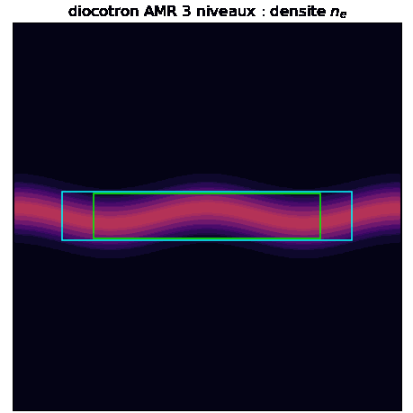

<div align="center">

# ADC CPP

**Coeur C++23 d'un solveur AMR / MPI / GPU pour systemes hyperbolique-elliptique couples.**


</div>

<p align="center">
  
</p>

<div align="center">
<sub>
Instabilite diocotron (derive E x B) sur AMR 3 niveaux emboites, ROMEO (x64cpu, 96 coeurs AMD EPYC).
Patchs fins suivis par regrid Berger-Rigoutsos, sous-cyclage Berger-Oliger + reflux conservatif (derive de masse ~ 1e-15).
</sub>
</div>

---

`adc_cpp` est la **bibliotheque** : le moteur generique (coeur sans modele) plus une bibliotheque de
briques physiques (`include/adc/physics/`) et les **bindings Python de la lib**, le module `adc`
(composition `System` / `AmrSystem`). Le coeur est **agnostique au modele** : il ne nomme aucun
scenario, il ne fournit que des briques generiques composees en `CompositeModel`. Les scenarios nommes
(diocotron, Euler-Poisson, deux-fluides...) vivent dans le depot separe
**[`adc_cases`](https://github.com/wolf75222/adc_cases)**.

Le coeur resout, sur maillage cartesien adaptatif :

```
d U / d t  +  div F(U, aux)  =  S(U, aux)
D phi = f(U)
```

ou la partie hyperbolique `U` et la partie elliptique `phi` sont couplees a chaque pas via le canal
`aux`. Contrat de base `(phi, grad_x, grad_y)`, extensible : un modele declare `n_aux` pour lire des
champs supplementaires (`B_z`, `T_e`), avec retro-compat bit-exacte si `n_aux=3`.

## Ce que fournit le coeur

Concepts, seams, operateurs, integrateurs, solveur elliptique, moteur AMR distribue et facades
runtime : voir **[docs/ARCHITECTURE.md](docs/ARCHITECTURE.md)** (section 6 : carte des modules par
type ; section 13 : arborescence detaillee fichier par fichier).
Algorithmes et formules : [docs/ALGORITHMS.md](docs/ALGORITHMS.md).
Profil : [docs/PERFORMANCE.md](docs/PERFORMANCE.md).

## DSL symbolique : ecrire un modele en formules Python

Outre la composition de briques (`adc.Model`), on peut ecrire un modele en formules cote Python avec
`adc.dsl.Model` : on declare les variables conservatives, le flux physique, les valeurs propres, la
source et la contribution elliptique. Le DSL emet du C++, compile en `.so`, et renvoie un
`CompiledModel` a brancher sur le systeme.

```python
import adc
m = adc.dsl.Model("euler")
rho, rhou, rhov, E = m.conservative_vars("rho", "rho_u", "rho_v", "E")
g = m.param("gamma", 1.4)
u = m.primitive("u", rhou / rho)
p = m.primitive("p", (g - 1.0) * (E - 0.5 * rho * (u*u + u*u)))
m.flux(x=[rhou, rhou*u + p, rhou*u, (E + p)*u],
       y=[rhov, rhov*u, rhov*u + p, (E + p)*u])
compiled = m.compile(backend="production")   # mis en cache par hash
sim = adc.System(n=192, periodic=True)
sim.add_equation("gas", model=compiled,
                 spatial=adc.FiniteVolume(limiter="minmod", riemann="hllc"),
                 time=adc.Explicit())
sim.run(t_end=0.2, cfl=0.4)
```

Le backend RECOMMANDE est `backend="production"` (chemin natif zero-copie ; GPU np=1 GH200 #97 + MPI solve_fields np=1/2/4 #93/#99 valides ; transport production GPU+MPI multi-rang pas encore exerce -- voir Validation). Les
quatre chemins de modele (natif compose, production, aot, prototype) et les limites honnetes :
**[docs/DSL_MODEL_DESIGN.md](docs/DSL_MODEL_DESIGN.md)**.

## Systemes multi-especes

On couple N especes (ions, electrons, neutres...), chacune avec son `PhysicalModel`, son schema
spatial, sa politique temporelle. Interactions dans le second membre elliptique (`ChargeDensityRhs`)
et dans la source (`CoupledSource`), jamais dans le flux. Le scheduler supporte sous-pas, cadence,
IMEX partiel, pas adaptatif multirate (`step_adaptive`), et integrateur fait maison.
Detail : **[docs/ARCHITECTURE.md](docs/ARCHITECTURE.md)** (section 5 : couche temps et couplage).

## Backends CMake

```bash
cmake -B build                       # serie
cmake -B build -DADC_USE_MPI=ON      # distribue (halos + FFT par MPI)
cmake -B build -DADC_USE_KOKKOS=ON   # CPU multi-thread (device OpenMP), recommande
cmake -B build -DADC_USE_KOKKOS=ON \
   -DCMAKE_CXX_COMPILER=$K/bin/nvcc_wrapper -DKokkos_ROOT=$K   # GPU GH200
```

**Kokkos est le backend de dispatch recommande** (CPU ET GPU, un seul code). Le backend OpenMP
autonome (`ADC_USE_OPENMP`) est **deprecie**. Detail : [docs/ARCHITECTURE.md](docs/ARCHITECTURE.md) (section 9).

## Utiliser le coeur

```cmake
include(FetchContent)
FetchContent_Declare(adc_cpp GIT_REPOSITORY https://github.com/wolf75222/adc_cpp.git)
FetchContent_MakeAvailable(adc_cpp)
target_link_libraries(mon_appli PRIVATE adc::adc)
```

On definit un type qui satisfait `PhysicalModel`, on l'instancie dans un `Coupler<Model, Elliptic>`
(ou `AmrCouplerMP` pour l'AMR), et on avance en temps.

## Module Python `adc`

Construction : `cmake -B build-py -DADC_BUILD_PYTHON=ON && cmake --build build-py --target _adc -j`.

> L'extension compilee est **epinglee a l'interpreteur** (`_adc.cpython-312`). `import adc`
> ne fonctionne QUE sous l'interpreteur correspondant (p.ex. un Python 3.12 anaconda/conda qui a
> AUSSI numpy), avec le dossier `python/` du build sur `sys.path` (`build-py/python` ou
> `build-master/python`). Sous le `python3` systeme il echoue avec `ModuleNotFoundError: adc._adc`.

```python
import adc
sim = adc.System(n=192, periodic=False)
electrons = adc.Model(state=adc.FluidState("compressible", gamma=1.4),
                      transport=adc.CompressibleFlux(),
                      source=adc.PotentialForce(charge=-1.0),
                      elliptic=adc.ChargeDensity(charge=-1.0))
sim.add_block("electrons", model=electrons,
              spatial=adc.Spatial(vanleer=True, flux="hllc"), time=adc.IMEX(substeps=10))
sim.set_poisson(rhs="charge_density", solver="geometric_mg", bc="dirichlet",
                wall="circle", wall_radius=0.40)
sim.step_cfl(0.4)
```

`adc.AmrSystem` compose un ou plusieurs blocs sur une hierarchie raffinee (API proche de `System`
plus `set_refinement`). Etat actuel d'`AmrSystem` : mono- ET multi-bloc (`add_native_block` /
`add_compiled_block` repetes, capstone #195/#199/#205, cadence de regrid via `regrid_every` +
`set_refinement`/`set_phi_refinement`), reflux conservatif, recon
`conservative|primitive`, flux `rusanov|hllc|roe`, IMEX source locale (Gap 2 #132,
backward_euler_source / mf_apply_source_treatment). Reste hors-perimetre : pas de Schur global sur
AMR. `AmrSystem.potential()` binding SHIPPE (python/bindings.cpp:332, `#135`).
Detail des adders et chemins avances : **[docs/DSL_MODEL_DESIGN.md](docs/DSL_MODEL_DESIGN.md)**.

## Ecosysteme

| Repo | Role | Socle maillage |
|---|---|---|
| **`adc_cpp`** (ce depot) | coeur hyperbolique-elliptique sur **AMR** + GPU/MPI/Kokkos | propre (from scratch) |
| [`adc_cases`](https://github.com/wolf75222/adc_cases) | applications : modeles, facades, exemples, Python | consomme `adc::adc` |
| [`poisson_cpp`](https://github.com/wolf75222/poisson_cpp) | solveurs Poisson (Thomas, SOR, CG, DST, multigrille) | propre |
| [`pde_core_cpp`](https://github.com/wolf75222/pde_core_cpp) | infra partagee (mesh, fields, AMR) | propre |
| [`advection_cpp`](https://github.com/wolf75222/advection_cpp) | advection + Burgers + Chorin NS | `pde_core_cpp` |
| [`euler_cpp`](https://github.com/wolf75222/euler_cpp) | Euler 2D + viscous NS + sources plasma | `pde_core_cpp` |

## Build et tests

```bash
git clone https://github.com/wolf75222/adc_cpp.git
cd adc_cpp
cmake -B build -DCMAKE_BUILD_TYPE=Release
cmake --build build -j
ctest --test-dir build
```

La CI a trois jobs : Release (serie), MPI (`-DADC_USE_MPI=ON`, bit-identiques np=1/2/4) et Kokkos
(Serial). Module Python : suite supplementaire (bindings + DSL). CI ignore les changements
documentaires (`paths-ignore: docs/**`, `**.md`).

| Option | Defaut | Role |
|---|---|---|
| `ADC_BUILD_TESTS` | `ON` | suite CTest du coeur |
| `ADC_USE_KOKKOS` | `OFF` | dispatch Kokkos (CPU OpenMP + GPU), **recommande** |
| `ADC_USE_OPENMP` | `OFF` | dispatch OpenMP autonome, **deprecie** (utiliser Kokkos) |
| `ADC_USE_MPI` | `OFF` | backend distribue (comm, halos, FFT) |
| `ADC_USE_HDF5` | `OFF` | DataWriter HDF5 parallele |

## Organisation du depot

```
include/adc/
  core/         types, etat, PhysicalModel, EquationBlock, CoupledSystem
  mesh/         MultiFab, BoxArray, Geometry, for_each_cell, CL physiques
  parallel/     seam comm (MPI), load balance
  physics/      briques generiques -> CompositeModel
  numerics/     reconstruction, flux numeriques, operateur spatial
  numerics/elliptic/  concept EllipticSolver, multigrille, FFT
  numerics/time/      SSP-RK, scheduler, IMEX, splitting, moteur AMR
  coupling/     Coupler, SystemCoupler, AmrSystemCoupler, AmrCouplerMP
  amr/          clustering BR, regrid, hierarchie
  runtime/      facades System / AmrSystem, model_factory, DSL, canal aux extensible
tests/          tests coeur (MPI via mpirun quand -DADC_USE_MPI=ON)
docs/           ARCHITECTURE.md, ALGORITHMS.md, GPU_RUNTIME_PORT.md, PERFORMANCE.md, ...
```

Detail par fichier : [docs/ARCHITECTURE.md](docs/ARCHITECTURE.md) (section 13).

## Validation (coeur)

- CI : ctests coeur Release + Kokkos (Serial) ; MPI np=1/2/4 bit-identiques ; module Python (bindings + DSL).
- AMR conservatif : reflux multi-patch a l'arrondi machine (~1e-15).
- GPU GH200 (hors CI) : System production np=1 valide (#97) ; multigrille geometrique device-MPI
  np=1/2/4 valide (#93) ; AmrSystem + MPI + GPU valides bit-identiques (phase 10, dmax=0, #105) ;
  Schur/polaire device : **7/7 device-clean Kokkos Cuda single-GPU + MPI+Kokkos Cuda multi-GPU
  rank-invariant (10 tests, #157) + Kokkos OpenMP CI (#155)** -- condensed_schur, polar_transport,
  lorentz, full_tensor, polar_poisson, krylov, schur_condensation (tous device-clean GH200,
  compute-sanitizer 0 err). Les 4 echecs initiaux etaient TEST-SIDE (foncteurs hote / pointeurs hote
  appeles dans des kernels device, ou lecture hote d'une sortie async sans fence), corriges #150/#152/#158 ;
  le LIBRARY elliptique/Schur/polaire est device-correct.
  Detail : docs/BACKEND_COVERAGE.md.
- FFT sous `System` MPI np>1 : REFUSEE proprement (#106, plus de segfault) ; `DistributedFFTSolver`
  existe et teste a part, mais n'est PAS route dans `System`.

Detail des validations device : [docs/GPU_RUNTIME_PORT.md](docs/GPU_RUNTIME_PORT.md).
Matrice de couverture backend : [docs/BACKEND_COVERAGE.md](docs/BACKEND_COVERAGE.md).
Validation applicative (modeles, diocotron, ROMEO) : [`adc_cases`](https://github.com/wolf75222/adc_cases).
