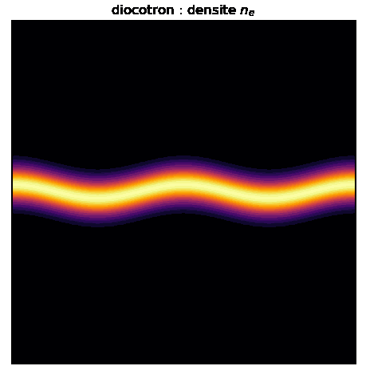
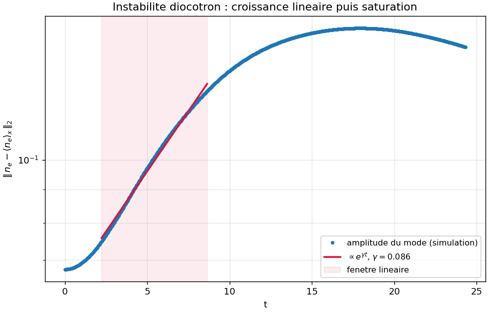
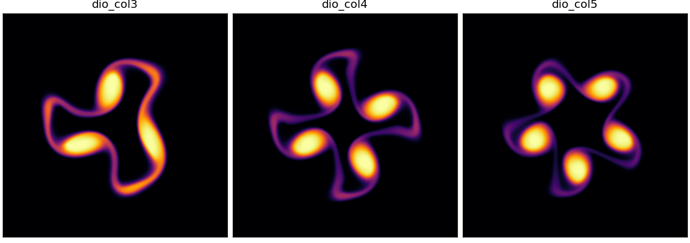
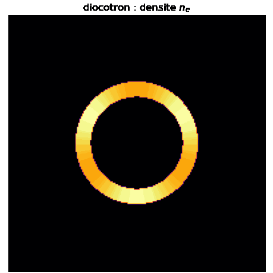
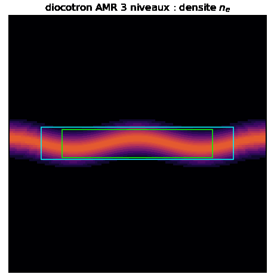

# adc_cpp

Solveur advection-diffusion-couplage : systeme hyperbolique-elliptique couple,
concu des le depart pour l'AMR dynamique, OpenMP, MPI et Kokkos, cible cluster.

Forme generale resolue :

```
d U / d t + div F(U, phi) = div H(U, grad U) + S(U, phi)
D phi = f(U)
```

Cas H = 0 pour l'instant. Cible de validation : l'instabilite diocotron
(transport E x B d'une densite electronique couple a Poisson).

## Validation : instabilite diocotron

Une bande de charge cree un ecoulement E x B cisaille, instable a une
perturbation le long de la bande : les bords s'enroulent en "cat's eyes". Le
systeme diocotron est isomorphe a la dynamique tourbillonnaire 2D d'Euler
(densite = vorticite, potentiel = fonction de courant), donc c'est l'instabilite
de Kelvin-Helmholtz d'une couche de cisaillement.





Resultat (mode m=2, couplage Poisson resolu par la multigrille maison a chaque
etage, reconstruction VanLeer ordre 2) : croissance exponentielle dans la phase
lineaire puis saturation non lineaire. Le taux de croissance mesure est
independant du maillage, donc physique :

| n   | gamma |
|-----|-------|
| 128 | 0.086 |
| 192 | 0.086 |
| 256 | 0.086 |

Le spectre KH est respecte : les grands modes (m=1, m=2) croissent, les petits
(m=3 et au-dela) sont stables. Reproduire :

```bash
cmake --build build --target diocotron
./build/bin/diocotron /tmp/dio 256 700 2
python scripts/plot_diocotron_growth.py /tmp/dio/diocotron_amp.csv docs/fig_diocotron_growth.png
python scripts/make_diocotron_gif.py /tmp/dio docs/anim_diocotron.gif
```

### Colonne creuse en cavite (cas canonique)

Le cas de reference de la litterature (Davidson-Felice 1998 ; Hoffart, Maier,
Shadid, Tomas 2025, arXiv:2510.11808, fig. 5.1-5.3) : un anneau de charge creux
dans une cavite conductrice, perturbe sur le mode azimutal l. Le mode l croit en
l tourbillons "cat's eyes" disposes en anneau.

Point cle : leur difficulte (schema implicite, complement de Schur PDE) sert a
atteindre la limite de derive magnetique depuis le modele complet a beta=1e6
(echelles cyclotron / plasma / diocotron separees de 10 ordres). Notre modele
guiding-center vit deja dans cette limite : on resout directement le transport
E x B de n_e, explicitement. On obtient donc la meme instabilite, bien plus
simplement.





La selection de mode est exacte : l = 3, 4, 5 donnent 3, 4, 5 tourbillons, en
accord visuel direct avec les figures 5.1-5.3 du papier. Reproduire :

```bash
cmake --build build --target diocotron_column
for L in 3 4 5; do ./build/bin/diocotron_column /tmp/col$L 256 1500 $L; done
python scripts/plot_diocotron_modes.py docs/fig_diocotron_modes.png /tmp/col3 /tmp/col4 /tmp/col5
python scripts/make_diocotron_gif.py /tmp/col3 docs/anim_diocotron_column.gif
```

### Taux de croissance : validation contre la theorie lineaire (fig 5.4)

Un eigensolver radial (host Eigen) resout le probleme aux valeurs propres
diocotron de Petri (arXiv:astro-ph/0611936, eq. 20-21), equivalent a
Davidson-Felice : `ω L_m φ = mΩ L_m φ + q_m φ`, discretise en differences finies
et resolu par `M = L⁻¹A` avec `Eigen::EigenSolver`. C'est le seul usage d'Eigen,
cote host, conformement a la decision d'architecture.


Pour la geometrie du papier (a=6, b=8, R=16), il reproduit les taux theoriques
publies a mieux que 0.5 % :

| ℓ | eigensolver | Hoffart et al. (fig 5.4) |
|---|---|---|
| 3 | 0.772 | 0.772 |
| 4 | 0.912 | 0.911 |
| 5 | 0.686 | 0.683 |

Le spectre culmine a ℓ=4 et se coupe a ℓ≥6 (cutoff haute frequence), comme dans
le papier. C'est la fig 5.4 du papier reproduite cote theorie. La simulation non
lineaire reproduit la phenomenologie (les ℓ tourbillons) et la tendance du
spectre ; son taux absolu est attenue par la diffusion numerique du schema, donc
la comparaison theorie/simulation reste qualitative a cette resolution.

Reproduire :

```bash
cmake --build build --target diocotron_theory
./build/bin/diocotron_theory 6 8 16 /tmp/theory.csv
python scripts/plot_diocotron_theory.py /tmp/theory.csv docs/fig_diocotron_theory.png
```

## AMR dans le temps : diocotron raffine

Le transport est integre sur une hierarchie 2 niveaux avec **sous-cyclage
Berger-Oliger** (le niveau fin fait r=2 sous-pas de dt/2) et **reflux**
(`FluxRegister` : le flux grossier a l'interface est remplace par la somme des
flux fins). Resultat : conservation de masse a l'arrondi (1e-15) ET stabilite.

Le couplage est **decouple** : phi etant lisse, Poisson est resolu sur la grille
grossiere uniforme (la multigrille maison), et aux = grad phi est injecte vers le
niveau fin. Pas de Poisson composite : l'AMR ne porte que le transport.


La couche de cisaillement (mode m=2) s'enroule en deux tourbillons, resolus dans
la zone raffinee (cadre cyan), avec une fraction des degres de liberte d'une
grille uniforme equivalente. Reproduire :

```bash
cmake --build build --target diocotron_amr
./build/bin/diocotron_amr /tmp/dio_amr 128 500
```

Le **regrid est dynamique** : toutes les 20 iterations, les cellules dont la
densite depasse le fond sont taguees, on en prend le bounding box, on l'elargit
d'un buffer et on le clippe a l'interieur ; la nouvelle box fine est reallouee et
l'etat transfere (ancien fin la ou il existe, sinon injection depuis le grossier
synchronise). Le cadre cyan de l'animation suit ainsi les structures (extents lus
dans `boxes.csv`), et la masse reste conservee a l'arrondi a travers chaque
remaillage (drift ~1e-15).

Le sous-cyclage + reflux se generalise a **N niveaux emboites** par recursion
(`amr_multilevel.hpp`) : chaque niveau qui possede un enfant joue le role du
grossier de l'etape 2-niveaux vis-a-vis de cet enfant (flux grossier sauve,
flux fins accumules sur les r sous-pas, average_down, reflux). Le niveau le plus
fin d'une pile a 3 etages fait r*r = 4 sous-pas par pas grossier. Le test
`test_amr_multilevel` valide la conservation a l'arrondi (drift ~1e-16) et la
borne de la solution sur 3 niveaux.



Le demo `diocotron_amr3` met cette pile en oeuvre : niveau 0 grossier (Poisson +
transport), niveau 1 (cadre cyan, ratio 2) qui suit la bande de charge, niveau 2
(cadre lime, ratio 4) qui suit les coeurs denses des deux tourbillons. Le regrid
est **imbrique** : le niveau 2 est retague depuis le niveau 1 a chaque remaillage
et clippe strictement a l'interieur du niveau 1 (nesting). La masse reste
conservee a l'arrondi (drift ~1e-14 sur 500 pas). L'animation est un montage
composite : chaque niveau est dessine a sa vraie resolution sur son extent.

```bash
cmake --build build --target diocotron_amr3
./build/bin/diocotron_amr3 /tmp/dio3 128 500
python scripts/make_diocotron_amr3_gif.py /tmp/dio3 docs/anim_diocotron_amr3.gif
```

## Niveau d'abstraction

Trois axes orthogonaux qui ne se melangent jamais :

| Axe | Question | Qui le porte |
|---|---|---|
| Quoi calculer | la physique | `PhysicalModel` : fonctions pures sur des etats ponctuels |
| Ou / comment iterer | le parallelisme | maillage + dispatch (`parallel_for`) |
| Dans quel ordre | le temps | integrateur + coupleur |

Invariant central : **AMR, MPI et Kokkos sont des proprietes de la couche
donnees/maillage. Ils n'apparaissent jamais dans la couche physique.** Un
`PhysicalModel` ne voit jamais une box, un rang MPI, un ghost ni une vue
Kokkos. On lui passe des etats ponctuels, il rend des flux/sources ponctuels.
C'est ce qui le rend portable CPU et device : il ne touche a aucun parallelisme.

## Couches

Fige (le socle, ecrit une fois) :
- maillage : abstraction box/patch, hierarchie de niveaux
- tableau distribue (equivalent `MultiFab`) : memoire, layout, rangs MPI, ghosts
- dispatch `parallel_for` (Kokkos) sur les boxes
- echange de halos
- machinerie AMR : regridding (tagging, clustering Berger-Rigoutsos, equilibrage
  de charge), prolongation/restriction, registres de reflux
- squelette d'avancement temporel (sous-cyclage en temps entre niveaux)

Generalise (interchangeable, exprime en concept/template) :
- `PhysicalModel` : formules ponctuelles
- reconstruction (MUSCL/WENO)
- solveur de Riemann
- backend elliptique
- integrateur temporel (SSPRK2/3, IMEX)
- strategie de couplage (split, par etage, monolithique)

## Operateur spatial

L'objet qui assemble le residu spatial complet :

```
R(U, aux) = -div F(U, aux) + S(U, aux)
```

Par box : echange de halos, reconstruction, flux numerique (Riemann aux faces),
divergence, source, et sur AMR enregistrement des flux coarse-fine pour le
reflux. Il consomme `aux` (phi et grad phi produits par la resolution
elliptique), il ne possede ni l'integration temporelle ni l'elliptique.
C'est la fleche "PDE -> systeme d'ODE" de la methode des lignes : l'integrateur
reste agnostique du modele et de la discretisation.

`flux` et `source` du modele prennent tous deux `aux`. C'est le point qui unifie
diocotron (le potentiel entre par le flux) et Euler-Poisson (il entre par la
source) sous un seul operateur, sans branchement par modele.

Boucle par pas :

```
advance(U, dt):
    fill_ghosts(U)                    # maillage (MPI/Kokkos)
    b   = model.elliptic_rhs(U)       # modele (ponctuel)
    phi = elliptic.solve(b)           # backend elliptique (decomposition propre)
    aux = derive(phi)                 # phi, grad phi
    R   = spatial_op.assemble(U, aux) # reconstruction + flux + div + source + reflux
    U   = integrator.update(U, R, dt) # integrateur (agnostique)
```

## Solveur elliptique

Maillage cartesien structure + Poisson a coefficient constant (ou epsilon lisse)
appelle une multigrille geometrique (FAC / MLMG), pas une FFT (incompatible AMR
et difficile a distribuer) ni une multigrille algebrique (utile seulement sur
maillage non structure ou coefficients durs). Interface abstraite `EllipticSolver`
pour brancher PETSc/hypre BoomerAMG comme oracle de verification et repli sur
coefficients durs.

## Decisions

- socle maillage/AMR : mini-AMReX maison (block-structured AMR ecrit a la main,
  inspire d'AMReX / Parthenon / AthenaK)
- dispatch / donnees : seam maison (`Box2D` / `Fab2D` / `for_each_cell`) calque
  sur la semantique Kokkos (handle `Array4` capture par valeur, fonctor sur
  indices). Backend OpenMP maintenant, backend Kokkos branchable au passage
  cluster sans toucher la logique AMR. La physique reste agnostique du backend.
- elliptique : multigrille geometrique maison (FAC sur la hierarchie), interface
  abstraite pour brancher PETSc/hypre en oracle de verification
- Eigen : cote host uniquement (bottom solve dense, decompositions
  caracteristiques Euler, post-traitement). Jamais dans le hot path : l'etat
  ponctuel (`StateVec`) et le stockage (`Fab2D`) restent device-safe pour le
  passage Kokkos/GPU. Tire au premier besoin host reel, pas avant.
- couplage : a fixer (splitting pour diocotron non raide, IMEX/well-balanced
  pour le regime quasi-neutre, longueur de Debye -> 0)

## Plan mini-AMReX

1. index space : `Box2D` (fait)
2. donnees mono-grille : `Fab2D` + `Array4` + `for_each_cell` (fait)
3. decomposition : `BoxArray` + `DistributionMapping` + seam `comm` (fait)
4. conteneur multi-grille : `MultiFab` (collection de `Fab2D` + ghosts) (fait)
5. echange de halos : `fill_boundary` (intra-niveau, periodique, MPI ensuite) (fait)
6. CL physiques : Foextrap / Dirichlet au bord du domaine (fait)
7a. hierarchie AMR + transfert : `AmrHierarchy`, `average_down`, `interpolate`,
    `parallel_copy` (fait)
7b. regrid dynamique : tagging, Berger-Rigoutsos, proper nesting (fait)
8. reflux : `FluxRegister` coarse-fine
9a. operateur spatial : `Geometry` + `assemble_rhs` (Rusanov 1er ordre) (fait)
9b. reconstruction MUSCL + limiteurs (Minmod, VanLeer), ordre 2 (fait)
10a. integrateur temporel : SSPRK2 mono-niveau (fait)
10b. sous-cyclage AMR + reflux
11a. multigrille geometrique maison (Laplacien, GS red-black, V-cycle) (fait)
11b. derivation aux = grad phi + coupleur (Poisson -> aux -> advance) (fait)

## Etat

Couche physique : concept `PhysicalModel`, types ponctuels `StateVec` / `Aux`,
premier modele conforme (`Diocotron`).

Couche donnees/maillage : index space `Box2D`, donnees mono-grille `Fab2D`
(layout composante-lente, ghosts) avec handle `Array4` capturable par valeur, et
dispatch `for_each_cell` (backend OpenMP, miroir de Kokkos `parallel_for`).
Decomposition `BoxArray` + `DistributionMapping` sur le seam `comm` (rang
unique, interface MPI-ready), champ distribue `MultiFab`, echange de halos
`fill_boundary` (intra-niveau, wrapping periodique) et CL physiques
(`fill_physical_bc` : Foextrap, Dirichlet).

Couche AMR : `AmrHierarchy` (niveaux, ratio de raffinement), operateurs de
transfert `average_down` (moyenne conservative fin->grossier) et `interpolate`
(injection grossier->fin) sur la brique `parallel_copy`, clustering
Berger-Rigoutsos et regrid dynamique (tagging, buffer, nesting).

Couche physique/temps : `Geometry` (coords physiques, dx par niveau),
operateur spatial `assemble_rhs` (flux de Rusanov, R = -div F + S consommant
aux) avec reconstruction au choix par template (NoSlope 1er ordre, MUSCL
Minmod/VanLeer ordre 2) et integrateur `advance_ssprk2`. Advection bout-en-bout
du diocotron a aux prescrit : masse conservee, positivite, vitesse correcte.
Convergence mesuree : ordre 1.86 (VanLeer) contre 0.89 (Rusanov 1er ordre).

Couche elliptique : multigrille geometrique maison `GeometricMG` (Laplacien 5
points, lisseur Gauss-Seidel red-black, V-cycle, restriction par `average_down`
et prolongation par `interpolate`). Convergence independante du maillage
(8 V-cycles a n=32 comme n=64) et precision O(dx^2) sur solutions manufacturees
Dirichlet et periodique.

Couplage : `Coupler` ferme la boucle hyperbolique-elliptique stade par stade
(elliptic_rhs -> resolution multigrille -> aux = grad phi par differences
centrees -> assemble_rhs -> SSPRK2). Diocotron : equilibre neutre stationnaire,
masse conservee et positivite preservee sous dynamique couplee non triviale.

## Build

```bash
cmake -B build -DCMAKE_BUILD_TYPE=Release
cmake --build build -j
ctest --test-dir build --output-on-failure
```

Pre-requis : un compilateur C++23 (AppleClang/Homebrew clang 17+, GCC 13+),
CMake 3.20+.
