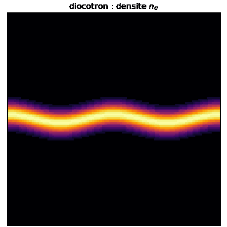

# adc_cpp

Solveur advection-diffusion-couplage : systeme hyperbolique-elliptique couple,
concu des le depart pour l'AMR dynamique, OpenMP, MPI et Kokkos, cible cluster.

Forme generale resolue :

```
d U / d t + div F(U, phi) = div H(U, grad U) + S(U, phi)
D phi = f(U)
```

Cas H = 0 pour l'instant. Cible de validation : l'instabilite diocotron
(transport E x B d'une densite electronique couple a Poisson).

## Validation : instabilite diocotron

Une bande de charge cree un ecoulement E x B cisaille, instable a une
perturbation le long de la bande : les bords s'enroulent en "cat's eyes". Le
systeme diocotron est isomorphe a la dynamique tourbillonnaire 2D d'Euler
(densite = vorticite, potentiel = fonction de courant), donc c'est l'instabilite
de Kelvin-Helmholtz d'une couche de cisaillement.


Resultat (mode m=2, couplage Poisson resolu par la multigrille maison a chaque
etage, reconstruction VanLeer ordre 2) : croissance exponentielle dans la phase
lineaire puis saturation non lineaire. Le taux de croissance mesure est
independant du maillage, donc physique :

| n   | gamma |
|-----|-------|
| 128 | 0.086 |
| 192 | 0.086 |
| 256 | 0.086 |

Le spectre KH est respecte : les grands modes (m=1, m=2) croissent, les petits
(m=3 et au-dela) sont stables. Reproduire :

```bash
cmake --build build --target diocotron
./build/bin/diocotron /tmp/dio 256 700 2
python scripts/plot_diocotron_growth.py /tmp/dio/diocotron_amp.csv docs/fig_diocotron_growth.png
python scripts/make_diocotron_gif.py /tmp/dio docs/anim_diocotron.gif
```

### Colonne creuse en cavite (cas canonique)

Le cas de reference de la litterature (Davidson-Felice 1998 ; Hoffart, Maier,
Shadid, Tomas 2025, arXiv:2510.11808, fig. 5.1-5.3) : un anneau de charge creux
dans une cavite conductrice, perturbe sur le mode azimutal l. Le mode l croit en
l tourbillons "cat's eyes" disposes en anneau.

Point cle : leur difficulte (schema implicite, complement de Schur PDE) sert a
atteindre la limite de derive magnetique depuis le modele complet a beta=1e6
(echelles cyclotron / plasma / diocotron separees de 10 ordres). Notre modele
guiding-center vit deja dans cette limite : on resout directement le transport
E x B de n_e, explicitement. On obtient donc la meme instabilite, bien plus
simplement.


La selection de mode est exacte : l = 3, 4, 5 donnent 3, 4, 5 tourbillons, en
accord visuel direct avec les figures 5.1-5.3 du papier. Reproduire :

```bash
cmake --build build --target diocotron_column
for L in 3 4 5; do ./build/bin/diocotron_column /tmp/col$L 256 1500 $L; done
python scripts/plot_diocotron_modes.py docs/fig_diocotron_modes.png /tmp/col3 /tmp/col4 /tmp/col5
python scripts/make_diocotron_gif.py /tmp/col3 docs/anim_diocotron_column.gif
```

### Taux de croissance : validation contre la theorie lineaire (fig 5.4)

Un eigensolver radial (host Eigen) resout le probleme aux valeurs propres
diocotron de Petri (arXiv:astro-ph/0611936, eq. 20-21), equivalent a
Davidson-Felice : `ω L_m φ = mΩ L_m φ + q_m φ`, discretise en differences finies
et resolu par `M = L⁻¹A` avec `Eigen::EigenSolver`. C'est le seul usage d'Eigen,
cote host, conformement a la decision d'architecture.


Pour la geometrie du papier (a=6, b=8, R=16), il reproduit les taux theoriques
publies a mieux que 0.5 % :

| ℓ | eigensolver | Hoffart et al. (fig 5.4) |
|---|---|---|
| 3 | 0.772 | 0.772 |
| 4 | 0.912 | 0.911 |
| 5 | 0.686 | 0.683 |

Le spectre culmine a ℓ=4 et se coupe a ℓ≥6 (cutoff haute frequence), comme dans
le papier. C'est la fig 5.4 du papier reproduite cote theorie. La simulation non
lineaire reproduit la phenomenologie (les ℓ tourbillons) et la tendance du
spectre ; son taux absolu est attenue par la diffusion numerique du schema, donc
la comparaison theorie/simulation reste qualitative a cette resolution.

Reproduire :

```bash
cmake --build build --target diocotron_theory
./build/bin/diocotron_theory 6 8 16 /tmp/theory.csv
python scripts/plot_diocotron_theory.py /tmp/theory.csv docs/fig_diocotron_theory.png
```

## AMR dans le temps : diocotron raffine

Le transport est integre sur une hierarchie 2 niveaux avec **sous-cyclage
Berger-Oliger** (le niveau fin fait r=2 sous-pas de dt/2) et **reflux**
(`FluxRegister` : le flux grossier a l'interface est remplace par la somme des
flux fins). Resultat : conservation de masse a l'arrondi (1e-15) ET stabilite.

Le couplage est **decouple** : phi etant lisse, Poisson est resolu sur la grille
grossiere uniforme (la multigrille maison), et aux = grad phi est injecte vers le
niveau fin. Pas de Poisson composite : l'AMR ne porte que le transport.


La couche de cisaillement (mode m=2) s'enroule en deux tourbillons, resolus dans
la zone raffinee (cadre cyan), avec une fraction des degres de liberte d'une
grille uniforme equivalente. Reproduire :

```bash
cmake --build build --target diocotron_amr
./build/bin/diocotron_amr /tmp/dio_amr 128 500
```

Le **regrid est dynamique** : toutes les 20 iterations, les cellules dont la
densite depasse le fond sont taguees, on en prend le bounding box, on l'elargit
d'un buffer et on le clippe a l'interieur ; la nouvelle box fine est reallouee et
l'etat transfere (ancien fin la ou il existe, sinon injection depuis le grossier
synchronise). Le cadre cyan de l'animation suit ainsi les structures (extents lus
dans `boxes.csv`), et la masse reste conservee a l'arrondi a travers chaque
remaillage (drift ~1e-15).

Le sous-cyclage + reflux se generalise a **N niveaux emboites** par recursion
(`amr_multilevel.hpp`) : chaque niveau qui possede un enfant joue le role du
grossier de l'etape 2-niveaux vis-a-vis de cet enfant (flux grossier sauve,
flux fins accumules sur les r sous-pas, average_down, reflux). Le niveau le plus
fin d'une pile a 3 etages fait r*r = 4 sous-pas par pas grossier. Le test
`test_amr_multilevel` valide la conservation a l'arrondi (drift ~1e-16) et la
borne de la solution sur 3 niveaux.


Le pas couple AMR (sync + Poisson grossier + aux = grad phi injecte +
sous-cyclage/reflux multi-niveaux) est un **composant reutilisable**
`AmrExBStepper<Model>` (`coupling/amr_coupler.hpp`, pendant AMR du
`SpectralExBStepper`) : `diocotron_amr3` ne reimplemente plus la boucle, il ne
garde que ce qui lui est propre (le critere de regrid) et appelle `sim.step(dt)`.
L'aux est resynchronise automatiquement quand un regrid change une box.

Le demo `diocotron_amr3` met cette pile en oeuvre : niveau 0 grossier (Poisson +
transport), niveau 1 (cadre cyan, ratio 2) qui suit la bande de charge, niveau 2
(cadre lime, ratio 4) qui suit l'interface de cisaillement et les filaments. Le
tag est un **critere gradient** (magnitude de la difference centrale non-divisee,
proxy d'erreur de troncature facon Berger-Colella) avec seuil relatif au max :
il raffine les zones de forte variation (bords, braids) plutot que les pics de
densite, et s'adapte a la decroissance des gradients par diffusion. Le regrid est
**imbrique** : le niveau 2 est retague depuis le niveau 1 a chaque remaillage et
clippe strictement a l'interieur du niveau 1 (nesting). La masse reste conservee
a l'arrondi (drift ~1e-15 sur 500 pas). L'animation est un montage composite :
chaque niveau est dessine a sa vraie resolution sur son extent.

```bash
cmake --build build --target diocotron_amr3
./build/bin/diocotron_amr3 /tmp/dio3 128 500
python scripts/make_diocotron_amr3_gif.py /tmp/dio3 docs/anim_diocotron_amr3.gif
```

## Niveau d'abstraction

Trois axes orthogonaux qui ne se melangent jamais :

| Axe | Question | Qui le porte |
|---|---|---|
| Quoi calculer | la physique | `PhysicalModel` : fonctions pures sur des etats ponctuels |
| Ou / comment iterer | le parallelisme | maillage + dispatch (`parallel_for`) |
| Dans quel ordre | le temps | integrateur + coupleur |

Invariant central : **AMR, MPI et Kokkos sont des proprietes de la couche
donnees/maillage. Ils n'apparaissent jamais dans la couche physique.** Un
`PhysicalModel` ne voit jamais une box, un rang MPI, un ghost ni une vue
Kokkos. On lui passe des etats ponctuels, il rend des flux/sources ponctuels.
C'est ce qui le rend portable CPU et device : il ne touche a aucun parallelisme.

## Couches

Fige (le socle, ecrit une fois) :
- maillage : abstraction box/patch, hierarchie de niveaux
- tableau distribue (equivalent `MultiFab`) : memoire, layout, rangs MPI, ghosts
- dispatch `parallel_for` (Kokkos) sur les boxes
- echange de halos
- machinerie AMR : regridding (tagging, clustering Berger-Rigoutsos, equilibrage
  de charge), prolongation/restriction, registres de reflux
- squelette d'avancement temporel (sous-cyclage en temps entre niveaux)

Generalise (interchangeable, exprime en concept/template) :
- `PhysicalModel` : formules ponctuelles
- reconstruction (MUSCL/WENO)
- solveur de Riemann
- backend elliptique
- integrateur temporel (SSPRK2/3, IMEX)
- strategie de couplage (split, par etage, monolithique)

## Operateur spatial

L'objet qui assemble le residu spatial complet :

```
R(U, aux) = -div F(U, aux) + S(U, aux)
```

Par box : echange de halos, reconstruction, flux numerique (Riemann aux faces),
divergence, source, et sur AMR enregistrement des flux coarse-fine pour le
reflux. Il consomme `aux` (phi et grad phi produits par la resolution
elliptique), il ne possede ni l'integration temporelle ni l'elliptique.
C'est la fleche "PDE -> systeme d'ODE" de la methode des lignes : l'integrateur
reste agnostique du modele et de la discretisation.

`flux` et `source` du modele prennent tous deux `aux`. C'est le point qui unifie
diocotron (le potentiel entre par le flux) et Euler-Poisson (il entre par la
source) sous un seul operateur, sans branchement par modele.

Boucle par pas :

```
advance(U, dt):
    fill_ghosts(U)                    # maillage (MPI/Kokkos)
    b   = model.elliptic_rhs(U)       # modele (ponctuel)
    phi = elliptic.solve(b)           # backend elliptique (decomposition propre)
    aux = derive(phi)                 # phi, grad phi
    R   = spatial_op.assemble(U, aux) # reconstruction + flux + div + source + reflux
    U   = integrator.update(U, R, dt) # integrateur (agnostique)
```

## Solveur elliptique

Maillage cartesien structure + Poisson a coefficient constant (ou epsilon lisse)
appelle une multigrille geometrique (FAC / MLMG), pas une FFT (incompatible AMR
et difficile a distribuer) ni une multigrille algebrique (utile seulement sur
maillage non structure ou coefficients durs). Interface abstraite `EllipticSolver`
pour brancher PETSc/hypre BoomerAMG comme oracle de verification et repli sur
coefficients durs.

## Decisions

- socle maillage/AMR : mini-AMReX maison (block-structured AMR ecrit a la main,
  inspire d'AMReX / Parthenon / AthenaK)
- dispatch / donnees : seam maison (`Box2D` / `Fab2D` / `for_each_cell`) calque
  sur la semantique Kokkos (handle `Array4` capture par valeur, fonctor sur
  indices). Backend OpenMP maintenant, backend Kokkos branchable au passage
  cluster sans toucher la logique AMR. La physique reste agnostique du backend.
- elliptique : multigrille geometrique maison (FAC sur la hierarchie), interface
  abstraite pour brancher PETSc/hypre en oracle de verification
- Eigen : cote host uniquement (bottom solve dense, decompositions
  caracteristiques Euler, post-traitement). Jamais dans le hot path : l'etat
  ponctuel (`StateVec`) et le stockage (`Fab2D`) restent device-safe pour le
  passage Kokkos/GPU. Tire au premier besoin host reel, pas avant.
- couplage : a fixer (splitting pour diocotron non raide, IMEX/well-balanced
  pour le regime quasi-neutre, longueur de Debye -> 0)

## Plan mini-AMReX

1. index space : `Box2D` (fait)
2. donnees mono-grille : `Fab2D` + `Array4` + `for_each_cell` (fait)
3. decomposition : `BoxArray` + `DistributionMapping` + seam `comm` (fait)
4. conteneur multi-grille : `MultiFab` (collection de `Fab2D` + ghosts) (fait)
5. echange de halos : `fill_boundary` (intra-niveau, periodique, cross-rang MPI) (fait)
6. CL physiques : Foextrap / Dirichlet au bord du domaine (fait)
7a. hierarchie AMR + transfert : `AmrHierarchy`, `average_down`, `interpolate`,
    `parallel_copy` (fait)
7b. regrid dynamique : tagging, Berger-Rigoutsos, proper nesting (fait)
8. reflux : `FluxRegister` coarse-fine
9a. operateur spatial : `Geometry` + `assemble_rhs` (Rusanov 1er ordre) (fait)
9b. reconstruction MUSCL + limiteurs (Minmod, VanLeer), ordre 2 (fait)
10a. integrateur temporel : SSPRK2 mono-niveau (fait)
10b. sous-cyclage AMR + reflux
11a. multigrille geometrique maison (Laplacien, GS red-black, V-cycle) (fait)
11b. derivation aux = grad phi + coupleur (Poisson -> aux -> advance) (fait)

## Etat

Couche physique : concept `PhysicalModel`, types ponctuels `StateVec` / `Aux`,
premier modele conforme (`Diocotron`).

Couche donnees/maillage : index space `Box2D`, donnees mono-grille `Fab2D`
(layout composante-lente, ghosts) avec handle `Array4` capturable par valeur, et
dispatch `for_each_cell` (backend OpenMP, miroir de Kokkos `parallel_for`).
Decomposition `BoxArray` + `DistributionMapping` sur le seam `comm`, champ
distribue `MultiFab` (n'alloue que les fabs de `my_rank()`), echange de halos
`fill_boundary` (intra-niveau, wrapping periodique) et CL physiques
(`fill_physical_bc` : Foextrap, Dirichlet). Equilibrage de charge
(`parallel/load_balance.hpp`) : distribution **Z-order** (segments contigus le
long de la courbe de Morton, localite) et **knapsack** (LPT, desequilibre max
minimal), avec metrique de desequilibre.

**Backend MPI** (`-DADC_USE_MPI=ON`, optionnel, OFF par defaut) : le seam `comm`
passe par `MPI_Comm_rank/size` + collectives (`all_reduce_sum/max`, `barrier`).
Sans le flag, ou si MPI n'est pas initialise, tout reste serie (rang unique).
Le `MultiFab` etant deja distribue par `DistributionMapping`, `sum(mf)` agrege
via all-reduce et donne le meme resultat quel que soit le nombre de rangs.

L'**echange de halos est distribue** : `fill_boundary` fait les copies locales
puis, pour les paires coupant un bord de rang, agrege un message par voisin
(`MPI_Isend/Irecv`). Les metadonnees etant repliquees, les deux rangs d'une paire
enumerent la meme liste de jobs dans le meme ordre, donc la disposition des
tampons coincide sans negocier les tailles. La recherche des paires de voisins
passe par un **hash spatial** (`box_hash.hpp`, sect. 3.3) : au lieu de balayer
tout le `BoxArray` (O(N) par box), on n'interroge que les bins recouvrant la box
fantome, ce qui ramene la recherche a ~O(n), n << N. La requete rend un
sur-ensemble trie ; le test d'intersection exact reste fait par l'appelant
(aucune omission possible : deux boxes qui s'intersectent partagent un bin). Verifie par `test_mpi_smoke`
(somme globale invariante au nombre de rangs), `test_mpi_fillboundary` (ghosts
remplis depuis des fabs distants, egaux a la valeur periodique attendue, coins
compris) et `test_mpi_advect` (capstone : un pas d'advection complet sur
`MultiFab` reparti egale **bit a bit** le calcul serie mono-Fab, maxdiff = 0 a
np=1/2/4/7), lances via `mpirun -np 4`.

Valide hors-Mac sur **ROMEO 2025** (partition CPU `x64cpu`, gcc 14 + Open MPI
5.0.5, C++23) : les trois tests passent via `srun`, y compris en **multi-noeud**
(2 noeuds x 4 = 8 rangs, halos a travers l'interconnect), avec le capstone
toujours bit a bit (maxdiff = 0) et la somme globale invariante de np=1 a 16. Le
workflow build + run est fige dans `scripts/romeo_mpi.sbatch`.

Poisson distribue **spectral** (`elliptic/poisson_fft.hpp`) : pour le domaine
periodique, le solveur propre est la FFT, qui resout EXACTEMENT le Laplacien
5-points (valeur propre discrete, mode nul a zero). Distribue par bandes : FFT-x
locale, transpose parallele (`MPI_Alltoall`), FFT-y locale, division spectrale,
inverse. `test_mpi_poisson` verifie le residu `lap_h(phi) - rho` a 2e-14
(arrondi) et l'invariance au nombre de rangs (np=1 a 8). FFT 1D radix-2 maison.

**Diocotron distribue bout-en-bout** (`test_mpi_diocotron`) : K pas couples
transport (advection E x B, Rusanov) + Poisson spectral distribue, sur une
decomposition en bandes (meme layout que la FFT). A chaque pas : rho = alpha
(n_e - n_i0) -> solve FFT -> phi -> halos -> aux = grad phi -> halos -> advance
par bande. Le resultat egale **bit a bit** une reference serie pleine grille
(maxdiff = 0 a np=1/2/4/8), y compris en multi-noeud sur ROMEO (8 rangs, 2
noeuds). C'est le pendant MPI du demo AMR 3 niveaux : toute la chaine
distribution + halos + Poisson reparti + transport, exacte.

**Redistribution generale** (`parallel_copy`, le `ParallelCopy` d'AMReX) : copie
les regions valides qui se recouvrent entre deux `MultiFab` sur le meme domaine
mais a decompositions differentes (tuiles 2D <-> bandes FFT), y compris
cross-rang (meme machinerie agregee + hash spatial que `fill_boundary`). Cela
delie le layout du transport (tuiles 2D quelconques) de celui du Poisson
(bandes) : un remap suffit entre les deux. `test_mpi_redistribute` valide un
aller-retour tuiles<->bandes a l'identite (np=1 a 8, multi-noeud ROMEO). La
brique sert aussi a `average_down` / `interpolate` / `regrid`, desormais
corrects en distribue.



Le pas couple distribue (transport E x B + Poisson spectral, en bandes) est un
**composant reutilisable** `SpectralExBStepper<Model>` (`coupling/spectral_coupler.hpp`),
generique sur le modele : on construit, on remplit `state()`, on boucle `step(dt)`.
Le demo `diocotron_mpi` et le test `test_mpi_diocotron` ne reimplementent plus la
boucle, ils l'**utilisent** ; c'est l'esprit composant de MUFFIN (`Simulation`),
mais compile-time/template (zero virtuel, GPU-ready) plutot que factory runtime.
C'est le pendant distribue du `Coupler<Model>` (multigrille, mono-niveau). Le demo
produit ses instantanes en rassemblant la densite sur le rang 0 (`MPI_Gather`) :
la couche de cisaillement (mode m=2) s'enroule en deux tourbillons, version MPI du
demo AMR 3 niveaux. La physique etant invariante au nombre de rangs (bit a bit,
`test_mpi_diocotron` valide le composant contre une reference serie pleine grille),
les images sont rendues a partir d'un run du meme binaire. Reproduire :

```bash
mpirun -np 4 ./build-mpi/bin/diocotron_mpi /tmp/dio_mpi 128 600
python scripts/make_diocotron_gif.py /tmp/dio_mpi docs/anim_diocotron_mpi.gif
```

**Recouvrement calcul/comm** (sect. 4.3) : `fill_boundary` est decoupe en deux
phases non-bloquantes. `fill_boundary_begin` fait les copies locales et poste les
`MPI_Isend/Irecv` ; entre `begin` et `end` on avance l'**interieur** (qui ne
depend d'aucun ghost distant) pendant que les halos transitent ; puis
`fill_boundary_end` attend la reception, deballe, et on avance le **bord**.
`test_mpi_overlap` verifie que ce schema recouvert egale **bit a bit** l'advance
bloquante (maxdiff = 0, np=1 a 8). La version bloquante `fill_boundary` appelle
simplement `begin` puis `end`.

**GPU (Grace Hopper)** : le seam `Array4` est deja calque sur une vue Kokkos.
Un macro `ADC_HD` (= `__host__ __device__` sous nvcc/hip, vide sinon) rend
`Array4::operator()` appelable dans un kernel device, sans aucun effet sur le
build CPU. Le demo `examples/gpu/advect_cuda.cu` execute un pas d'advection
E x B (flux de Rusanov) dans un kernel CUDA en reutilisant TELLE QUELLE la vue
`Array4` (meme layout SoA, meme indexation), et valide le resultat contre le CPU.
Verifie sur ROMEO partition `armgpu` (Nvidia **GH200 120GB**, CUDA 12.6, gcc 11) :
`maxdiff(GPU vs CPU) = 0`. Build + run : `scripts/romeo_gpu.sbatch` (l'aarch64 +
CUDA ne se compile que sur un noeud `armgpu`, pas sur le login).

Surtout, le **seam `for_each_cell` lui-meme** a un backend Kokkos
(`#ifdef ADC_HAS_KOKKOS` -> `Kokkos::parallel_for(MDRangePolicy<Rank<2>>)`, a cote
des backends serie et OpenMP). Le demo `examples/gpu/advect_kokkos.cpp` appelle
le **MEME** `for_each_cell(box, kernel)` que le code CPU ; sous `ADC_HAS_KOKKOS`
il lance un kernel sur l'espace **Cuda** du GH200, le fonctor (lambda `ADC_HD`)
operant sur une vue `Array4` device-residente : `maxdiff(Kokkos vs CPU) = 2e-16`.
Le passage CPU -> GPU ne touche donc PAS les sites d'appel, seulement le backend.
Kokkos 4.4 est compile maison (CUDA + `Kokkos_ARCH_HOPPER90`) dans le scratch ; le
demo se construit via `examples/gpu/CMakeLists.txt` (`find_package(Kokkos)` +
`nvcc_wrapper`).

**Etape 2 (faite) : donnee device-residente.** Le stockage de `Fab2D` passe par
un allocateur selectionnable (`core/allocator.hpp`) : sous CUDA c'est la memoire
UNIFIEE (`cudaMallocManaged`), accessible de facon coherente hote ET device sur le
GH200 (Grace+Hopper, NVLink-C2C), tout en gardant la semantique VALEUR du
`std::vector` (copie profonde -> reflux/average_down restent corrects). Le build
CPU est byte-identique (l'alias se reduit a `std::allocator`). Le demo
`examples/gpu/advect_fab_kokkos.cpp` execute un pas d'advection sur le VRAI
`Fab2D` via `for_each_cell` (backend Kokkos -> Cuda) DIRECTEMENT sur ses vues
`Array4`, **sans aucun buffer device manuel ni deep_copy** : `maxdiff = 2e-16`. La
structure de donnees de la lib tourne donc sur GPU.

**Etape 3 (faite) : un vrai operateur sur GPU.** Le pas de transport
`advance_fab_1c` (flux de Rusanov via le modele `Diocotron`, Euler explicite)
tourne ENTIEREMENT sur GPU sans une ligne de code GPU dans l'operateur : ses
boucles passent par `for_each_cell` (backend Kokkos), la chaine flux (`StateVec`,
`load_aux`, `rusanov_flux`, methodes du modele) est annotee `ADC_HD`, et le
`Fab2D` est en memoire unifiee. `StateVec` utilise un tableau C (pas `std::array`)
et le flux evite `std::max`/`std::fabs` -> noyau device-trivial, sans dependance
a `--expt-relaxed-constexpr`. Le demo `examples/gpu/advance_fab_kokkos.cpp` valide
`maxdiff = 2e-16` sur GH200. Seuls le backend (`for_each_cell`) et l'allocateur
(`Fab2D`) ont change ; l'operateur, lui, est le meme qu'en CPU.

L'operateur hyperbolique d'ordre 2 suit : `assemble_rhs` (reconstruction MUSCL
**Minmod** + flux de Rusanov + source, le RHS de l'integrateur SSPRK) utilisait
deja `for_each_cell` ; il a suffi d'annoter `ADC_HD` son lambda, `reconstruct` et
les limiteurs (avec `min`/`abs` manuels, device-safe). `examples/gpu/rhs_kokkos.cpp`
le valide sur GH200 (`maxdiff = 3e-14` vs reference serie utilisant les memes
fonctions). Donc transport 1er ordre ET MUSCL ordre 2 tournent sur GPU.

Les briques de la multigrille geometrique suivent : l'operateur de Poisson 5
points (`apply_laplacian`, `poisson_residual`) et le lisseur Gauss-Seidel
red-black (`gs_color`) utilisaient deja `for_each_cell` ; on annote `ADC_HD` leurs
lambdas et celui de `copy_shifted` (remplissage de halos), si bien que residu,
lisseur ET remplissage de ghosts tournent sur le GPU. Subtilite : `gs_rb_sweep`
et `poisson_residual` alternent kernels device et remplissages de bord faits cote
hote sur la memoire unifiee ; un `device_fence()` (= `Kokkos::fence`, no-op hors
Kokkos) avant chaque lecture hote evite de lire un `phi` encore en cours
d'ecriture par un kernel. `examples/gpu/poisson_kokkos.cpp` valide sur GH200 :
`poisson_residual` bit a bit identique a la reference serie (`maxdiff = 0`), et
`gs_smooth` fait chuter le residu (lisseur + barrieres OK de bout en bout).

Le **V-cycle entier** suit : on route aussi les operateurs de transfert AMR
(`average_down` / `interpolate` via `for_each_cell` + `ADC_HD`, `coarsen_index`
annote `ADC_HD`) et l'arithmetique de `MultiFab` (`saxpy` / `lincomb` sur
`for_each_cell`). Les seuls points hote restants portent un `device_fence()` :
remplissage de bord (dans `gs`/`residu`), reduction `norm_inf` et `set_val`. Le
V-cycle devient une chaine de kernels device, ordonnancee sur le stream par
defaut. `examples/gpu/mg_kokkos.cpp` valide `GeometricMG::solve` sur GH200, probleme
manufacture Dirichlet : hierarchie 7 niveaux (128 -> 2), **9 V-cycles** pour un
residu relatif de `8e-11`, solution exacte a `err = 5e-5` = O(dx^2). Tout le
solveur elliptique tourne donc sur GPU.

**Capstone : un PAS COUPLE entier sur GPU.** `Coupler<Diocotron>::advance` enchaine,
par etage SSPRK2 : `f = elliptic_rhs(U)` -> multigrille `lap(phi)=f` -> `aux =
(phi, grad phi)` -> `assemble_rhs` MUSCL -> mise a jour `saxpy`/`lincomb`. Toutes
ces briques passent deja par `for_each_cell` ; il a suffi d'annoter `ADC_HD` les
deux lambdas du coupleur (extraites hors des methodes privees, car nvcc interdit
un lambda etendu `__host__ __device__` dans une methode privee). Une finesse de
plus : `for_each_cell` fixe `Kokkos::IndexType<int>` (indices SIGNES) car les
boites de ghosts ont des bornes basses negatives (le `copy_shifted` periodique),
que `MDRangePolicy` refuse sinon. `examples/gpu/coupled_kokkos.cpp` se compile en
CPU (sans Kokkos) ET en GPU (avec) depuis la MEME source : 20 pas couples d'un
diocotron periodique donnent des sommes de controle **bit a bit identiques** entre
le CPU (serie) et le GH200 (Cuda) (`sum(U^2) = 1.6752629937e+04`, `max|U| =
1.2998083392e+00`), masse conservee exactement. Le pas couple Euler-Poisson tourne
donc entierement sur GPU et donne le meme resultat que le CPU.

**Pool memoire (Arena).** Un `cudaMallocManaged` par petit Fab temporaire (etages
SSPRK, niveaux de la multigrille) est lent. `core/allocator.hpp` ajoute un cache
(`ManagedArena`) : free-list par taille en octets, qui RECYCLE les blocs liberes au
lieu de les rendre au pilote. Subtilite de correction : `cudaFree` synchronise
implicitement le device, ce qui protegeait la destruction d'un Fab dont un kernel
etait encore en vol ; le pool ne faisant pas de `cudaFree`, on reproduit cette
barriere EN LOT (un bloc libere passe en attente ; une seule `cudaDeviceSynchronize`
draine le device et rend tous les blocs reutilisables quand une allocation en manque).
La semantique valeur de `Fab2D` est intacte (chaque vecteur possede un bloc distinct,
le pool est un singleton sans etat). `examples/gpu/arena_kokkos.cpp` sur GH200 : apres
le rodage du premier pas, **0 nouveau `cudaMallocManaged`** sur les pas suivants
(`misses` constant a 32, des milliers de recyclages), et `coupled_kokkos` reste
**bit a bit identique** au CPU. La validation CPU (23/23) est inchangee (le pool
n'existe que dans la branche memoire unifiee).

Couche AMR : `AmrHierarchy` (niveaux, ratio de raffinement), operateurs de
transfert `average_down` (moyenne conservative fin->grossier) et `interpolate`
(injection grossier->fin) sur la brique `parallel_copy`, clustering
Berger-Rigoutsos et regrid dynamique (tagging, buffer, nesting).

Couche physique/temps : `Geometry` (coords physiques, dx par niveau),
operateur spatial `assemble_rhs` (flux de Rusanov, R = -div F + S consommant
aux) avec reconstruction au choix par template (NoSlope 1er ordre, MUSCL
Minmod/VanLeer ordre 2) et integrateur `advance_ssprk2`. Advection bout-en-bout
du diocotron a aux prescrit : masse conservee, positivite, vitesse correcte.
Convergence mesuree : ordre 1.86 (VanLeer) contre 0.89 (Rusanov 1er ordre).

Couche elliptique : multigrille geometrique maison `GeometricMG` (Laplacien 5
points, lisseur Gauss-Seidel red-black, V-cycle, restriction par `average_down`
et prolongation par `interpolate`). Convergence independante du maillage
(8 V-cycles a n=32 comme n=64) et precision O(dx^2) sur solutions manufacturees
Dirichlet et periodique.

Couplage : `Coupler` ferme la boucle hyperbolique-elliptique stade par stade
(elliptic_rhs -> resolution multigrille -> aux = grad phi par differences
centrees -> assemble_rhs -> SSPRK2). Diocotron : equilibre neutre stationnaire,
masse conservee et positivite preservee sous dynamique couplee non triviale.

Modele Euler compressible 2D (`model/euler.hpp`) : gaz parfait, U = (rho, rho u,
rho v, E), flux directionnel et `max_wave_speed = |v_dir| + c`, instance du concept
`PhysicalModel` (donc directement utilisable par `assemble_rhs<Limiter,
NumericalFlux>` + `advance_ssprk2`, et device-callable `ADC_HD`). `source = 0`
(Euler pur), `elliptic_rhs = rho` (prepare Euler-Poisson auto-gravitant). Valide
par `test_euler` : preservation d'un etat uniforme (`max|R| = 0`) et tourbillon
isentropique advecte, ordre de convergence **1.86 (VanLeer)** vers l'ordre 2
attendu (Minmod 1.50, ecretage des extrema lisses), positivite preservee.

Modele Euler-Poisson auto-gravitant (`model/euler_poisson.hpp`) : Euler couple a la
gravite, `lap phi = 4 pi G (rho - rho0)`, source = force `g = -grad phi` sur la
quantite de mouvement et l'energie. La partie hydrodynamique est deleguee a `Euler`
(seules la source et `elliptic_rhs` changent) : c'est le chemin "aux entre par la
source" du concept, et il se branche TEL QUEL sur `Coupler<EulerPoisson>`. Valide par
`test_euler_poisson` (theorie de Jeans, regime stable) : une perturbation oscille a
`omega = sqrt(c_s^2 k^2 - 4 pi G rho0)`, mesure **a 0.1%** de la theorie ; quantite de
mouvement totale conservee a `1e-16` (gravite interne) et masse conservee. Le meme
`Coupler` porte donc diocotron (aux dans le flux) ET Euler-Poisson (aux dans la
source) sans changement. Et il tourne SUR GPU sans modification :
`examples/gpu/euler_poisson_kokkos.cpp` (meme source CPU et GPU) execute le pas
couple a 4 variables sur GH200, **bit a bit identique au CPU** (`sum(U^2) =
5.3248058096e+04`, quantite de mouvement conservee a `1e-18`). L'infrastructure
generique (`Coupler`, `for_each_cell`, multigrille, Arena) porte donc le modele
auto-gravitant a 4 variables sans aucun changement de code GPU.

Interfaces generiques (avant d'ajouter Euler-Poisson) : trois points de variation
sont extraits en politiques/concepts, sans toucher mesh/amr/parallel.
- `operator/numerical_flux.hpp` : le flux numerique est une POLITIQUE template, au
  meme titre que le limiteur. `assemble_rhs<Limiter, NumericalFlux>` et
  `advance_ssprk2<Limiter, NumericalFlux>` (defaut `RusanovFlux`). Trois flux
  fournis, tous `ADC_HD` (GPU-safe) : `RusanovFlux` (Lax-Friedrichs local, ne
  demande que `max_wave_speed`), `HLLFlux` et `HLLCFlux` (exigent `wave_speeds`
  signees, et `pressure` pour HLLC ; fournis par `Euler`). Valides par
  `test_riemann` (tube a choc de Sod contre la solution de Riemann EXACTE) :
  `L1(rho)` Rusanov `5.7e-3` > HLL `4.7e-3` > HLLC `4.6e-3` (HLLC capture l'onde de
  contact), positivite preservee pour les trois.
- `elliptic/elliptic_solver.hpp` : concept `EllipticSolver` (rhs/phi/solve/
  residual/geom). DEUX backends le modelent : `GeometricMG` (multigrille iterative)
  et `PoissonFFTSolver` (FFT directe, periodique). Le `Coupler` est generique sur le
  backend : `Coupler<Model, Elliptic = GeometricMG>` ; passer a `PoissonFFTSolver`
  ne change que le type, pas la logique. `test_fft_coupler` : memes resultats
  (`maxdiff = 1.6e-14`), et **~4.8x plus rapide** sur le pas couple (cf.
  PERFORMANCE.md), car la FFT inverse le Laplacien discret en direct.
- `coupling/coupling_policy.hpp` : `Coupler::advance<Limiter, Policy>` avec
  `PerStageCoupling` (phi a chaque etage, defaut) ou `OncePerStepCoupling` (un
  solve elliptique par pas). `test_interfaces` valide : flux defaut == explicite
  bit a bit, OncePerStep conserve la masse.

Termes raides et sortie distribuee (briques inspirees de MUFFIN) :
- `integrator/splitting.hpp` : splitting d'operateur `lie_step` (1er ordre) et
  `strang_step` (2e ordre), generiques sur des sous-pas (transport / source raide),
  prerequis aux sources chimiques/collisionnelles. Mesure : Strang ordre 2.00,
  Lie 1.00 sur un systeme non commutant a flot exact.
- `integrator/imex.hpp` : IMEX d'Euler (forward-backward) asymptotic-preserving,
  explicite sur le transport, implicite sur la source raide. Pont vers le vrai
  Euler-Poisson magnetique (Debye -> 0, Lorentz, quasi-neutralite du regime
  Hoffart). Sur une relaxation raide : stable et vers l'equilibre a dt >> eps la
  ou l'explicite explose ; ordre 1 en regime non raide.
- `model/langmuir.hpp` : noyau 0D du schema AP deux-fluides. Mode de Langmuir
  linearise (deux-fluides isotherme), ou la frequence plasma `omega_p` est le terme
  RAIDE (-> infini quand `lambda_D -> 0`), traitee en implicite (solve 2x2 A-stable),
  la correction acoustique `c_s^2 k^2` etant explicite. `test_two_fluid_ap` (via
  `imex_euler_step`) : a `omega_p = 1e3`, `dt omega_p = 10`, l'IMEX reste borne
  (`max|a| = 1.0`) la ou l'explicite explose (`1e200`) ; ordre 1 en non raide. C'est
  le terme raide du futur deux-fluides isotherme magnetique, valide avant le
  couplage spatial complet.
- `model/two_fluid_isothermal.hpp` : `TwoFluidLinear`, generalisation aux DEUX
  especes mobiles (electrons + ions isothermes). Les amplitudes de mode obeissent a
  `Ä = K A` (couplage 2x2), dont les frequences propres sont les DEUX branches du
  plasma : Langmuir (haute freq) ET ion-acoustique (basse freq, absente quand les
  ions sont figes). IMEX : plasma (`omega_pe, omega_pi`) implicite (solve 2x2
  A-stable), acoustique explicite. `test_two_fluid` : dispersion conforme (relations
  de Vieta exactes, limites k->0), AP (a `omega_pe = 1e3`, IMEX borne vs explicite a
  `1e200`), et le schema reproduit la branche de Langmuir a 0.1%.
- Deux-fluides SPATIAL 1D (non lineaire) : `test_two_fluid_spatial` transporte les
  DEUX especes (Euler isotherme, flux de Rusanov, conservatif) + Poisson 1D
  periodique + force de Lorentz, sur une grille. Il reproduit la dispersion de
  Langmuir mesuree sur la grille (`5.07` vs `5.19` theorique, **2.4%**), conserve la
  masse de chaque espece a `1e-14`, positivite preservee. Premier solveur reellement
  multi-especes spatial (sort du mode de Fourier).
- Deux-fluides SPATIAL 1D **asymptotic-preserving** : `test_two_fluid_ap_spatial` rend
  continuite + Lorentz implicites. En substituant, l'equation du champ devient
  `d_x[(1+beta)E] = charge*` avec `beta = dt^2 (omega_pe^2 n_e + omega_pi^2 n_i)`
  (Poisson reformule) : quand `omega_pe -> infini`, `E -> charge*/beta` et la
  quasi-neutralite est capturee a `dt` FIXE. Valide a `omega_pe = 1e3`,
  `dt*omega_pe = 5` : le schema reste **borne** (`max|dne| ~ 5e-7`) et **quasi-neutre
  au niveau machine** (`max|charge| ~ 8e-13`) la ou l'explicite **explose** ; masse
  conservee, dispersion reproduite a 10% en regime resolu. C'est le coeur de
  `APIMEXTwoFluidIsothermal` (MUFFIN).
- Deux-fluides SPATIAL **2D** AP, branche sur le solveur spectral du depot :
  `test_two_fluid_ap_2d`. Avec `beta0 = dt^2(omega_pe^2 + omega_pi^2)` CONSTANT (exact
  en regime lineaire), la reformulation retombe sur un Poisson a coefficient constant
  `Lap(phi) = (ne* - ni*)/(1+beta0)` : le `PoissonFFT` existant (memes valeurs propres
  du Laplacien 5-points) s'utilise tel quel, on divise juste le RHS par `1+beta0`.
  Valide a `omega_pe = 1e3`, `dt*omega_pe = 5` : **borne** (`max|dne| ~ 6e-7`),
  **quasi-neutre** (`max|charge| ~ 2e-11`) vs la version non stabilisee qui
  **explose** ; dispersion **isotrope** sur mode diagonal `k=(1,1)` a 3.1%, masse
  conservee par espece.
- Portage **MultiFab** du pas AP 2D : `test_two_fluid_ap_2d_mf`. Le meme schema, mais
  l'etat deux-especes vit dans des `MultiFab` (3 composantes `n, mx, my`), le transport
  passe par `for_each_cell`, les halos periodiques par `fill_boundary` et le champ par
  `PoissonFFTSolver` (le wrapper `EllipticSolver` autour de `PoissonFFT`). Resultats
  **bit-identiques** a la reference self-contained (`max|dne|=5.786e-7`,
  `max|charge|=2.076e-11`, dispersion 3.1%) : une fois ici, le solveur herite du seam
  de parallelisme (serial/OpenMP/Kokkos) et de la couche distribuee.
- Pas AP deux-fluides **entier sur GPU** : `integrator/two_fluid_ap.hpp` est le header
  PORTABLE partage (kernels `for_each_cell` `ADC_HD`, abs/max par ternaires, template
  sur l'`EllipticSolver`). `examples/gpu/two_fluid_ap_kokkos.cpp` utilise
  `TwoFluidAP2D<GeometricMG>` (elliptique entierement on-device) : transport Rusanov +
  Lorentz implicite + Poisson reformule par multigrille, tout en `for_each_cell`
  (backend Kokkos -> Cuda). **Valide sur ROMEO GH200** (`sbatch scripts/romeo_tfap.sbatch`)
  bit-identique au CPU a 10 chiffres (`exec=Cuda` : `max|dne|=5.7859390501e-7`,
  `max|charge|=2.0756063535e-11`, `sum(ne^2)=4096`, `dmasse=4e-11`). Reste : non
  lineaire upwind, niveaux AMR multi-especes, le magnetique complet (B).
- `analysis/hdf5_writer.hpp` (option `ADC_USE_HDF5`) : DataWriter HDF5 parallele.
  Chaque rang ecrit ses boites par hyperslab dans un dataset global, sans gather
  (MPI-IO independant). Aller-retour `maxdiff = 0` en serie ; ecriture sur 4 rangs
  MPI validee sur ROMEO (GPFS).

## Organisation du depot

```text
include/adc/   coeur GENERIQUE, header-only : concepts (PhysicalModel,
               NumericalFlux, EllipticSolver) et machinerie template (MultiFab,
               for_each_cell, Coupler, multigrille...). Tout y est template ou
               inline -> doit etre visible a l'instanciation, donc en en-tetes.
src/           facade COMPILEE -> libadc : solveurs concrets non templatises
               (DiocotronSolver, EulerPoissonSolver) en PIMPL, qui instancient la
               pile template UNE fois. API stable, sans template (apps, pybind11).
examples/      demos minces (main()) ; le solveur n'est PAS ici, il est dans
               include/ + src/.
examples/gpu/  demos Kokkos/CUDA (GH200).
tests/         tests unitaires et d'integration (CTest), + tests MPI.
```

C'est le meme decoupage que poisson_cpp (`.hpp` API + `.cpp` compiles), adapte a un
coeur template : ce qui PEUT etre concret (les solveurs "prets a l'emploi") vit dans
`src/` et se compile dans `libadc` ; ce qui DOIT rester template (les operateurs
generiques, le seam GPU) reste dans `include/`.

`python/` : bindings pybind11 de la facade (option `ADC_BUILD_PYTHON`). On expose les
solveurs CONCRETS (`DiocotronSolver`, `EulerPoissonSolver`), jamais les templates :
c'est tout l'interet du `src/`. Cote Python :

```python
import adc, numpy as np
cfg = adc.EulerPoissonConfig(); cfg.n = 128; cfg.use_fft = True
s = adc.EulerPoissonSolver(cfg)
for _ in range(100): s.step(2e-3)
rho = s.density()        # tableau numpy (n, n)
print(s.mass(), s.total_momentum(0))
```

Build : `cmake -B build -DADC_BUILD_PYTHON=ON` (pybind11 via find_package ou
FetchContent), `cmake --build build --target adc_py` -> `build/python/adc*.so`.

## Build

```bash
cmake -B build -DCMAKE_BUILD_TYPE=Release
cmake --build build -j
ctest --test-dir build --output-on-failure
```

Pre-requis : un compilateur C++23 (AppleClang/Homebrew clang 17+, GCC 13+),
CMake 3.20+.
