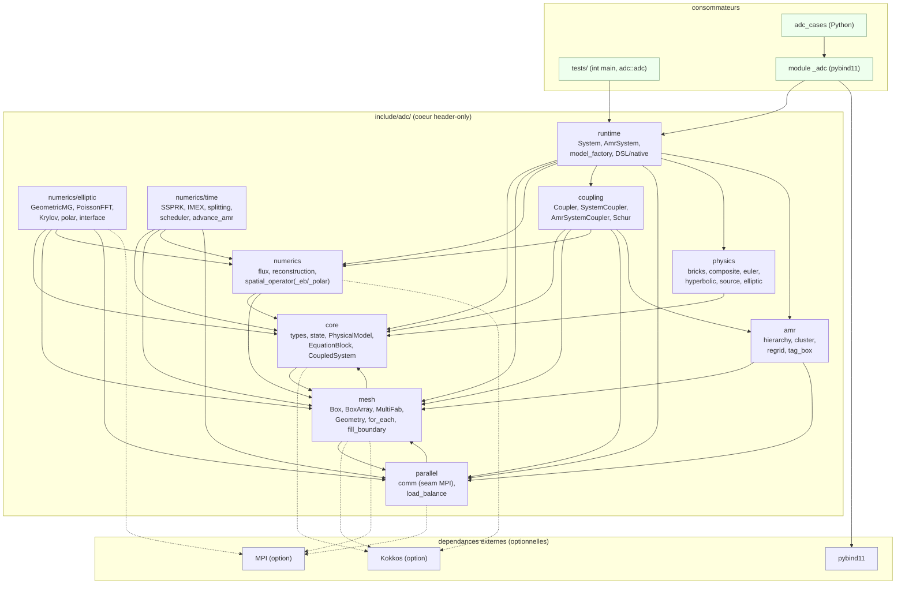
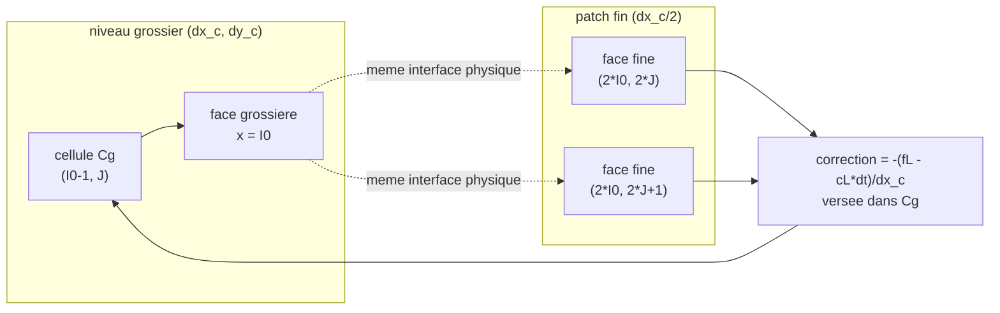
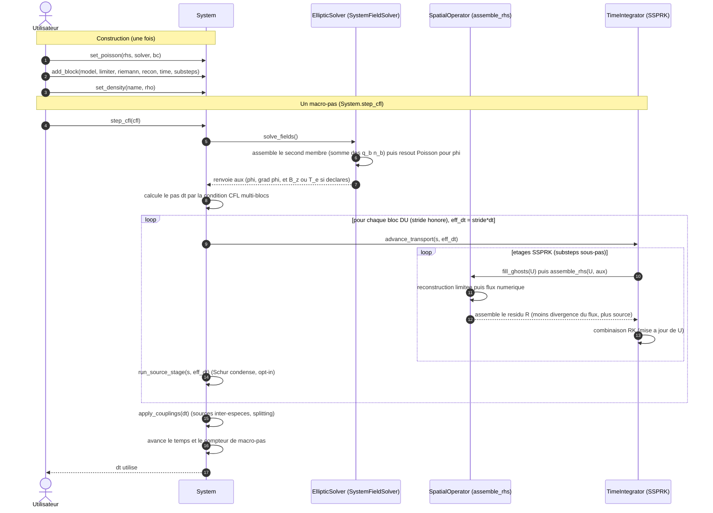
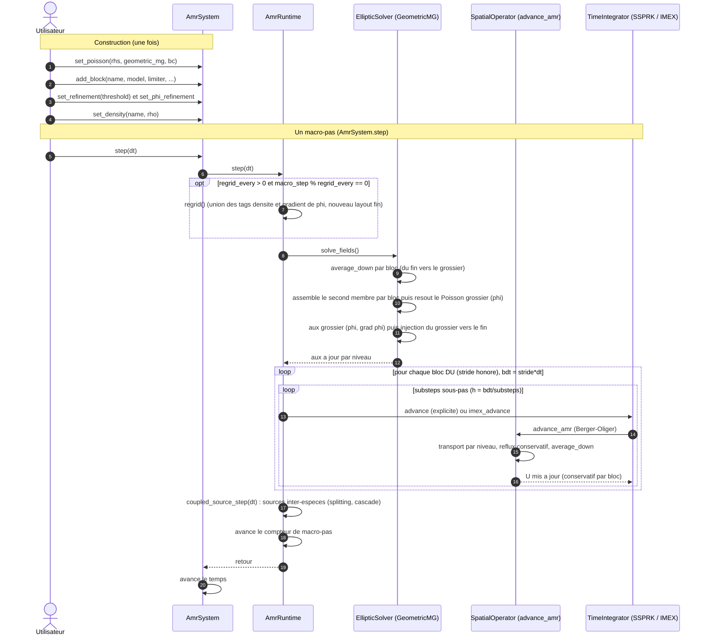

# Architecture de adc_cpp

adc_cpp est le coeur C++23 header-only pour les systemes hyperbolique-elliptique couples sur
maillage adaptatif (AMR), ecrit pour MPI + Kokkos (le backend OpenMP autonome est deprecie au
profit de Kokkos avec device OpenMP). Les briques physiques generiques
([`include/adc/physics/`](../include/adc/physics)) et les bindings Python de la lib (module
`adc`, extension compilee `_adc`, facades de composition `System` / `AmrSystem`) vivent ici ; le
depot voisin `adc_cases` ne contient que des cas d'utilisation Python qui importent ce module. Le
coeur est agnostique au modele : il ne nomme aucun scenario, il fournit des briques composees en
`CompositeModel`. Les couches sont orthogonales (physique, numerique, donnees/maillage, execution,
temps/couplage) et une couche haute ne depend jamais d'un detail d'execution.


## Sommaire

- [Vue d ensemble](#vue-d-ensemble)
- [Les couches](#les-couches)
- [Conventions de grille](#conventions-de-grille)
- [Stencil AMR coarse-fine (reflux)](#stencil-amr-coarse-fine-reflux)
- [Pipeline d un pas de temps](#pipeline-d-un-pas-de-temps)
- [Proprietes verifiees](#proprietes-verifiees)
- [Backends](#backends)
- [Thread safety](#thread-safety)
- [Utiliser la bibliotheque](#utiliser-la-bibliotheque)
- [Limitations](#limitations)
- [Arborescence](#arborescence)

---
## Vue d ensemble

Le diagramme ci-dessous montre les modules publics de [`include/adc/`](../include/adc), les
dependances externes reelles, et les consommateurs du coeur. Les fleches sont les inclusions
effectivement presentes dans les en-tetes (verifiees par `grep '#include <adc/...>'`). Les aretes
externes sont conditionnelles : Kokkos et MPI sont optionnels (`ADC_USE_KOKKOS`, `ADC_USE_MPI`),
pybind11 ne sert que le module Python. Le coeur reste utilisable en serie pure sans aucune des
deux. Note de fidelite : le projet n'embarque ni Eigen, ni fftw, ni Catch2 ; la FFT de
[`numerics/elliptic/poisson_fft.hpp`](../include/adc/numerics/elliptic/poisson_fft.hpp) est ecrite
a la main, et les tests sont des programmes `int main` qui lient `adc::adc` (pas de framework
tiers).




## Les couches

adc_cpp s'organise en cinq couches orthogonales. Une couche haute exprime le probleme, une couche basse l'execute ; une couche haute ne depend jamais d'un detail d'execution. La separation structurante : les conteneurs (ce qui stocke) sont distincts de la politique d'execution (comment on boucle et on communique).

**Physique (local, device-callable).** Le concept `PhysicalModel` ([`include/adc/core/physical_model.hpp`](../include/adc/core/physical_model.hpp)) n'expose que des lois locales et ponctuelles, toutes `ADC_HD` : `flux`, `source`, `max_wave_speed`, `elliptic_rhs`. Aucun acces au stockage ni au parallelisme ; pas d'allocation dans les boucles chaudes, pas de `std::function`, pas de polymorphisme dynamique. Le coeur est agnostique au modele : un modele est une composition (`CompositeModel`, [`include/adc/physics/composite.hpp`](../include/adc/physics/composite.hpp)) de briques generiques ([`include/adc/physics/bricks.hpp`](../include/adc/physics/bricks.hpp)) sur trois axes (transport / source / elliptique), les noms de scenario vivant cote application. Le canal `aux` porte `(phi, grad_x, grad_y)` et est extensible (`B_z`, `T_e`). La geometrie (cartesien / polaire / disque) est un axe de config du maillage, pas du modele.

**Numerique / discretisation.** La logique numerique locale : flux de Riemann ([`include/adc/numerics/numerical_flux.hpp`](../include/adc/numerics/numerical_flux.hpp) : Rusanov / HLL / HLLC / Roe, politiques `ADC_HD`), reconstruction MUSCL + WENO5-Z ([`include/adc/numerics/reconstruction.hpp`](../include/adc/numerics/reconstruction.hpp)), l'operateur elliptique ([`include/adc/numerics/elliptic/`](../include/adc/numerics/elliptic/)) et les CL logiques ([`include/adc/mesh/physical_bc.hpp`](../include/adc/mesh/physical_bc.hpp)). On distingue les politiques point-wise (flux, reconstruction, stencil : prennent des etats, ne voient aucun conteneur) des operateurs de grille (`assemble_rhs`, [`include/adc/numerics/spatial_operator.hpp`](../include/adc/numerics/spatial_operator.hpp)) qui bouclent sur une `Box` via une vue locale `Array4` mais ignorent la decomposition en boxes/rangs et le backend. Les variantes de geometrie sont purement additives : [`spatial_operator_eb.hpp`](../include/adc/numerics/spatial_operator_eb.hpp) (cut-cell) et [`spatial_operator_polar.hpp`](../include/adc/numerics/spatial_operator_polar.hpp), le cartesien restant bit-identique.

**Maillage / donnees.** Ce qui stocke : `box2d`, `box_array` ([`include/adc/mesh/box_array.hpp`](../include/adc/mesh/box_array.hpp)), `distribution_mapping` ([`include/adc/mesh/distribution_mapping.hpp`](../include/adc/mesh/distribution_mapping.hpp)), `multifab` ([`include/adc/mesh/multifab.hpp`](../include/adc/mesh/multifab.hpp)), `geometry` (cartesien + `PolarGeometry`, [`include/adc/mesh/geometry.hpp`](../include/adc/mesh/geometry.hpp)) et la hierarchie AMR. Ces conteneurs portent les champs distribues et leurs halos ; ils ne savent pas comment on boucle ni on communique.

**Execution (seams).** La politique d'execution, reduite a des seams qui ne voient que des vues minimales (Box2D, `Array4`, scalaire, rang), jamais `BoxArray` ni `DistributionMapping` : `for_each_cell` ([`include/adc/mesh/for_each.hpp`](../include/adc/mesh/for_each.hpp), dispatch serie / OpenMP / Kokkos) prend une box et un lambda `ADC_HD(i, j)` ; la vue POD `Array4` ([`include/adc/mesh/fab2d.hpp`](../include/adc/mesh/fab2d.hpp)) est identique host/device ; `comm` ([`include/adc/parallel/comm.hpp`](../include/adc/parallel/comm.hpp)) fait rang/size, all-reduce, barrier (identite serie / MPI) ; l'allocateur ([`include/adc/core/allocator.hpp`](../include/adc/core/allocator.hpp)) gere le stockage des Fab. L'echange de halos (`fill_boundary`) et les reductions / `saxpy` (`mf_arith`) ne sont pas cette couche : ce sont des operateurs de grille qui orchestrent les seams.

**Temps / couplage.** La couche qui compose les operateurs sans connaitre leur implementation interne : SSPRK ([`include/adc/numerics/time/ssprk.hpp`](../include/adc/numerics/time/ssprk.hpp)), IMEX asymptotic-preserving ([`include/adc/numerics/time/imex.hpp`](../include/adc/numerics/time/imex.hpp)), splitting `lie_step` / `strang_step` ([`include/adc/numerics/time/splitting.hpp`](../include/adc/numerics/time/splitting.hpp)). Une `TimePolicy` ([`include/adc/numerics/time/time_integrator.hpp`](../include/adc/numerics/time/time_integrator.hpp)) nomme, par bloc, le traitement temporel et le nombre de sous-pas ; le scheduler lit cette politique et appelle l'operateur adapte sans connaitre la formule du flux. Le couplage fluide <-> Poisson est porte par une `CouplingPolicy` ([`include/adc/coupling/coupling_policy.hpp`](../include/adc/coupling/coupling_policy.hpp)) qui decide l'ordre des operations et les synchronisations, sans posseder la donnee ni connaitre le backend : `Coupler` mono-modele ([`include/adc/coupling/coupler.hpp`](../include/adc/coupling/coupler.hpp)), `SystemCoupler` multi-especes mono-niveau ([`include/adc/coupling/system_coupler.hpp`](../include/adc/coupling/system_coupler.hpp)), `AmrCouplerMP` AMR multi-box ([`include/adc/coupling/amr_coupler_mp.hpp`](../include/adc/coupling/amr_coupler_mp.hpp)).


## Conventions de grille

Le code separe l'espace d'indices (entier, sans dimension physique) de l'espace physique
(centres de cellule). L'espace d'indices est porte par [`Box2D`](../include/adc/mesh/box2d.hpp),
un couple de coins `lo[2]` / `hi[2]` inclusifs (convention AMReX) ; la box est vide des que
`hi[d] < lo[d]`. La correspondance vers le physique est portee par
[`Geometry`](../include/adc/mesh/geometry.hpp) (cartesien) et `PolarGeometry` (annulaire), tous
deux des POD triviaux dont les accesseurs sont annotes `ADC_HD` pour rester appelables depuis un
kernel device sans rendre de valeur garbage sous nvcc.

Trois modules portent une grille, chacun avec sa propre convention. Le tableau ci-dessous fixe
les notations utilisees dans le reste de cette section.

### Cartesien : `System` cellule au centre, $N_x \times N_y$

`System` ([`include/adc/runtime/system.hpp`](../include/adc/runtime/system.hpp)) porte une grille
unique partagee par tous les blocs (especes). La configuration vit dans `SystemConfig`.

| champ `SystemConfig` | role |
| --- | --- |
| `n` | cellules par direction, domaine $n \times n$ |
| `L` | taille du domaine carre $[0, L]^2$ |
| `periodic` | domaine periodique (sinon sortie libre en transport) |
| `geometry` | `"cartesian"` (defaut) ou `"polar"` |

La box d'indices est `Box2D::from_extents(n, n)`, soit $[0, n-1] \times [0, n-1]$. La cellule au
centre est definie pour tout indice, ghosts compris (indices negatifs) : `Geometry::x_cell(i)`
rend $x_{lo} + (i + 1/2)\,dx$ avec $dx = (x_{hi} - x_{lo}) / N_x$ et de meme en $y$. La maille est
donc uniforme et le centre de cellule existe meme hors du domaine valide, ce qui permet de remplir
les couches de ghosts par simple evaluation.

### Polaire : `System` geometrie `"polar"`, anneau $n_r \times n_\theta$

Quand `geometry == "polar"`, le meme `System` tourne sur un anneau global $(r, \theta)$ decrit par
`PolarGeometry`. La convention d'axes est figee : la direction d'indice 0 est radiale (i parcourt
$r$ de `r_min` a `r_max`), la direction d'indice 1 est azimutale (j parcourt $\theta$ de $0$ a
$2\pi$).

| champ `SystemConfig` | role |
| --- | --- |
| `nr` | cellules radiales ($0 \Rightarrow$ prend `n`) |
| `ntheta` | cellules azimutales ($0 \Rightarrow$ prend `n`) |
| `r_min`, `r_max` | bornes radiales physiques de l'anneau |

La resolution `0 -> n` est cablee cote facade : `polar_nr` / `polar_ntheta` dans
[`python/system.cpp`](../python/system.cpp) renvoient `c.nr > 0 ? c.nr : c.n` (idem `ntheta`), et la
box d'indices devient `Box2D::from_extents(polar_nr(c), polar_ntheta(c))`. La maille est uniforme
en indice : $dr = (r_{max} - r_{min}) / N_r$ et $d\theta = 2\pi / N_\theta$. La maille physique en
$\theta$ vaut $r\,d\theta$ et croit donc avec $r$ ; c'est l'origine de la metrique $1/r$ de la
divergence polaire (cf. `assemble_rhs_polar`). `PolarGeometry` distingue centre et face : `r_cell(i)`
$= r_{min} + (i + 1/2)\,dr$, `r_face(i)` $= r_{min} + i\,dr$ (la face $i = 0$ est exactement
$r_{min}$, la face $i = N_r$ est $r_{max}$). En polaire, $\theta$ est periodique et $r$ porte une BC
physique en `r_min` / `r_max` ; la facade pose donc `per_ = {false, false}` et `periodic_ = false`
lorsque `polar_` est vrai.

Le polaire est `nr != ntheta` en general (la grille n'est pas carree), contrairement au cartesien
$n \times n$.

### AMR : `AmrSystem`, hierarchie de niveaux a extent physique constant

`AmrSystem` ([`include/adc/runtime/amr_system.hpp`](../include/adc/runtime/amr_system.hpp)) est le
pendant raffine de `System` : un ou plusieurs blocs portes sur une hierarchie de niveaux
(actuellement deux niveaux, ratio 2). La configuration vit dans `AmrSystemConfig`.

| champ `AmrSystemConfig` | role |
| --- | --- |
| `n` | cellules du niveau grossier par direction |
| `L` | taille du domaine carre $[0, L]^2$ |
| `regrid_every` | re-raffinement tous les $N$ pas ($0 =$ jamais apres l'init) |
| `periodic` | domaine periodique |
| `distribute_coarse` | grossier replique (defaut) ou multi-box reparti (strong-scaling) |
| `coarse_max_grid` | taille de tuile du grossier reparti ($0 \Rightarrow n/2$) |

Le raffinement n'est pas un raffinement de la maille physique : `Geometry::refine(r)` et
`Box2D::refine(r)` conservent l'extent physique $[x_{lo}, x_{hi}]$ et raffinent l'espace d'indices.
Une cellule grossiere $[lo, hi]$ devient un bloc $r \times r$ d'indices fins
$[lo \cdot r,\; hi \cdot r + r - 1]$ ; l'inverse `coarsen(r)` est une division plancher de chaque
coin, ce qui reste coherent de part et d'autre de zero (ghosts negatifs). Avec un ratio 2, un niveau
fin a donc une maille $dx_f = dx_c / 2$ a domaine physique inchange.

Le multi-blocs co-localise N especes sur une hierarchie partagee (meme `BoxArray`, meme
`DistributionMapping`, memes $dx, dy$ par niveau) ; le multi-blocs avec `regrid_every > 0` est refuse
(la hierarchie est figee). La conservation est garantie par bloc via reflux et average_down, decrits
ci-dessous.

## Stencil AMR coarse-fine (reflux)

A une interface 2:1 entre un niveau grossier et un patch fin, le flux numerique calcule cote
grossier et le flux calcule cote fin ne coincident pas : sans correction, la cellule grossiere
bordante perdrait la conservation. Le reflux corrige la cellule grossiere bordante en remplacant sa
contribution de flux grossier par le flux fin time-integre traversant la meme interface physique.

Pour le ratio 2 du code, une face grossiere a l'interface est recouverte par deux faces fines.
Le schema ci-dessous montre une cellule grossiere bordante `Cg` a gauche de l'interface et les deux
sous-faces fines `f0`, `f1` du patch qui la jouxtent.



La mecanique est portee par
[`amr_reflux_mf.hpp`](../include/adc/numerics/time/amr_reflux_mf.hpp), qui n'est qu'un parapluie
incluant les sous-entetes ; les types de l'interface vivent dans
[`amr_patch_range.hpp`](../include/adc/numerics/time/amr_patch_range.hpp) et le sous-cyclage qui les
pilote dans [`amr_subcycling.hpp`](../include/adc/numerics/time/amr_subcycling.hpp).

Trois objets se partagent le travail.

- `FluxRegister` est un buffer grossier a indexation globale sur une region. Chaque rang y ecrit
  ses contributions locales (0 ailleurs), `gather()` les somme par `all_reduce_sum_inplace`, puis
  chaque rang lit le total via `at()`. En serie le all-reduce est l'identite, donc bit-identique.
  `set` ecrase (chemin average_down), `add` additionne en restant borne a la region (chemin reflux).

- `CoverageMask` (et son enveloppe `CoarseFineInterface`) marque, sur la region grossiere, les
  cellules ombragees par un patch fin. Le masque est bati sur le `BoxArray` global des patchs fins,
  connu de tous les rangs, donc MPI-safe. `covered(I, J)` empeche le double-reflux d'un joint
  fin-fin : on ne verse une correction que sur une cellule grossiere bordante non couverte par un
  autre patch.

- Le registre par patch (`RegMP` ou le `Reg` local du sous-cyclage) stocke, le long du bord de
  l'empreinte parente $[I_0..I_1] \times [J_0..J_1]$, deux jeux de tableaux : `cL, cR, cB, cT` =
  flux grossier (sans dt) lu une fois au debut, et `fL, fR, fB, fT` = flux fin time-integre,
  accumule sous-pas apres sous-pas pendant le sous-cyclage Berger-Oliger.

L'accumulation du flux fin est exactement la somme des deux sous-faces sur chaque sous-pas :
le long du bord gauche du patch, `subcycle_level_mp` fait

`g.fL[(J - g.J0) * nc + k] += 0.5 * (FX(2*g.I0, 2*J, k) + FX(2*g.I0, 2*J+1, k)) * dt`

(et symetriquement `fR` en `2*g.I1 + 2`, `fB` / `fT` sur les faces $y$). Les deux faces fines sont
moyennees par le facteur $0.5$, time-integrees par `* dt` du sous-pas, et le `+=` cumule sur les
deux sous-pas du ratio 2.

Le versement final est porte par `CoarseFineInterface::route_reflux`. Sur chaque cellule grossiere
bordante non couverte, il ajoute au registre

$$
\text{ref.add}(I_0 - 1,\, J,\, k) \mathrel{+}= -\frac{f_L - c_L \cdot dt}{dx_c}
$$

a gauche, $+(f_R - c_R \cdot dt)/dx_c$ a droite, et de meme en $y$ avec $dy_c$ ($f_B$, $f_T$,
divises par $dy_c$). On voit la structure conservative : $f_\bullet$ est deja la somme des flux
fins time-integres, $c_\bullet \cdot dt$ est le flux grossier que la cellule a deja encaisse pendant
le macro-pas, et le signe (negatif a gauche / en bas, positif a droite / en haut) suit la
convention de divergence du schema. L'empreinte parente est calculee par
`PatchRange` ($I_0 = lo/2$, $I_1 = (hi-1)/2$), historiquement distincte de `Box2D::coarsen` pour
preserver l'arithmetique bit-identique. Le average_down (`mf_average_down_multi` /
`mf_average_down_mb`) ecrase ensuite chaque cellule grossiere couverte par la moyenne $0.25$ des
quatre cellules fines, fermant la coherence grossier/fin.


## Pipeline d un pas de temps

Le pas de temps a deux incarnations qui partagent la meme grammaire d etapes (resoudre l elliptique,
peupler l aux, transporter, sourcer) mais des moteurs distincts : `System` sur grille mono-niveau et
`AmrSystem` sur hierarchie adaptative. La phase de construction (`set_poisson`, `add_block`,
`set_density`) est identique de loin : elle declare le Poisson de systeme, compose les briques de
chaque bloc et pose l etat initial. C est le macro-pas qui differe.

### Mono-niveau : `System.step_cfl`

Le coeur est `SystemStepper::step_cfl` (et `step`), dans
[`include/adc/runtime/system_stepper.hpp`](../include/adc/runtime/system_stepper.hpp). L ordre est un
invariant explicite (cf. le contrat en tete du fichier) : `solve_fields` une fois en tete, puis pour
chaque bloc DU (cadence stride honoree) un `advance_transport` suivi d un `run_source_stage`
entrelaces, puis `apply_couplings`, puis `avance le temps` et `avance le compteur de macro-pas`.

Le `solve_fields` delegue a `SystemFieldSolver`
([`include/adc/runtime/system_field_solver.hpp`](../include/adc/runtime/system_field_solver.hpp)) : il
resout le Poisson de systeme dont le second membre est la somme des briques elliptiques des blocs
($f = \sum_b q_b\, n_b$), puis derive l aux. L aux est le canal partage qui porte $\phi$ et $\nabla\phi$
(composantes 1 et 2), plus eventuellement $B_z$ et $T_e$. Le transport d un bloc, lui, lit cet aux :
`advance_transport` aiguille vers la fermeture `s.advance` (chemin plein) ou ses variantes disque, et
cette fermeture fait `fill_ghosts` puis `assemble_rhs` (reconstruction limitee puis flux numerique ->
$R = -\mathrm{div} F + S$) a chaque etage SSPRK (cf.
[`include/adc/numerics/time/ssprk.hpp`](../include/adc/numerics/time/ssprk.hpp), `SSPRK2Step` /
`SSPRK3`). Le pas $dt$ retourne par `step_cfl` est le min sur les blocs evolutifs de
$cfl \cdot h \cdot \mathrm{substeps}_b / (\mathrm{stride}_b \cdot w_b)$, avec $h = \min(dx, dy)$ en
cartesien et $h = \min(dr,\, r_{\min}\, d\theta)$ en polaire.



Variante Strang (`step_strang`, opt-in via `set_scheme`) : le transport est scinde en
$H(dt/2)\,;\,S(dt)\,;\,H(dt/2)$ et `solve_fields` est RE-resolu avant chaque etage qui consomme $\phi$
(le $\phi$ de tete de pas serait perime pour la seconde demi-avance).

### AMR : `AmrSystem.step`

Sur la hierarchie adaptative, `AmrSystem::step`
([`include/adc/runtime/amr_system.hpp`](../include/adc/runtime/amr_system.hpp)) force le build paresseux
puis delegue au moteur multi-blocs `AmrRuntime::step`
([`include/adc/runtime/amr_runtime.hpp`](../include/adc/runtime/amr_runtime.hpp)) (ou, en mono-bloc, a
la fermeture `step_fn` d un `AmrCouplerMP`). Le moteur ajoute deux etapes propres a l adaptatif autour
du meme squelette.

D abord le regrid periodique : si `regrid_every > 0` et que le macro-pas tombe sur la cadence
(`macro_step_ % regrid_every == 0`, et pas au tout premier pas), `regrid()` re-grille la hierarchie a
partir de l union des tags de tous les blocs plus le tag de $|\nabla\phi|$, applique un seul nouveau
layout fin a tous les blocs et a l aux partage. Ensuite `solve_fields` : il fait d abord un
`average_down` par bloc (fin -> grossier), assemble le second membre somme co-localise
($f = \sum_b r_b(U_b)$ (chaque $r_b$ = `elliptic_rhs` du bloc)), resout le Poisson grossier par multigrille geometrique,
derive l aux grossier ($\phi$, $\nabla\phi$ via `field_postprocess`), puis injecte l aux du grossier
vers les niveaux fins (`coupler_inject_aux_mb`). Le transport de chaque bloc DU est alors `advance`
(transport explicite : `advance_amr` = Berger-Oliger + reflux conservatif + `average_down`) ou
`imex_advance` (transport source-free + source raide implicite `backward_euler_source`), sous-cycle
`substeps` fois sur le pas effectif $\mathrm{stride} \cdot dt$. Enfin `coupled_source_step` applique les
sources inter-especes par splitting, avant `avance le compteur de macro-pas`.



Le parallele entre les deux pipelines est volontaire : `AmrRuntime::solve_fields` reproduit
`AmrSystemCoupler::solve_fields` (le pendant compile-time), et la sequence (resoudre l elliptique ;
transporter par bloc en honorant stride/substeps ; sourcer ; avancer le compteur de macro-pas) est la
meme que celle de `SystemStepper`. La difference tient au moteur de transport (`assemble_rhs` plein
contre `advance_amr` Berger-Oliger avec reflux et `average_down`), a l injection coarse -> fine de l aux
et au regrid periodique, propres a la hierarchie.


## Proprietes verifiees

La bibliotheque distingue deux filets (cf. [`docs/ARCHITECTURE.md`](ARCHITECTURE.md) section 11) : le bit-identique est un filet logiciel (la refactorisation n'a rien casse), pas une preuve numerique. Les deux sont necessaires. Les proprietes ci-dessous sont celles effectivement mesurees par la suite de tests, pas des objectifs.

**Conservation de la masse a l'arrondi.** Le schema volumes finis est conservatif par telescopage des flux ; au reflux coarse-fine (FluxRegister), la masse globale reste conservee a la precision machine. Le test source `python/tests/test_schur_conservation.py` (cf. [`docs/CONSERVATION_SUMMARY.md`](CONSERVATION_SUMMARY.md)) mesure sur 64x64 periodique, anneau axisymetrique, 40 pas un drift relatif de masse de l'ordre de $1.9\times 10^{-16}$ (precision machine), tres en dessous du seuil $10^{-12}$. Cote AMR, l'extraction des coupleurs en ordonnanceurs minces a ete validee a conservation de masse a l'arrondi inchangee (`amr_mass`, section 5 de l'architecture). Le momentum n'est exact ($\sim 5\times 10^{-18}$) que lorsque la force nette est nulle par symetrie discrete ; sous force electrostatique/Lorentz reelle il n'est pas conserve par construction, ce qui est le comportement attendu d'un schema FV (et non d'un schema a forme faible structure-preservante).

**Sorties MPI bit-identiques np=1/2/4.** Le multipatch distribue (FillPatch / FluxRegister 2-niveaux) est bit-identique a la reference mono-process sur les entrees ctest MPI (`-DADC_USE_MPI=ON`, np=1/2/4). Voir [`docs/BACKEND_COVERAGE.md`](BACKEND_COVERAGE.md) section 1h : `test_mpi_mbox_parity`, `test_mpi_amr_compiled_parity`, `test_krylov_solver`, `test_schur_condensation`, `test_mpi_poisson` et leurs variantes `_np1/2/4` passent en CI dans le job MPI. Caveat honnete documente : un grossier multi-box distribue n'est pas bit-identique sur les sommes globales (l'ordre de reduction FMA change), mais le `max` reste exact et le comportement reste correct.

**Noyaux device-clean GH200.** Le backend Kokkos Cuda a ete valide sur GH200 (noeud `armgpu`, `Kokkos_ARCH_HOPPER90`, `nvcc_wrapper`, OpenMPI CUDA-aware) avec des composants bit-identiques au CPU : System mono-grille, operations de champ AMR (flux_register, diffusion), halos MPI multi-GPU (fill_boundary np=1/2/4, gfails=0), EPM ecrante et anisotrope (`dmax=0`), B_z par niveau AMR (`dmax=0`), chemin compile a foncteurs nommes multi-box et MPI. La validation integree AmrSystem + MPI + GPU est faite (les trois axes dans un seul run, np=1/2/4, `dmax=0`, masse conservee a `0`). Ces harnesses vivent dans `python/tests/gpu/` (hors CI faute de runner GPU) ; le detail est dans [`docs/GPU_RUNTIME_PORT.md`](GPU_RUNTIME_PORT.md). Caveats device : `add_compiled_model` a lambdas etendues n'est pas zero-copie sur device (rebond hote, limite nvcc cross-TU), les sommes additives multi-rang ne sont pas bit-exactes entre np (ordre FMA), et le strong-scaling AMR par grossier reparti est negatif a cette echelle.

**Parite production == add_block.** Le chemin de production (modele natif compile AOT via `add_compiled_model`) produit le meme resultat que l'assemblage par briques (`add_block`) : la parite du bloc compile AOT est validee sur CPU/Serial (`test_compiled_model_parity`, [`docs/ARCHITECTURE.md`](ARCHITECTURE.md) section 11). La production System mono-process a ete validee separement (cf. [`docs/VALIDATION.md`](VALIDATION.md)). Limite a connaitre : ce chemin n'est pas encore valide sur Kokkos Cuda (la limite nvcc des lambdas etendues `__host__ __device__` cross-TU est documentee phase 8 de [`docs/GPU_RUNTIME_PORT.md`](GPU_RUNTIME_PORT.md)) ; le contournement par foncteurs nommes existe et est valide device, mais n'a pas ete porte sur `test_compiled_model_parity` lui-meme.

## Backends

Les backends (OpenMP, MPI, HDF5, Kokkos) sont une propriete de la bibliotheque, pas un drapeau par cible. Ils sont attaches a la cible d'interface `adc` : tout ce qui lie `adc` (tests du coeur, applications downstream) herite du backend choisi a la configuration. On configure une seule fois (cf. [`docs/ARCHITECTURE.md`](ARCHITECTURE.md) section 9) :

```
cmake -B build                       # serie
cmake -B build -DADC_USE_OPENMP=ON   # CPU multi-thread (_OPENMP), deprecie -> Kokkos
cmake -B build -DADC_USE_MPI=ON      # distribue (ADC_HAS_MPI + MPI::MPI_CXX)
cmake -B build -DADC_USE_KOKKOS=ON   # GPU / CPU portable (ADC_HAS_KOKKOS), recommande
```

**Kokkos : le dispatch CPU+GPU recommande.** Kokkos couvre le CPU multi-thread (Serial / OpenMP) ET le GPU (Cuda) avec un seul code, sans aucun kernel CUDA ecrit a la main. C'est le backend recommande pour une cible recherche/hpc mono-config comme ROMEO/GH200. Sous Kokkos, la norme retombe a C++20 (nvcc CUDA 12.x) ; les kernels marques `ADC_HD` et le seam `for_each_cell` sont alors compiles pour le backend choisi. La CI joue le backend Kokkos en Serial (job Release Kokkos-Serial) et, depuis le job `ci-full`, en Kokkos OpenMP (`Kokkos_ENABLE_OPENMP=ON`, 91/91 ctest). La CI ne construit jamais `-DKokkos_ENABLE_CUDA=ON` : toutes les cellules Kokkos Cuda sont donc ROMEO (validation manuelle GH200) ou inconnues.

**OpenMP autonome : deprecie.** Le chemin OpenMP natif (`-DADC_USE_OPENMP=ON`, garde `_OPENMP` dans `for_each_cell`) existe encore mais est deprecie au profit de Kokkos, qui fournit le meme multi-thread CPU et en plus le GPU avec un seul code source.

**MPI : distribue, optionnel.** `-DADC_USE_MPI=ON` definit `ADC_HAS_MPI` et lie `MPI::MPI_CXX`. Le bloc `if(ADC_HAS_MPI)` du CMake compile les tests MPI-only (section 1h de [`docs/BACKEND_COVERAGE.md`](BACKEND_COVERAGE.md)), chacun rejoue a np=1/2/4. Hors MPI, le seam `comm` ([`include/adc/parallel/comm.hpp`](../include/adc/parallel/comm.hpp)) degenere en identite serie (rang 0, taille 1, all-reduce et barrier no-op), si bien qu'un binaire lie MPI mais lance mono-process se comporte comme la serie. MPI + Kokkos Cuda multi-GPU est valide sur ROMEO pour 10 tests Krylov/Schur/MPI-noyau (rank-invariant np=1/2/4, `dmax=0`).

**Le seam `for_each_cell`.** Le point de couture qui rend tout cela possible est `for_each_cell(box, f)` dans [`include/adc/mesh/for_each.hpp`](../include/adc/mesh/for_each.hpp). Il exprime une politique d'execution, pas de la logique numerique : il prend une `Box` et un lambda `ADC_HD(i, j)`, et se compile en boucle serie, en boucle `_OPENMP`, ou en `Kokkos::parallel_for` (Cuda) selon le backend. La logique numerique reste dans le lambda (couche 2 : discretisation), jamais dans le seam ; le faire grossir en `for_each_cell(U, grid, ghosts, mpi, bc, amr, ...)` recreerait un framework opaque. Un operateur de grille voit une vue locale `Array4` + `Box`, mais ni la `DistributionMapping` ni la politique de boucle. Les reductions partagent la meme philosophie : `for_each_cell_reduce_sum` / `_max` portent les reducteurs `Kokkos::Sum` / `Max` deterministes (bit-identiques en serie/OpenMP ; sous Kokkos le `sum` reassocie le dernier bit, le `max` reste exact).

## Thread safety

Le modele d'execution est parallelisme de donnees pur, pas de threads partageant un etat mutable arbitraire. Ce qui est sur et ce qui ne l'est pas decoule directement de la separation maillage/donnees vs execution (couches 3-4, section 4 de l'architecture).

**Reentrant / sans etat partage.**
- Le corps de `for_each_cell` est un lambda `ADC_HD(i, j)` qui ecrit la cellule `(i,j)` de sa propre vue `Array4` locale. Tant que le noyau n'ecrit que sa cellule (idiome FV cellule-par-cellule), il n'y a pas de course : chaque iteration touche une adresse disjointe. C'est la base de la portabilite Serial / OpenMP / Cuda sans verrou.
- Un operateur de grille recoit une vue locale (`Array4` + `Box`) et ne voit ni la `DistributionMapping`, ni le rang MPI, ni la politique de boucle. Il est donc independant de la decomposition en boxes/rangs et reentrant sur des fabs distincts.
- Les reductions passent par les reducteurs deterministes `for_each_cell_reduce_sum` / `_max` : l'accumulation est geree par Kokkos (pas d'accumulateur hote partage ecrit en concurrence), ce qui evite les courses de reduction faites a la main.

**Non partage / a sequencer explicitement.**
- Memoire unifiee + fence : sur GH200 la memoire est unifiee (un seul buffer). Toute fonction qui lance un kernel device puis lit la meme memoire dans une boucle hote doit appeler `device_fence()` (= `sync_host()`) entre les deux, sinon course hote/device invisible en CI CPU. C'est, d'apres CHOICES.md, le bug le plus subtil du depot. Le choix assume est le fence explicite et separe de l'acces (pas un type a la `Memory<T>` qui cache la barriere dans l'accesseur). Le filet de detection est `romeo/sanitizer.sbatch` (compute-sanitizer) plus le checksum bit-identique CPU vs GPU de `diocotron_amr_kokkos`, qui diverge si un fence manque.
- Ecritures aux halos : les trois familles de ghosts (physiques, paralleles, coarse-fine) sont des etapes sequencees, pas concurrentes avec le calcul interieur. `fill_ghosts` est une composition explicite `fill_boundary` (echange) puis `fill_physical_bc` (CL au bord) ; elle s'execute entre deux balayages, pas pendant.
- Communication MPI : le seam `comm` n'est pas concu pour des appels concurrents depuis plusieurs threads sur le meme communicateur ; le pattern est mono-thread par rang, threads/GPU a l'interieur du rang via `for_each_cell`.


## Utiliser la bibliotheque

`adc_cpp` est un coeur header-only. Cote consommateur C++, on le tire par `FetchContent` et on lie la
cible `adc::adc` ; rien n'est compile a l'avance, l'instanciation a lieu chez l'appelant.

```cmake
include(FetchContent)
FetchContent_Declare(adc_cpp GIT_REPOSITORY https://github.com/wolf75222/adc_cpp.git)
FetchContent_MakeAvailable(adc_cpp)
target_link_libraries(mon_appli PRIVATE adc::adc)
```

Le contrat d'entree est le concept `PhysicalModel`, declare dans
[`include/adc/core/physical_model.hpp`](../include/adc/core/physical_model.hpp). Un type qui le satisfait
expose un flux, une source, une vitesse d'onde maximale (`max_wave_speed`) et une contribution au second
membre elliptique (`elliptic_rhs`), avec `M::Aux == adc::Aux` exige explicitement par le concept. Les
methodes appelees dans les kernels doivent porter `ADC_HD` (callable device) ; le concept ne le verifie
pas, c'est un invariant a la charge de l'auteur du modele. On obtient un tel type soit en composant des
briques generiques en `CompositeModel<Hyperbolic, Source, Elliptic>`
([`include/adc/physics/composite.hpp`](../include/adc/physics/composite.hpp)), soit en ecrivant son propre
struct.

Le modele s'instancie ensuite dans un coupleur, qui ferme la boucle Poisson -> canal `aux` -> avance en
temps. Pour un domaine mono-niveau, c'est `Coupler<Model, Elliptic = GeometricMG>`
([`include/adc/coupling/coupler.hpp`](../include/adc/coupling/coupler.hpp)) : le solveur elliptique est un
parametre de template, `GeometricMG` par defaut. Pour l'AMR multi-patch ExB, c'est
`AmrCouplerMP<Model, Elliptic = GeometricMG>`
([`include/adc/coupling/amr_coupler_mp.hpp`](../include/adc/coupling/amr_coupler_mp.hpp)), qui ordonne les
operations (Poisson grossier -> `aux = grad phi` -> avance + regrid Berger-Rigoutsos) et sort la
hierarchie dans `AmrLevelStack`. Le coupleur multi-especes porte sur AMR est `AmrSystemCoupler`
([`include/adc/coupling/amr_system_coupler.hpp`](../include/adc/coupling/amr_system_coupler.hpp)).

Les facades runtime `System` ([`include/adc/runtime/system.hpp`](../include/adc/runtime/system.hpp)) et
`AmrSystem` ([`include/adc/runtime/amr_system.hpp`](../include/adc/runtime/amr_system.hpp)) emballent ces
coupleurs pour la composition multi-blocs ; ce sont elles qu'exposent les bindings Python.

## Limitations

Les limites suivantes sont gardees dans le code (elles levent une erreur claire plutot que de deriver
silencieusement), ou sont des frontieres de portee assumees.

- AMR : pas de solve elliptique composite ni de Schur global. Le Poisson est resolu au niveau grossier
  puis injecte vers le fin ; `AmrSystem` n'a pas d'etage Schur condense (note dans
  [`include/adc/runtime/amr_system.hpp`](../include/adc/runtime/amr_system.hpp), et
  [`amr_system_coupler.hpp`](../include/adc/coupling/amr_system_coupler.hpp) decrit "Poisson grossier +
  reflux par bloc"). L'operateur tensoriel plein de la condensation de Schur passe par
  `TensorKrylovSolver`, hors du `GeometricMG` symetrique, et n'est pas branche sur la hierarchie raffinee.

- FFT sous `System` en MPI np>1 : refusee. `System` repartit une box unique en round-robin ; a np>1
  certains rangs ont `local_size()==0` et `PoissonFFTSolver::solve()` dereferencerait une box absente.
  `set_poisson(solver="fft")` leve donc explicitement, sur tous les rangs, si `n_ranks() > 1`
  ([`include/adc/runtime/system_field_solver.hpp`](../include/adc/runtime/system_field_solver.hpp)) :
  "solveur fft non supporte en MPI (n_ranks>1) : utiliser geometric_mg ou le solveur fft distribue". Le
  periodique distribue existe (`DistributedFFTSolver`, bandes MPI_Alltoall) mais sa decomposition par
  bandes est incompatible avec la box unique de `System` ; il n'y est pas cable. Le `fft` mono-rang refuse
  aussi une paroi, un `eps(x)` variable, l'anisotropie et le terme de reaction kappa (cas reserves a
  `geometric_mg`).

- Polaire : scalaire ExB, mono-rang. La geometrie polaire (anneau global $r \in [r_{min}, r_{max}] \times \theta \in [0, 2\pi)$, `PolarGeometry`) cable dans `System::step` porte le transport ExB scalaire
  (`CompositeModel<ExBVelocityPolar, NoSource, ChargeDensity>`, voir
  [`include/adc/physics/hyperbolic.hpp`](../include/adc/physics/hyperbolic.hpp)). Le Poisson polaire direct
  `PolarPoissonSolver` ([`include/adc/numerics/elliptic/polar_poisson_solver.hpp`](../include/adc/numerics/elliptic/polar_poisson_solver.hpp))
  est mono-rang, sur une box unique couvrant l'anneau : sa FFT-en-theta + tridiagonale-en-r exige la ligne
  azimutale complete et la colonne radiale complete sur un meme rang, donc il leve si `n_ranks() > 1` ou si
  `ba.size() != 1`. La transposee parallele est hors portee a ce stade.

Ces garde-fous sont volontaires : ils transforment un SIGSEGV en Release (box absente, assert disparu) en
une erreur lisible.

## Arborescence

Coeur header-only sous `include/adc/`, range par couche orthogonale. Une ligne par sous-dossier ; le
detail fichier par fichier est en section 13.

```
include/adc/
  core/               types de base, State/Aux, concept PhysicalModel, EquationBlock, CoupledSystem, seam Kokkos
  mesh/               Box2D, BoxArray, Fab2D, MultiFab, Geometry (+ PolarGeometry), for_each_cell, fill_boundary, CL physiques, refinement AMR
  physics/            briques generiques (etat/transport/source/elliptique) -> CompositeModel ; flux Euler, hyperbolique iso, pendants polaires
  numerics/           flux de Riemann (Rusanov/HLL/HLLC/Roe), reconstruction (MUSCL/WENO5-Z), spatial_operator (cartesien, EB cut-cell, polaire), LorentzEliminator
  numerics/elliptic/  concepts EllipticOperator/Solver, GeometricMG (eps(x), anisotrope, kappa), Poisson FFT (mono + bandes), polaire direct + tensoriel, TensorKrylovSolver
  numerics/time/      tags SSPRK, integrateurs objets, scheduler de sous-cyclage, IMEX/AP, splitting Lie/Strang, moteur AMR de production (amr_reflux_mf)
  coupling/           Coupler, SystemCoupler, AmrCouplerMP, AmrSystemCoupler, regrid BR extrait, source couplee, condensation de Schur (cartesien + polaire)
  runtime/            facades System / AmrSystem, model_factory (briques -> CompositeModel), block builders, chemins DSL (compiled/native/aot), canal aux extensible
  amr/                AmrHierarchy, tag_box, clustering Berger-Rigoutsos, regrid (proper nesting)
  parallel/           seam MPI (comm degenere en serie), load balance (round-robin / SFC)
```
