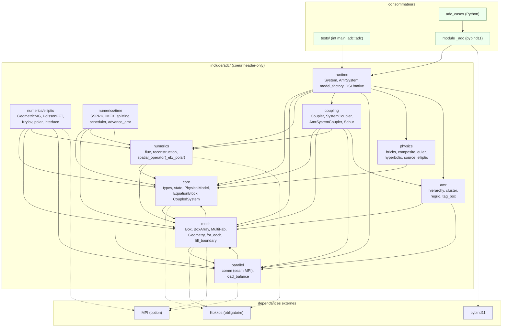
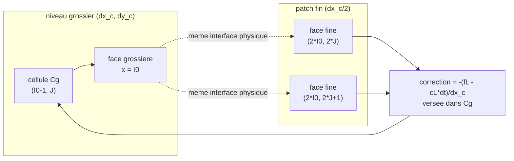
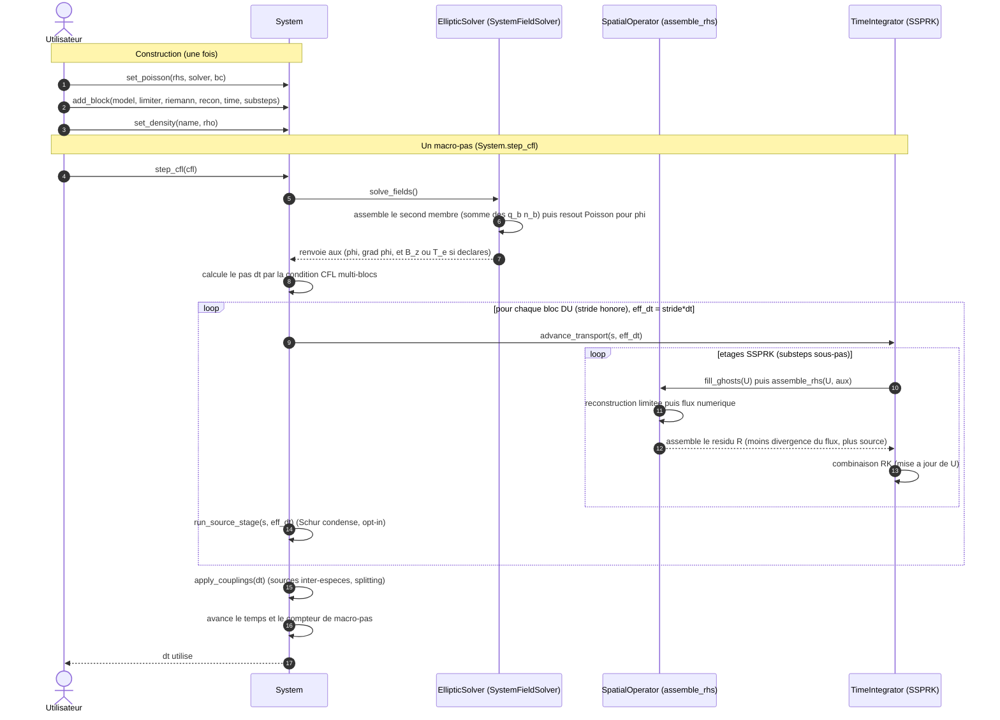
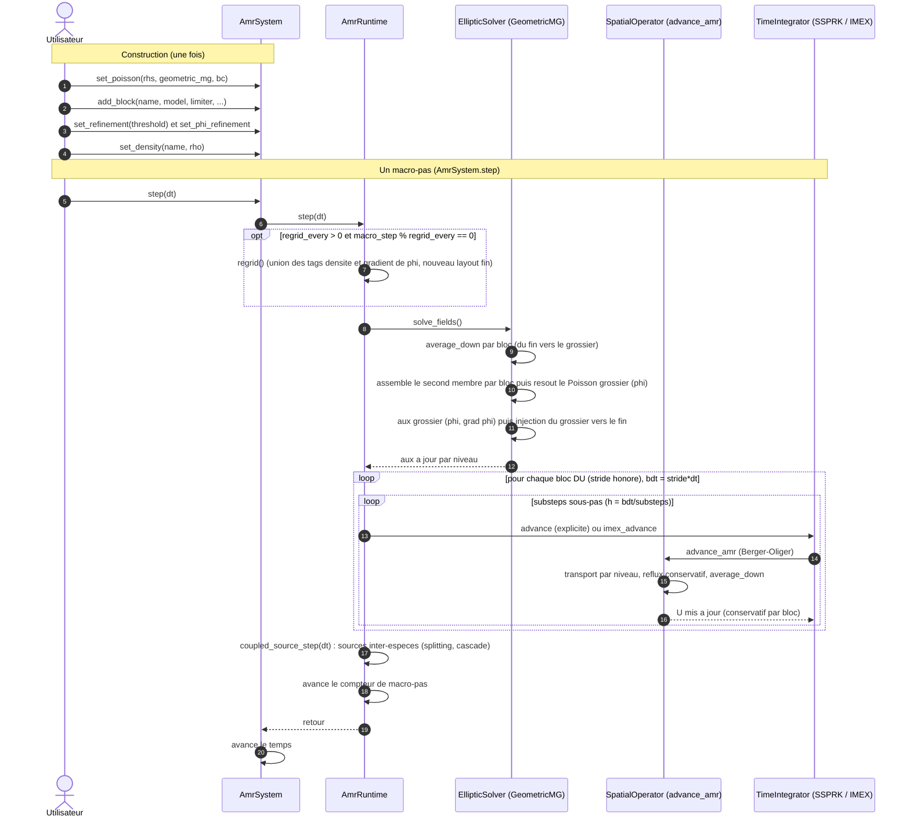

# Architecture of adc_cpp

adc_cpp is the header-only C++20 core for coupled hyperbolic-elliptic systems on
adaptive mesh (AMR), written for MPI + Kokkos (Kokkos is the ONLY on-node backend: Serial /
OpenMP / Cuda depending on the install; the standalone OpenMP backend was removed). The generic physics bricks
([`include/adc/physics/`](../include/adc/physics)) and the library's Python bindings (module
`adc`, compiled extension `_adc`, composition facades `System` / `AmrSystem`) live here; the
neighboring repository `adc_cases` only contains Python use cases that import this module. The
core is model-agnostic: it names no scenario, it provides bricks composed in
`CompositeModel`. The layers are orthogonal (physics, numerics, data/mesh, execution,
time/coupling) and a high layer never depends on an execution detail.


## Contents

- [Overview](#overview)
- [The layers](#the-layers)
- [Grid conventions](#grid-conventions)
- [AMR coarse-fine stencil (reflux)](#amr-coarse-fine-stencil-reflux)
- [Pipeline of a time step](#pipeline-of-a-time-step)
- [Verified properties](#verified-properties)
- [Backends](#backends)
- [Thread safety](#thread-safety)
- [Using the library](#using-the-library)
- [Limitations](#limitations)
- [Tree](#tree)

---
## Overview

The diagram below shows the public modules of [`include/adc/`](../include/adc), the
real external dependencies, and the consumers of the core. The arrows are the inclusions
actually present in the headers (verified by `grep '#include <adc/...>'`). The
external edges: **Kokkos is required** (the only on-node backend: `ADC_USE_KOKKOS` ON by default,
found by `find_package` or fetched by FetchContent); MPI is optional (`ADC_USE_MPI`);
pybind11 only serves the Python module. The sequential path goes through Kokkos Serial, not through a host loop
without Kokkos. Fidelity note: the project embeds neither Eigen, nor fftw, nor Catch2; the FFT of
[`numerics/elliptic/poisson_fft.hpp`](../include/adc/numerics/elliptic/poisson/poisson_fft.hpp) is written
by hand, and the tests are `int main` programs that link `adc::adc` (no third-party
framework).




## The layers

adc_cpp is organized into five orthogonal layers. A high layer expresses the problem, a low layer executes it; a high layer never depends on an execution detail. The structuring separation: the containers (what stores) are distinct from the execution policy (how one loops and communicates).

**Physics (local, device-callable).** The `PhysicalModel` concept ([`include/adc/core/model/physical_model.hpp`](../include/adc/core/model/physical_model.hpp)) only exposes local and pointwise laws, all `ADC_HD`: `flux`, `source`, `max_wave_speed`, `elliptic_rhs`. No access to storage nor to parallelism; no allocation in hot loops, no `std::function`, no dynamic polymorphism. The core is model-agnostic: a model is a composition (`CompositeModel`, [`include/adc/physics/composition/composite.hpp`](../include/adc/physics/composition/composite.hpp)) of generic bricks ([`include/adc/physics/bricks/bricks.hpp`](../include/adc/physics/bricks/bricks.hpp)) on three axes (transport / source / elliptic), the scenario names living on the application side. The `aux` channel carries `(phi, grad_x, grad_y)` and is extensible (`B_z`, `T_e`). The geometry (cartesian / polar / disk) is a config axis of the mesh, not of the model.

**Numerics / discretization.** The local numerical logic: Riemann flux ([`include/adc/numerics/fv/numerical_flux.hpp`](../include/adc/numerics/fv/numerical_flux.hpp): Rusanov / HLL / HLLC / Roe, `ADC_HD` policies), MUSCL + WENO5-Z reconstruction ([`include/adc/numerics/fv/reconstruction.hpp`](../include/adc/numerics/fv/reconstruction.hpp)), the elliptic operator ([`include/adc/numerics/elliptic/`](../include/adc/numerics/elliptic/)) and the logical BCs ([`include/adc/mesh/boundary/physical_bc.hpp`](../include/adc/mesh/boundary/physical_bc.hpp)). We distinguish the point-wise policies (flux, reconstruction, stencil: they take states, see no container) from the grid operators (`assemble_rhs`, [`include/adc/numerics/spatial_operator.hpp`](../include/adc/numerics/spatial_operator.hpp)) which loop over a `Box` via a local view `Array4` but ignore the decomposition into boxes/ranks and the backend. The geometry variants are purely additive: [`spatial_operator_eb.hpp`](../include/adc/numerics/spatial/embedded_boundary/operator.hpp) (cut-cell) and [`spatial_operator_polar.hpp`](../include/adc/numerics/spatial/operators/polar_operator.hpp), the cartesian remaining bit-identical.

**Mesh / data.** What stores: `box2d`, `box_array` ([`include/adc/mesh/layout/box_array.hpp`](../include/adc/mesh/layout/box_array.hpp)), `distribution_mapping` ([`include/adc/mesh/layout/distribution_mapping.hpp`](../include/adc/mesh/layout/distribution_mapping.hpp)), `multifab` ([`include/adc/mesh/storage/multifab.hpp`](../include/adc/mesh/storage/multifab.hpp)), `geometry` (cartesian + `PolarGeometry`, [`include/adc/mesh/geometry/geometry.hpp`](../include/adc/mesh/geometry/geometry.hpp)) and the AMR hierarchy. These containers carry the distributed fields and their halos; they do not know how one loops nor communicates.

**Execution (seams).** The execution policy, reduced to seams that only see minimal views (Box2D, `Array4`, scalar, rank), never `BoxArray` nor `DistributionMapping`: `for_each_cell` ([`include/adc/mesh/execution/for_each.hpp`](../include/adc/mesh/execution/for_each.hpp), serial / OpenMP / Kokkos dispatch) takes a box and an `ADC_HD(i, j)` lambda; the POD view `Array4` ([`include/adc/mesh/storage/fab2d.hpp`](../include/adc/mesh/storage/fab2d.hpp)) is identical host/device; `comm` ([`include/adc/parallel/comm.hpp`](../include/adc/parallel/comm.hpp)) does rank/size, all-reduce, barrier (serial / MPI identity); the allocator ([`include/adc/core/foundation/allocator.hpp`](../include/adc/core/foundation/allocator.hpp)) manages the storage of the Fabs. The halo exchange (`fill_boundary`) and the reductions / `saxpy` (`mf_arith`) are not this layer: they are grid operators that orchestrate the seams.

**Time / coupling.** The layer that composes the operators without knowing their internal implementation: SSPRK ([`include/adc/numerics/time/integrators/ssprk.hpp`](../include/adc/numerics/time/integrators/ssprk.hpp)), IMEX asymptotic-preserving ([`include/adc/numerics/time/schemes/imex.hpp`](../include/adc/numerics/time/schemes/imex.hpp)), splitting `lie_step` / `strang_step` ([`include/adc/numerics/time/schemes/splitting.hpp`](../include/adc/numerics/time/schemes/splitting.hpp)). A `TimePolicy` ([`include/adc/numerics/time/integrators/time_integrator.hpp`](../include/adc/numerics/time/integrators/time_integrator.hpp)) names, per block, the temporal treatment and the number of substeps; the scheduler reads this policy and calls the adapted operator without knowing the flux formula. The fluid <-> Poisson coupling is carried by a `CouplingPolicy` ([`include/adc/coupling/base/coupling_policy.hpp`](../include/adc/coupling/base/coupling_policy.hpp)) which decides the order of operations and the synchronizations, without owning the data nor knowing the backend: `Coupler` single-model ([`include/adc/coupling/single/coupler.hpp`](../include/adc/coupling/single/coupler.hpp)), `SystemCoupler` multi-species single-level ([`include/adc/coupling/system/system_coupler.hpp`](../include/adc/coupling/system/system_coupler.hpp)), `AmrCouplerMP` AMR multi-box ([`include/adc/coupling/amr/amr_coupler_mp.hpp`](../include/adc/coupling/amr/amr_coupler_mp.hpp)).


## Grid conventions

The code separates the index space (integer, without physical dimension) from the physical space
(cell centers). The index space is carried by [`Box2D`](../include/adc/mesh/index/box2d.hpp),
a pair of inclusive corners `lo[2]` / `hi[2]` (AMReX convention); the box is empty as soon as
`hi[d] < lo[d]`. The correspondence to the physical is carried by
[`Geometry`](../include/adc/mesh/geometry/geometry.hpp) (cartesian) and `PolarGeometry` (annular), both
trivial PODs whose accessors are annotated `ADC_HD` to stay callable from a
device kernel without returning garbage value under nvcc.

Three modules carry a grid, each with its own convention. The table below fixes
the notations used in the rest of this section.

### Cartesian: `System` cell-centered, $N_x \times N_y$

`System` ([`include/adc/runtime/system.hpp`](../include/adc/runtime/system.hpp)) carries a single
grid shared by all the blocks (species). The configuration lives in `SystemConfig`.

| champ `SystemConfig` | role |
| --- | --- |
| `n` | cells per direction, domain $n \times n$ |
| `L` | size of the square domain $[0, L]^2$ |
| `periodic` | periodic domain (otherwise free outflow in transport) |
| `geometry` | `"cartesian"` (default) or `"polar"` |

The index box is `Box2D::from_extents(n, n)`, i.e. $[0, n-1] \times [0, n-1]$. The cell
center is defined for any index, ghosts included (negative indices): `Geometry::x_cell(i)`
returns $x_{lo} + (i + 1/2)\,dx$ with $dx = (x_{hi} - x_{lo}) / N_x$ and likewise in $y$. The mesh is
therefore uniform and the cell center exists even outside the valid domain, which allows filling
the ghost layers by simple evaluation.

### Polar: `System` geometry `"polar"`, ring $n_r \times n_\theta$

When `geometry == "polar"`, the same `System` runs on a global ring $(r, \theta)$ described by
`PolarGeometry`. The axis convention is fixed: the index-0 direction is radial (i traverses
$r$ from `r_min` to `r_max`), the index-1 direction is azimuthal (j traverses $\theta$ from $0$ to
$2\pi$).

| champ `SystemConfig` | role |
| --- | --- |
| `nr` | radial cells ($0 \Rightarrow$ takes `n`) |
| `ntheta` | azimuthal cells ($0 \Rightarrow$ takes `n`) |
| `r_min`, `r_max` | physical radial bounds of the ring |

The resolution `0 -> n` is wired on the facade side: `polar_nr` / `polar_ntheta` in
[`python/system.cpp`](../python/system.cpp) return `c.nr > 0 ? c.nr : c.n` (same for `ntheta`), and the
index box becomes `Box2D::from_extents(polar_nr(c), polar_ntheta(c))`. The mesh is uniform
in index: $dr = (r_{max} - r_{min}) / N_r$ and $d\theta = 2\pi / N_\theta$. The physical mesh in
$\theta$ equals $r\,d\theta$ and therefore grows with $r$; this is the origin of the $1/r$ metric of the
polar divergence (cf. `assemble_rhs_polar`). `PolarGeometry` distinguishes center and face: `r_cell(i)`
$= r_{min} + (i + 1/2)\,dr$, `r_face(i)` $= r_{min} + i\,dr$ (the face $i = 0$ is exactly
$r_{min}$, the face $i = N_r$ is $r_{max}$). In polar, $\theta$ is periodic and $r$ carries a physical BC
in `r_min` / `r_max`; the facade therefore sets `per_ = {false, false}` and `periodic_ = false`
when `polar_` is true.

The polar is `nr != ntheta` in general (the grid is not square), contrary to the cartesian
$n \times n$.

### AMR: `AmrSystem`, hierarchy of levels at constant physical extent

`AmrSystem` ([`include/adc/runtime/amr_system.hpp`](../include/adc/runtime/amr_system.hpp)) is the
refined counterpart of `System`: one or more blocks carried over a hierarchy of levels
(currently two levels, ratio 2). The configuration lives in `AmrSystemConfig`.

| champ `AmrSystemConfig` | role |
| --- | --- |
| `n` | cells of the coarse level per direction |
| `L` | size of the square domain $[0, L]^2$ |
| `regrid_every` | re-refinement every $N$ steps ($0 =$ never after init) |
| `periodic` | periodic domain |
| `distribute_coarse` | coarse replicated (default) or multi-box distributed (strong-scaling) |
| `coarse_max_grid` | tile size of the distributed coarse ($0 \Rightarrow n/2$) |

The refinement is not a refinement of the physical mesh: `Geometry::refine(r)` and
`Box2D::refine(r)` preserve the physical extent $[x_{lo}, x_{hi}]$ and refine the index space.
A coarse cell $[lo, hi]$ becomes a block $r \times r$ of fine indices
$[lo \cdot r,\; hi \cdot r + r - 1]$; the inverse `coarsen(r)` is a floor division of each
corner, which stays coherent on both sides of zero (negative ghosts). With a ratio 2, a fine
level therefore has a mesh $dx_f = dx_c / 2$ at unchanged physical domain.

The multi-block co-locates N species on a shared hierarchy (same `BoxArray`, same
`DistributionMapping`, same $dx, dy$ per level); the multi-block supports `regrid_every > 0` (the union-tag regrid rebuilds the
hierarchy from all blocks' tags; `regrid_every == 0` keeps it frozen). Conservation is guaranteed per block via reflux and average_down, described
below.

## AMR coarse-fine stencil (reflux)

At a 2:1 interface between a coarse level and a fine patch, the numerical flux computed on the
coarse side and the flux computed on the fine side do not coincide: without correction, the bordering
coarse cell would lose conservation. The reflux corrects the bordering coarse cell by replacing its
coarse flux contribution with the time-integrated fine flux crossing the same physical interface.

For the ratio 2 of the code, a coarse face at the interface is covered by two fine faces.
The schema below shows a bordering coarse cell `Cg` to the left of the interface and the two
fine sub-faces `f0`, `f1` of the patch that adjoin it.



The mechanics is carried by
[`amr_reflux_mf.hpp`](../include/adc/numerics/time/amr/reflux/amr_reflux_mf.hpp), which is only an umbrella
including the sub-headers; the types of the interface live in
[`amr_patch_range.hpp`](../include/adc/numerics/time/amr/levels/amr_patch_range.hpp) and the subcycling that
drives them in [`amr_subcycling.hpp`](../include/adc/numerics/time/amr/levels/amr_subcycling.hpp).

Three objects share the work.

- `FluxRegister` is a coarse buffer with global indexing over a region. Each rank writes there
  its local contributions (0 elsewhere), `gather()` sums them by `all_reduce_sum_inplace`, then
  each rank reads the total via `at()`. In serial the all-reduce is the identity, hence bit-identical.
  `set` overwrites (average_down path), `add` accumulates while staying bounded to the region (reflux path).

- `CoverageMask` (and its envelope `CoarseFineInterface`) marks, on the coarse region, the
  cells shadowed by a fine patch. The mask is built on the global `BoxArray` of the fine patches,
  known by all the ranks, hence MPI-safe. `covered(I, J)` prevents the double-reflux of a
  fine-fine joint: we only pour a correction onto a bordering coarse cell not covered by an
  other patch.

- The per-patch register (`RegMP` or the local `Reg` of the subcycling) stores, along the border of
  the parent footprint $[I_0..I_1] \times [J_0..J_1]$, two sets of arrays: `cL, cR, cB, cT` =
  coarse flux (without dt) read once at the start, and `fL, fR, fB, fT` = time-integrated fine flux,
  accumulated substep after substep during the Berger-Oliger subcycling.

The accumulation of the fine flux is exactly the sum of the two sub-faces on each substep:
along the left border of the patch, `subcycle_level_mp` does

`g.fL[(J - g.J0) * nc + k] += 0.5 * (FX(2*g.I0, 2*J, k) + FX(2*g.I0, 2*J+1, k)) * dt`

(and symmetrically `fR` at `2*g.I1 + 2`, `fB` / `fT` on the $y$ faces). The two fine faces are
averaged by the factor $0.5$, time-integrated by `* dt` of the substep, and the `+=` accumulates on the
two substeps of the ratio 2.

The final pour is carried by `CoarseFineInterface::route_reflux`. On each bordering coarse
cell not covered, it adds to the register

$$
\text{ref.add}(I_0 - 1,\, J,\, k) \mathrel{+}= -\frac{f_L - c_L \cdot dt}{dx_c}
$$

on the left, $+(f_R - c_R \cdot dt)/dx_c$ on the right, and likewise in $y$ with $dy_c$ ($f_B$, $f_T$,
divided by $dy_c$). One sees the conservative structure: $f_\bullet$ is already the sum of the fine
time-integrated fluxes, $c_\bullet \cdot dt$ is the coarse flux that the cell has already taken in during
the macro-step, and the sign (negative on the left / at the bottom, positive on the right / at the top) follows the
divergence convention of the scheme. The parent footprint is computed by
`PatchRange` ($I_0 = lo/2$, $I_1 = (hi-1)/2$), historically distinct from `Box2D::coarsen` to
preserve the bit-identical arithmetic. The average_down (`mf_average_down_multi` /
`mf_average_down_mb`) then overwrites each covered coarse cell with the $0.25$ average of the
four fine cells, closing the coarse/fine coherence.


## Pipeline of a time step

The time step has two incarnations that share the same grammar of steps (solve the elliptic,
populate the aux, transport, source) but distinct engines: `System` on single-level grid and
`AmrSystem` on adaptive hierarchy. The construction phase (`set_poisson`, `add_block`,
`set_density`) is identical from afar: it declares the system Poisson, composes the bricks of
each block and sets the initial state. It is the macro-step that differs.

### Single-level: `System.step_cfl`

The core is `SystemStepper::step_cfl` (and `step`), in
[`include/adc/runtime/system/system_stepper.hpp`](../include/adc/runtime/system/system_stepper.hpp). The order is an
explicit invariant (cf. the contract at the head of the file): `solve_fields` once at the head, then for
each block DU (honored stride cadence) an `advance_transport` followed by a `run_source_stage`
interleaved, then `apply_couplings`, then `advance the time` and `advance the macro-step counter`.

The `solve_fields` delegates to `SystemFieldSolver`
([`include/adc/runtime/system/system_field_solver.hpp`](../include/adc/runtime/system/system_field_solver.hpp)): it
solves the system Poisson whose right-hand side is the sum of the elliptic bricks of the blocks
($f = \sum_b q_b\, n_b$), then derives the aux. The aux is the shared channel that carries $\phi$ and $\nabla\phi$
(components 1 and 2), plus optionally $B_z$ and $T_e$. The transport of a block, in turn, reads this aux:
`advance_transport` routes toward the closure `s.advance` (full path) or its disk variants, and
this closure does `fill_ghosts` then `assemble_rhs` (limited reconstruction then numerical flux ->
$R = -\mathrm{div} F + S$) at each SSPRK stage (cf.
[`include/adc/numerics/time/integrators/ssprk.hpp`](../include/adc/numerics/time/integrators/ssprk.hpp), `SSPRK2Step` /
`SSPRK3`). The step $dt$ returned by `step_cfl` is the min over the evolutive blocks of
$cfl \cdot h \cdot \mathrm{substeps}_b / (\mathrm{stride}_b \cdot w_b)$, with $h = \min(dx, dy)$ in
cartesian and $h = \min(dr,\, r_{\min}\, d\theta)$ in polar.



Strang variant (`step_strang`, opt-in via `set_scheme`): the transport is split into
$H(dt/2)\,;\,S(dt)\,;\,H(dt/2)$ and `solve_fields` is RE-solved before each stage that consumes $\phi$
(the $\phi$ of the step head would be stale for the second half-advance).

### AMR: `AmrSystem.step`

On the adaptive hierarchy, `AmrSystem::step`
([`include/adc/runtime/amr_system.hpp`](../include/adc/runtime/amr_system.hpp)) forces the lazy build
then delegates to the multi-block engine `AmrRuntime::step`
([`include/adc/runtime/amr/amr_runtime.hpp`](../include/adc/runtime/amr/amr_runtime.hpp)) (or, in single-block, to
the closure `step_fn` of an `AmrCouplerMP`). The engine adds two steps proper to the adaptive around
the same skeleton.

First the periodic regrid: if `regrid_every > 0` and the macro-step falls on the cadence
(`macro_step_ % regrid_every == 0`, and not at the very first step), `regrid()` re-grids the hierarchy
from the union of the tags of all the blocks plus the tag of $|\nabla\phi|$, applies a single new
fine layout to all the blocks and to the shared aux. Then `solve_fields`: it first does an
`average_down` per block (fine -> coarse), assembles the co-located summed right-hand side
($f = \sum_b r_b(U_b)$ (each $r_b$ = `elliptic_rhs` of the block)), solves the coarse Poisson by geometric multigrid,
derives the coarse aux ($\phi$, $\nabla\phi$ via `field_postprocess`), then injects the coarse aux
to the fine levels (`coupler_inject_aux_mb`). The transport of each block DU is then `advance`
(explicit transport: `advance_amr` = Berger-Oliger + conservative reflux + `average_down`) or
`imex_advance` (source-free transport + stiff implicit source `backward_euler_source`), subcycled
`substeps` times on the effective step $\mathrm{stride} \cdot dt$. Finally `coupled_source_step` applies the
inter-species sources by splitting, before `advance the macro-step counter`.



The parallel between the two pipelines is deliberate: `AmrRuntime::solve_fields` reproduces
`AmrSystemCoupler::solve_fields` (the compile-time counterpart), and the sequence (solve the elliptic;
transport per block honoring stride/substeps; source; advance the macro-step counter) is the
same as that of `SystemStepper`. The difference lies in the transport engine (`assemble_rhs` full
versus `advance_amr` Berger-Oliger with reflux and `average_down`), in the coarse -> fine injection of the aux
and in the periodic regrid, proper to the hierarchy.


## Verified properties

The library distinguishes two safety nets (cf. [`docs/ARCHITECTURE.md`](ARCHITECTURE.md) section 11): the bit-identical is a software net (the refactoring did not break anything), not a numerical proof. Both are necessary. The properties below are those actually measured by the test suite, not objectives.

**Mass conservation at round-off.** The finite-volume scheme is conservative by telescoping of the fluxes; at the coarse-fine reflux (FluxRegister), the global mass stays conserved at machine precision. The source test `python/tests/test_schur_conservation.py` (cf. [`docs/CONSERVATION_SUMMARY.md`](CONSERVATION_SUMMARY.md)) measures on 64x64 periodic, axisymmetric ring, 40 steps a relative mass drift of the order of $1.9\times 10^{-16}$ (machine precision), well below the threshold $10^{-12}$. On the AMR side, the extraction of the couplers into thin schedulers has been validated at unchanged mass conservation at round-off (`amr_mass`, section 5 of the architecture). The momentum is only exact ($\sim 5\times 10^{-18}$) when the net force is zero by discrete symmetry; under real electrostatic/Lorentz force it is not conserved by construction, which is the expected behavior of an FV scheme (and not of a structure-preserving weak-form scheme).

**MPI bit-identical outputs np=1/2/4.** The distributed multipatch (FillPatch / FluxRegister 2-level) is bit-identical to the single-process reference on the MPI ctest entries (`-DADC_USE_MPI=ON`, np=1/2/4). See [`docs/BACKEND_COVERAGE.md`](BACKEND_COVERAGE.md) section 1h: `test_mpi_mbox_parity`, `test_mpi_amr_compiled_parity`, `test_krylov_solver`, `test_schur_condensation`, `test_mpi_poisson` and their `_np1/2/4` variants pass in CI in the MPI job. Honest caveat documented: a distributed multi-box coarse is not bit-identical on the global sums (the FMA reduction order changes), but the `max` stays exact and the behavior stays correct.

**Device-clean kernels GH200.** The Kokkos Cuda backend has been validated on GH200 (node `armgpu`, `Kokkos_ARCH_HOPPER90`, `nvcc_wrapper`, OpenMPI CUDA-aware) with components bit-identical to CPU: single-grid System, AMR field operations (flux_register, diffusion), multi-GPU MPI halos (fill_boundary np=1/2/4, gfails=0), screened and anisotropic EPM (`dmax=0`), B_z per AMR level (`dmax=0`), compiled path with named functors multi-box and MPI. The integrated validation AmrSystem + MPI + GPU is done (the three axes in a single run, np=1/2/4, `dmax=0`, mass conserved at `0`). These harnesses live in `python/tests/gpu/` (out of CI for lack of GPU runner); the detail is in [`docs/GPU_RUNTIME_PORT.md`](GPU_RUNTIME_PORT.md). Device caveats: `add_compiled_model` with extended lambdas is not zero-copy on device (host bounce, nvcc cross-TU limit), the multi-rank additive sums are not bit-exact across np (FMA order), and the AMR strong-scaling by distributed coarse is negative at this scale.

**Parity production == add_block.** The production path (native model compiled AOT via `add_compiled_model`) produces the same result as the brick assembly (`add_block`): the parity of the AOT compiled block is validated on CPU/Serial (`test_compiled_model_parity`, [`docs/ARCHITECTURE.md`](ARCHITECTURE.md) section 11). The single-process System production has been validated separately (cf. [`docs/VALIDATION.md`](VALIDATION.md)). Limit to know: this path is not yet validated on Kokkos Cuda (the nvcc limit of the extended `__host__ __device__` lambdas cross-TU is documented phase 8 of [`docs/GPU_RUNTIME_PORT.md`](GPU_RUNTIME_PORT.md)); the workaround by named functors exists and is validated device, but has not been ported to `test_compiled_model_parity` itself.

## Backends

The backends (Kokkos, MPI, HDF5) are a property of the library, not a flag per target. They are attached to the interface target `adc`: everything that links `adc` (core tests, downstream applications) inherits the backend chosen at configuration. Kokkos is the ONLY on-node backend and it is required (the serial goes through Kokkos Serial, not through a manual C++ loop). One configures once (cf. [`docs/ARCHITECTURE.md`](ARCHITECTURE.md) section 9):

```
# Kokkos est obligatoire mais PAS forcement pre-installe : trouve s'il existe (-DKokkos_ROOT),
# sinon recupere + construit automatiquement (FetchContent). La cible on-node = options Kokkos_ENABLE_*.
cmake -B build                                       # serie : Kokkos fetch+build auto (Serial defaut)
cmake -B build -DKokkos_ENABLE_OPENMP=ON             # CPU multi-thread (Kokkos OpenMP, fetch)
cmake -B build -DKokkos_ROOT=$K                       # reutilise une install Kokkos existante
cmake -B build -DKokkos_ROOT=$K -DCMAKE_CXX_COMPILER=$K/bin/nvcc_wrapper  # GPU Cuda (install nvcc_wrapper)
cmake -B build -DADC_USE_MPI=ON                       # + distribue (ADC_HAS_MPI + MPI::MPI_CXX)
```

**Kokkos: the only on-node backend.** Kokkos covers the sequential (Serial), the multi-thread CPU (OpenMP) AND the GPU (Cuda/HIP) with a single code, without any CUDA kernel written by hand nor `#pragma omp`. The target is chosen by the options `Kokkos_ENABLE_SERIAL` / `Kokkos_ENABLE_OPENMP` / `Kokkos_ENABLE_CUDA` -- at config (FetchContent path) or at the install of Kokkos (`-DKokkos_ROOT` path), not by an adc flag. Kokkos is REQUIRED but does not need to be pre-installed: CMake does `find_package(Kokkos)` then, failing that, fetches it via FetchContent (version `ADC_KOKKOS_FETCH_VERSION`, default 4.4.01, tarball verified by SHA256). Configuring without Kokkos (`-DADC_USE_KOKKOS=OFF`) is a fatal error, and the seam `for_each_cell` does not compile without `ADC_HAS_KOKKOS`. The standard is C++20 (nvcc CUDA 12.x does not offer `-std=c++23`); the kernels marked `ADC_HD` and the seam `for_each_cell` are compiled for the chosen execution space. CI plays Kokkos Serial (gate `build-and-test`, C++ + Python) and, since the `ci-full` job, Kokkos OpenMP (`Kokkos_ENABLE_OPENMP=ON`). CI never builds `-DKokkos_ENABLE_CUDA=ON`: all the Kokkos Cuda cells are therefore ROMEO (manual GH200 validation) or unknown.

**MPI: distributed, optional.** `-DADC_USE_MPI=ON` defines `ADC_HAS_MPI` and links `MPI::MPI_CXX`. The `if(ADC_HAS_MPI)` block of the CMake compiles the MPI-only tests (section 1h of [`docs/BACKEND_COVERAGE.md`](BACKEND_COVERAGE.md)), each replayed at np=1/2/4. Out of MPI (a single process), the seam `comm` ([`include/adc/parallel/comm.hpp`](../include/adc/parallel/comm.hpp)) degenerates to the identity (rank 0, size 1, all-reduce and barrier no-op), so that a binary linked MPI but launched single-process behaves like a single-rank run. MPI + Kokkos Cuda multi-GPU is validated on ROMEO for 10 Krylov/Schur/MPI-kernel tests (rank-invariant np=1/2/4, `dmax=0`).

**The seam `for_each_cell`.** The seam point that makes all this possible is `for_each_cell(box, f)` in [`include/adc/mesh/execution/for_each.hpp`](../include/adc/mesh/execution/for_each.hpp). It expresses an execution policy, not numerical logic: it takes a `Box` and an `ADC_HD(i, j)` lambda, and compiles into `Kokkos::parallel_for` (Serial / OpenMP / Cuda depending on the Kokkos install). The numerical logic stays in the lambda (layer 2: discretization), never in the seam; growing it into `for_each_cell(U, grid, ghosts, mpi, bc, amr, ...)` would recreate an opaque framework. A grid operator sees a local view `Array4` + `Box`, but neither the `DistributionMapping` nor the loop policy. The reductions share the same philosophy: `for_each_cell_reduce_sum` / `_max` carry the deterministic reducers `Kokkos::Sum` / `Max` (the `sum` reassociates the addition by tile -- deterministic/idempotent but not bit-identical to a lexicographic sum, for all the Kokkos spaces; the `max` stays exact).

## Thread safety

The execution model is pure data parallelism, no threads sharing an arbitrary mutable state. What is safe and what is not follows directly from the mesh/data vs execution separation (layers 3-4, section 4 of the architecture).

**Reentrant / without shared state.**
- The body of `for_each_cell` is an `ADC_HD(i, j)` lambda that writes the cell `(i,j)` of its own local view `Array4`. As long as the kernel only writes its cell (cell-by-cell FV idiom), there is no race: each iteration touches a disjoint address. This is the basis of the Serial / OpenMP / Cuda portability without lock.
- A grid operator receives a local view (`Array4` + `Box`) and sees neither the `DistributionMapping`, nor the MPI rank, nor the loop policy. It is therefore independent of the decomposition into boxes/ranks and reentrant on distinct fabs.
- The reductions go through the deterministic reducers `for_each_cell_reduce_sum` / `_max`: the accumulation is managed by Kokkos (no shared host accumulator written concurrently), which avoids the hand-made reduction races.

**Not shared / to sequence explicitly.**
- Unified memory + fence: on GH200 the memory is unified (a single buffer). Any function that launches a device kernel then reads the same memory in a host loop must call `device_fence()` (= `sync_host()`) between the two, otherwise host/device race invisible in CPU CI. This is, according to CHOICES.md, the most subtle bug of the repository. The assumed choice is the explicit fence separate from the access (not a `Memory<T>`-like type that hides the barrier in the accessor). The detection net is `romeo/sanitizer.sbatch` (compute-sanitizer) plus the bit-identical CPU vs GPU checksum of `diocotron_amr_kokkos`, which diverges if a fence is missing.
- Halo writes: the three families of ghosts (physical, parallel, coarse-fine) are sequenced steps, not concurrent with the interior computation. `fill_ghosts` is an explicit composition `fill_boundary` (exchange) then `fill_physical_bc` (BC at the border); it executes between two sweeps, not during.
- MPI communication: the seam `comm` is not designed for concurrent calls from several threads on the same communicator; the pattern is single-thread per rank, threads/GPU inside the rank via `for_each_cell`.


## Using the library

`adc_cpp` is a header-only core. On the C++ consumer side, one pulls it by `FetchContent` and links the
target `adc::adc`; nothing is compiled in advance, the instantiation takes place at the caller's.

```cmake
include(FetchContent)
FetchContent_Declare(adc_cpp GIT_REPOSITORY https://github.com/wolf75222/adc_cpp.git)
FetchContent_MakeAvailable(adc_cpp)
target_link_libraries(mon_appli PRIVATE adc::adc)
```

The entry contract is the `PhysicalModel` concept, declared in
[`include/adc/core/model/physical_model.hpp`](../include/adc/core/model/physical_model.hpp). A type that satisfies it
exposes a flux, a source, a maximum wave speed (`max_wave_speed`) and a contribution to the elliptic right-hand
side (`elliptic_rhs`), with `M::Aux == adc::Aux` explicitly required by the concept. The
methods called in the kernels must carry `ADC_HD` (device callable); the concept does not verify it,
it is an invariant in the charge of the model author. One obtains such a type either by composing
generic bricks in `CompositeModel<Hyperbolic, Source, Elliptic>`
([`include/adc/physics/composition/composite.hpp`](../include/adc/physics/composition/composite.hpp)), or by writing one's own
struct.

The model is then instantiated in a coupler, which closes the loop Poisson -> `aux` channel -> advance in
time. For a single-level domain, it is `Coupler<Model, Elliptic = GeometricMG>`
([`include/adc/coupling/single/coupler.hpp`](../include/adc/coupling/single/coupler.hpp)): the elliptic solver is a
template parameter, `GeometricMG` by default. For the multi-patch AMR ExB, it is
`AmrCouplerMP<Model, Elliptic = GeometricMG>`
([`include/adc/coupling/amr/amr_coupler_mp.hpp`](../include/adc/coupling/amr/amr_coupler_mp.hpp)), which orders the
operations (coarse Poisson -> `aux = grad phi` -> advance + regrid Berger-Rigoutsos) and outputs the
hierarchy in `AmrLevelStack`. The multi-species coupler carried over AMR is `AmrSystemCoupler`
([`include/adc/coupling/system/amr_system_coupler.hpp`](../include/adc/coupling/system/amr_system_coupler.hpp)).

The runtime facades `System` ([`include/adc/runtime/system.hpp`](../include/adc/runtime/system.hpp)) and
`AmrSystem` ([`include/adc/runtime/amr_system.hpp`](../include/adc/runtime/amr_system.hpp)) wrap these
couplers for the multi-block composition; it is they that the Python bindings expose.

## Limitations

The following limits are guarded in the code (they raise a clear error rather than drift
silently), or are assumed scope boundaries.

- AMR composite elliptic and global Schur: present at Phase-4a scope. A 2-level composite FAC
  Poisson (`CompositeFacPoisson`,
  [`include/adc/numerics/elliptic/mg/composite_fac_poisson.hpp`](../include/adc/numerics/elliptic/mg/composite_fac_poisson.hpp))
  and the AMR condensed Schur source stage (`AmrCondensedSchurSourceStepper`,
  [`include/adc/coupling/schur/amr/amr_condensed_schur_source_stepper.hpp`](../include/adc/coupling/schur/amr/amr_condensed_schur_source_stepper.hpp))
  are wired on the refined hierarchy. The supported scope is 2 levels, 1..N disjoint NON-adjacent fine
  patches, a replicated mono-block coarse, mono-rank; adjacent patches, more than 2 levels, MPI and
  multi-block are refused explicitly (Phase 4b). See ALGORITHMS.md section 25 for the full scope.

- FFT under `System` in MPI np>1: supported since ADC-287. `System` distributes a single box in
  round-robin, so `PoissonFFTSolver` (which needs the whole grid) is kept only for `n_ranks()==1`; at
  np>1 [`include/adc/runtime/system/system_field_solver.hpp`](../include/adc/runtime/system/system_field_solver.hpp)
  now SELECTS a `RemappedFFTSolver` instead of raising: it hides a box-slab scatter/gather around
  `PoissonFFT` (the field-solve path is unchanged, it sees the single round-robin box outward).
  `set_poisson(solver="fft"|"fft_spectral")` therefore SUCCEEDS under MPI np>1 for the periodic,
  constant-coefficient case; it raises only when the slab remap cannot tile (`Ny % n_ranks() != 0`).
  A wall, a variable `eps(x)`, the anisotropy and the kappa reaction term are still reserved to
  `geometric_mg` (the MPI default and the only option for those), at any rank count.

- Polar: scalar ExB, single-rank. The polar geometry (global ring $r \in [r_{min}, r_{max}] \times \theta \in [0, 2\pi)$, `PolarGeometry`) wired in `System::step` carries the scalar ExB transport
  (`CompositeModel<ExBVelocityPolar, NoSource, ChargeDensity>`, see
  [`include/adc/physics/bricks/hyperbolic.hpp`](../include/adc/physics/bricks/hyperbolic.hpp)). The direct polar Poisson
  `PolarPoissonSolver` ([`include/adc/numerics/elliptic/polar/polar_poisson_solver.hpp`](../include/adc/numerics/elliptic/polar/polar_poisson_solver.hpp))
  is single-rank, on a single box covering the ring: its FFT-in-theta + tridiagonal-in-r requires the
  complete azimuthal line and the complete radial column on a same rank, so it raises if `n_ranks() > 1` or if
  `ba.size() != 1`. The parallel transpose is out of scope at this stage.

These safeguards are deliberate: they transform a SIGSEGV in Release (absent box, assert disappeared) into
a readable error.

## Tree

Header-only core under `include/adc/`, ordered by orthogonal layer. One line per subfolder; the
file-by-file detail is in section 13.

```
include/adc/
  core/               types de base, State/Aux, concept PhysicalModel, EquationBlock, CoupledSystem, seam Kokkos
  mesh/               Box2D, BoxArray, Fab2D, MultiFab, Geometry (+ PolarGeometry), for_each_cell, fill_boundary, CL physiques, refinement AMR
  physics/            briques generiques (etat/transport/source/elliptique) -> CompositeModel ; flux Euler, hyperbolique iso, pendants polaires
  numerics/           flux de Riemann (Rusanov/HLL/HLLC/Roe), reconstruction (MUSCL/WENO5-Z), spatial_operator (cartesien, EB cut-cell, polaire), LorentzEliminator
  numerics/elliptic/  concepts EllipticOperator/Solver, GeometricMG (eps(x), anisotrope, kappa), Poisson FFT (mono + bandes), polaire direct + tensoriel, TensorKrylovSolver, composite FAC AMR (mg/composite_fac_poisson)
  numerics/time/      tags SSPRK, integrateurs objets, scheduler de sous-cyclage, IMEX/AP, splitting Lie/Strang, moteur AMR de production (amr_reflux_mf)
  coupling/           Coupler, SystemCoupler, AmrCouplerMP, AmrSystemCoupler, regrid BR extrait, source couplee, condensation de Schur (cartesien + polaire + AMR)
  runtime/            facades System / AmrSystem, model_factory (briques -> CompositeModel), block builders, chemins DSL (compiled/native/aot), canal aux extensible
  amr/                AmrHierarchy, tag_box, clustering Berger-Rigoutsos, regrid (proper nesting)
  parallel/           seam MPI (comm degenere en serie), load balance (round-robin / SFC)
```
