# PoPS perf scaling and frontends audit - 2026-06-08

Audit written on 2026-06-08 14:47 CEST.

Goal: define a reproducible campaign to measure the CPU/GPU/MPI scaling of
`adc_cpp`, and estimate where performance is lost between native C++, Python
native bricks and Python DSL `production`. Hoffart must not serve as the main
benchmark case here: it remains a delicate scientific case, not a neutral
performance bench.

This document is deliberately separated from `docs/PAPER_ROADMAP.md` and from
`docs/HOFFART_GEOMETRY_VERDICT.md`. It deals with runtime costs, Python/C++
boundaries, scaling and instrumentation.

## 1. Frozen Git status

The local checkouts are behind at audit time. Measurements must therefore
be labeled by exact commit and must not mix local `HEAD`,
`origin/master` and PR branches.

| repo | local HEAD | origin/master | local status |
|---|---:|---:|---|
| `adc_cpp` | `0187329` | `075255b` | local behind `origin/master` by 18 commits |
| `adc_cases` | `1affec1` | `6483e37` | local behind `origin/master` by 16 commits |

Open branches/PRs to isolate from `master` measurements:

| repo | PR | branch | perf/science role |
|---|---:|---|---|
| `adc_cpp` | #239 | `feat/isothermal-hll-flux` | HLL flux for 3-variable models; may change transport cost and robustness |
| `adc_cpp` | #238 | `docs/hoffart-spatial-diagnostics` | Hoffart documentation; outside neutral perf benchmark |
| `adc_cpp` | #237 | `feat/gauss-policy` | Gauss policy; may change cost and dynamics of coupled runs |
| `adc_cpp` | #232 | `docs/amr-condensed-schur-design` | AMR Schur design; not a runtime target to measure as an implementation |
| `adc_cases` | #30 | `docs/hoffart-imre-case-verdict` | Hoffart diagnostic; outside neutral perf benchmark |

Publication rule: each perf table must begin with:

```text
pops_cpp_commit=<sha>
pops_cases_commit=<sha ou n/a>
backend=<serial|kokkos-openmp|kokkos-cuda|mpi+kokkos-openmp|mpi+kokkos-cuda>
compiler=<id/version>
kokkos=<version/devices>
mpi=<implementation/version/cuda-aware?>
machine=<CPU/GPU/node>
case=<euler-periodic|poisson-mms|halo|amr-synthetic|frontend-euler>
```

## 2. Anti-MUFFIN verdict

The problem flagged by the supervisor about MUFFIN is real, but it must be named
precisely: it is not only "Python copies". In
`alvarezlaguna/MUFFIN_Release`, several costs add up:

- core storage in `py::array_t` (`Simulation1D.cpp`, `MeshData.hpp`);
- Python callbacks in model functions (`PythonPhysicalModel.cpp`);
- creation of NumPy views per cell via `CellDataRef::getView()`;
- Python source and boundary condition callbacks (`PythonSourceTerm.cpp`,
  `PythonBC.cpp`);
- HDF5 I/O via Python (`h5py`) with NumPy allocation and `memcpy` per output
  (`DataWriter1DH5Py.cpp`);
- periodic linear solver going through `numpy.linalg.solve`, with copy of
  matrix and right-hand side (`ThomasAlgorithmPeriodic.cpp`);
- `py::print` and array returns from the simulation loop
  (`Simulation1D::simulate`, `advance_one`).

Upstream sources:

- https://github.com/alvarezlaguna/MUFFIN_Release/blob/main/src/PhysicalModel/PythonPhysicalModel.cpp
- https://github.com/alvarezlaguna/MUFFIN_Release/blob/main/src/MeshData/CellDataRef.hpp
- https://github.com/alvarezlaguna/MUFFIN_Release/blob/main/src/DataWriter/DataWriter1DH5Py.cpp
- https://github.com/alvarezlaguna/MUFFIN_Release/blob/main/src/LinearSolver/ThomasAlgorithmPeriodic.cpp
- https://github.com/alvarezlaguna/MUFFIN_Release/blob/main/src/Simulation1D.cpp

The risk to audit in PoPS is therefore:

```text
cout catastrophique = callback Python par cellule/face
cout structurel fort = copie full-array par pas ou diagnostic frequent
cout acceptable = appel pybind par macro-pas si le calcul reste C++
cout acceptable = compilation DSL froide, si amortie par cache et run long
```

Status observed in PoPS at audit time:

- `include/pops/runtime/system.hpp` documents the contract: Python composes, the
  cell-by-cell compute stays compiled C++; no Python callback in the
  hot path, except custom integrator via `eval_rhs/get_state/set_state`.
- `python/bindings/core/bindings.cpp` exposes `step` and `advance` directly. The visible
  copies are at the `set_*` boundaries (`flat(arr)`) and diagnostics
  `get_state`, `density`, `potential` (`to_2d`, `to_3d` with `memcpy`).
- `python/pops/integrate.py` is the path to ban from production measurements:
  it calls `eval_rhs`, `get_state`, `set_state` from Python and therefore copies
  full fields at each stage.
- `python/pops/dsl.py` distinguishes `prototype`, `aot` and `production`. For
  production measurements, you must require `backend="production"` and check that
  the adder is `add_native_block`.

Verdict: PoPS does not have, on the native bricks and DSL `production` paths, the
MUFFIN profile "Python in the cell loop". The expected Python costs are
mainly setup, DSL compilation, pybind call per `step`, and diagnostic copies.
The main risk is the accidental use of a wrong path
(`integrate.py`, `eval_rhs` in a Python loop, DSL `aot/prototype`, or
diagnostics that are too frequent).

## 3. Theoretical cost model

The total time must be modeled as follows:

```text
T_total =
  T_import
+ T_compile_dsl
+ T_setup
+ Nsteps * T_step
+ Ndiag * T_diag
+ Nio * T_io

T_step =
  T_kernel
+ T_halo
+ T_reduction
+ T_poisson
+ T_fence
+ T_py_boundary
```

Interpretation:

- Native C++: `T_py_boundary = 0`.
- Python native bricks with `advance(dt, nsteps)`:
  `T_py_boundary ~= un appel pybind pour tout le run`, hence amortized.
- Python native bricks with `for step(dt)` loop:
  `T_py_boundary ~= Nsteps * cout_pybind_step`. The cost remains per step, not per
  cell.
- Python DSL `production` warm cache:
  `T_compile_dsl ~= 0`, then same hot path as `add_block`.
- Python DSL `production` cold cache:
  `T_compile_dsl` may dominate a small run, but must disappear in a long
  run or cache.
- Python DSL `aot`:
  flat-array marshaling, no MPI/AMR, no zero-copy; useful as a
  counter-example, not as a target.
- Python `integrate.py`:
  full-array copies per stage. To be treated as a "bad usage" baseline and not
  as PoPS production performance.

Useful orders of magnitude before measurement:

- A Python callback per cell/face is incompatible with performant GPU/MPI.
  Even `1 us` per callback already gives about `1 s` for `10^6` calls.
- A host copy of an Euler state `4*n*n*8` is `32 MiB` at `n=1024`. The minimum
  bandwidth may be sub-ms on CPU, but NumPy allocation, GIL, cache and
  GPU synchronization can make it much more expensive.
- A host read on GPU can force a `Kokkos::fence` or a unified-memory
  migration. Diagnostics must therefore be measured with and without extraction.
- The pybind cost per `step` call must not appear in the per-phase C++ profile;
  it must be measured by comparing `advance` vs Python loop.

## 4. Neutral benchmark cases

Main case, frontends:

```text
case=frontend-euler-periodic
modele=Euler compressible 2D lisse, periodique, sans disque, sans Hoffart
schema=minmod ou weno5 selon campagne, flux rusanov puis hllc si stable
source=none pour transport pur, ou gravity+Poisson pour chemin couple controle
dt=fixe pour comparer step/advance, pas step_cfl pour la comparaison frontend
diagnostics=off pendant la boucle, extraction finale separee
```

Isolated kernel cases:

| case | objective | current source |
|---|---|---|
| `transport-fv` | pure transport kernel cost | to be extracted from `tests/test_mpi_mbox_parity.cpp` or a future dedicated bench |
| `poisson-mms` | controlled elliptic solve cost | Poisson MMS tests and `GeometricMG` |
| `halo-mpi` | halos-only cost | `python/tests/gpu/mpi6_fillboundary.cpp` |
| `reduction` | global reductions cost | `MultiFab` reductions / `profile_step` |
| `amr-synthetic` | AMR scaling outside Hoffart | `python/tests/gpu/amrmpi_integrated.cpp` |

Existing case not to be used as main benchmark:

- `bench/profile_step.cpp`: useful for phase breakdown, but its model is
  ExB/diocotron and the MPI decomposition is mono-box in the `System` style.
  It must not be sold as general distributed strong/weak scaling.

## 5. Scaling campaign

### Strong scaling

Definition: fixed global size, growing resources.

CPU on-node:

```text
backend=kokkos-openmp
threads=1,2,4,8,16,...
OMP_PROC_BIND=spread
OMP_PLACES=cores
KOKKOS_NUM_THREADS=<threads>
```

MPI + Kokkos CPU:

```text
backend=mpi+kokkos-openmp
ranks=1,2,4,...
threads_per_rank=1,2,4,...
conserver ranks*threads <= coeurs physiques
ne pas utiliser Kokkos Serial comme cible perf
```

GPU:

```text
backend=kokkos-cuda
np=1 pour GPU single-rank
backend=mpi+kokkos-cuda
np=1,2,4,... avec un GPU par rang
srun -n <np> --gpus-per-task=1
```

Metrics:

```text
per_step_ms = temps mur max sur rangs / pas mesures
speedup(np) = per_step_ms(np=1) / per_step_ms(np)
efficiency(np) = speedup(np) / np
```

### Weak scaling

Definition: fixed local size, growing global size.

For a square domain, take `n_global = n_local * sqrt(np)` when `np` is
a perfect square. Otherwise impose a documented rectangular decomposition.

Metrics:

```text
weak_eff(np) = per_step_ms(np=1) / per_step_ms(np)
communication_pct = (halos + reductions + fences MPI) / total
```

### AMR

The only AMR case to use for neutral perf is synthetic, not Hoffart.
`python/tests/gpu/amrmpi_integrated.cpp` already measures a four-bubble
Euler-Poisson AMR case and compares coarse replicated vs distributed.

Result already documented in `docs/GPU_RUNTIME_PORT.md`: at small scale on
GH200, the strong scaling of AMR by distributed coarse is negative. This result must
not be hidden: distributing a too-small coarse saves little compute
and adds a lot of MPI/MG latency.

## 6. C++ vs Python frontends campaign

Run exactly the same smooth periodic Euler case in three variants:

1. `cpp-native`: native C++, without Python.
2. `python-bricks`: `pops.Model(FluidState, CompressibleFlux, NoSource, ...)`.
3. `python-dsl-production`: `dsl.Model(...).compile(backend="production")`.

Required controls:

- `python-dsl-production.compiled.adder == "add_native_block"`.
- `compiled.backend == "production"`.
- `compiled.target == "system"` for uniform, `"amr_system"` only for AMR.
- No `eval_rhs/get_state/set_state` call in the measured loop.
- Measure `advance(dt, nsteps)` and the Python `for step(dt)` loop separately.
- Measure final `get_state` in an `extract_final` phase, not in `step`.
- Clear or isolate `POPS_CACHE_DIR` for the cold compile measurement, then redo
  warm cache with the same model.

Target table:

| frontend | setup_ms | compile_ms | advance_ms | python_step_loop_ms | extract_ms | notes |
|---|---:|---:|---:|---:|---:|---|
| native C++ | | | | n/a | | reference |
| Python bricks | | 0 | | | | native `ModelSpec` |
| Python DSL production cold | | | | | | compile + run |
| Python DSL production warm | | ~0 | | | | cache hit |
| Python DSL aot | | | | | | counter-example |
| Python custom integrate | | 0 | n/a | | | controlled bad usage |

Ratios to publish:

```text
R_bricks_hot = python_bricks.advance_ms / cpp_native.advance_ms
R_dsl_hot = dsl_production_warm.advance_ms / cpp_native.advance_ms
R_step_boundary = python_step_loop_ms / python_advance_ms
R_dsl_cold_warm = dsl_cold_total_ms / dsl_warm_total_ms
R_extract = extract_ms / advance_ms
```

Expected interpretation:

- `R_bricks_hot` and `R_dsl_hot` close to 1 if the hot path is properly native.
- If `R_step_boundary` is high, recommend `advance(dt, nsteps)` for
  long runs from Python.
- If `R_extract` is high on GPU, reduce host diagnostics or do them
  on the device/reduction side.

## 7. Graphs to produce

The graphs must only be produced from campaign CSVs, never from
invented values.

Recommended result files:

```text
bench/results/perf_scaling_master_<sha>.csv
bench/results/perf_frontends_master_<sha>.csv
bench/results/perf_phases_master_<sha>.csv
```

Minimal `perf_scaling` columns:

```text
commit,repo,case,scaling,backend,machine,np,threads,gpus,n_global,n_local,steps,warmup,
wall_s,per_step_ms,speedup,efficiency,notes
```

Minimal `perf_frontends` columns:

```text
commit,case,frontend,backend,n,steps,dt,cache_state,setup_ms,compile_ms,
advance_ms,step_loop_ms,extract_ms,total_ms,ratio_vs_cpp,notes
```

Minimal `perf_phases` columns:

```text
commit,case,backend,np,threads,n,steps,phase,total_s,per_step_ms,pct
```

Required graphs:

- `strong_scaling_speedup.png`
- `strong_scaling_efficiency.png`
- `weak_scaling_efficiency.png`
- `phase_breakdown_stacked.png`
- `frontend_ratios.png`
- `dsl_cold_warm.png`
- `diagnostics_io_impact.png`

Plotting script added:

```bash
python3 bench/plot_perf_campaign.py --results-dir bench/results --out-dir docs/perf_figures
```

The script reads `perf_scaling*.csv`, `perf_frontends*.csv` and
`perf_phases*.csv`. It skips graphs whose data is missing; it never
generates synthetic values.

## 8. Recommendations

1. Do not use Hoffart to conclude on C++ vs Python.
2. Do not use `bench/profile_step` as proof of MPI strong scaling: it
   profiles a representative mono-box step of `System`, not a distributed load.
3. For frontends, make `advance(dt, nsteps)` the primary measurement and
   `for step(dt)` a measurement of the pybind boundary cost.
4. For the DSL, publish cold compile, warm cache and hot loop separately.
5. Ban `python/pops/integrate.py` from production numbers; keep it as
   a quantified anti-example.
6. On GPU, put diagnostics in their own phase: any host
   extraction may hide a `fence` or a unified-memory migration.
7. For MPI + GPU, publish the max time over ranks, not the mean.
8. For AMR, start with the synthetic four-bubble case and document the
   coarse replicated/distributed mode.
9. Any open PR must be measured as an explicit variant, never mixed with
   `master`.

## 9. Campaign acceptance criterion

The campaign is usable only if it lets us answer these
questions:

- Is the Python bricks hot loop at parity with native C++?
- Is the DSL `production` warm cache hot loop at parity with native C++?
- What share of the overhead comes from `step` called from Python instead of
  `advance`?
- What share comes from the `set_state/get_state/density/potential` copies?
- What share comes from Poisson, halos, reductions and fences?
- Does weak scaling degrade through communication or through local kernel?
- Is AMR strong scaling limited by coarse replicated, coarse distributed,
  multi-box MG, regrid or diagnostics?

Until these questions have a quantified table, do not announce a definitive gain or
loss of C++ vs Python.

## 10. ROMEO results of 2026-06-08

This section adds the first runs launched on ROMEO on 2026-06-08. It does not
replace the protocol above: it gives a measured status, with its
limits.

### 10.1 Git status and jobs

The scaling runs were frozen on:

```text
adc_cpp=1f9fb4a
adc_cases=b8bccbe
```

During the frontend catch-up, `origin/master` of `adc_cpp` advanced to
`0c3eae1`, then to `adde23b` during the multi-box transport catch-up.
The results below therefore remain deliberately tied to
`1f9fb4a` so as not to mix commits.

ROMEO jobs:

| job | target | status | time | remark |
|---:|---|---|---:|---|
| `647780` | CPU `x64cpu`, OpenMP + MPI/OpenMP | `COMPLETED` | `00:17:51` | CPU scaling + C++ frontend |
| `647781` | GPU `armgpu`, CUDA + MPI/CUDA | `COMPLETED` | `00:13:32` | GPU scaling + synthetic AMR |
| `647809` | CPU frontend catch-up | `FAILED` | `00:00:10` | Python harness missing |
| `647813` | CPU frontend catch-up | `CANCELLED` | `00:03:23` | cancelled to avoid a useless C++ build |
| `647815` | CPU Python-only frontend, Kokkos PIC | `COMPLETED` | `00:03:55` | Python bricks + DSL production |

Local results:

```text
bench/romeo_results_final_647780_647781_647815/
docs/perf_figures_647780_647781_647815/
```

ROMEO results:

```text
/home/rmdraux/pops_perf_20260608/results/
/home/rmdraux/pops_perf_20260608/logs/
```

Generated graphs:

- `docs/perf_figures_647780_647781_647815/strong_scaling_speedup.png`
- `docs/perf_figures_647780_647781_647815/strong_scaling_efficiency.png`
- `docs/perf_figures_647780_647781_647815/weak_scaling_efficiency.png`
- `docs/perf_figures_647780_647781_647815/phase_breakdown_stacked.png`
- `docs/perf_figures_647780_647781_647815/frontend_ratios.png`
- `docs/perf_figures_647780_647781_647815/dsl_cold_warm.png`
- `docs/perf_figures_647780_647781_647815/diagnostics_io_impact.png`

Final graphs after catch-ups `647836` and `647848`:

- `docs/perf_figures_647780_647781_647815_647836_647848/strong_scaling_speedup.png`
- `docs/perf_figures_647780_647781_647815_647836_647848/strong_scaling_efficiency.png`
- `docs/perf_figures_647780_647781_647815_647836_647848/weak_scaling_efficiency.png`
- `docs/perf_figures_647780_647781_647815_647836_647848/phase_breakdown_stacked.png`
- `docs/perf_figures_647780_647781_647815_647836_647848/frontend_ratios.png`
- `docs/perf_figures_647780_647781_647815_647836_647848/dsl_cold_warm.png`
- `docs/perf_figures_647780_647781_647815_647836_647848/diagnostics_io_impact.png`

### 10.2 Observed blocker: Poisson dominates

On `bench/profile_step`, the time is almost entirely in Poisson:

| backend | resources | n | per_step_ms | Poisson share |
|---|---:|---:|---:|---:|
| `kokkos-openmp` | 1 rank, 1 thread | 256 | 194.19 | 96.5 % |
| `kokkos-openmp` | 1 rank, 8 threads | 256 | 347.04 | 99.0 % |
| `mpi+kokkos-openmp` | 1 rank, 4 threads | 256 | 183.15 | 98.8 % |
| `mpi+kokkos-openmp` | 8 ranks, 4 threads/rank | 256 | 4313.26 | 95.7 % |
| `kokkos-cuda` | 1 GPU | 256 | 238.38 | 99.1 % |
| `mpi+kokkos-cuda` | 4 GPU | 256 | 292.73 | 98.8 % |

Interpretation: this campaign mainly measures the elliptic solver and the
associated reductions. It is not enough to conclude on the cost of pure FV
transport. The next bench must isolate transport, Poisson, halos and reductions.

### 10.3 CPU/GPU strong scaling

CPU OpenMP, global size `n=256`:

| backend | resources | per_step_ms |
|---|---:|---:|
| `kokkos-openmp` | 1 thread | 194.19 |
| `kokkos-openmp` | 2 threads | 855.31 |
| `kokkos-openmp` | 4 threads | 576.57 |
| `kokkos-openmp` | 8 threads | 347.04 |

MPI + OpenMP, global size `n=256`, `threads=4` per rank:

| backend | ranks | per_step_ms |
|---|---:|---:|
| `mpi+kokkos-openmp` | 1 | 183.15 |
| `mpi+kokkos-openmp` | 2 | 474.94 |
| `mpi+kokkos-openmp` | 4 | 2722.01 |
| `mpi+kokkos-openmp` | 8 | 4313.26 |

GPU, global size `n=256`:

| backend | GPU/ranks | per_step_ms |
|---|---:|---:|
| `kokkos-cuda` | 1 | 238.38 |
| `mpi+kokkos-cuda` | 1 | 234.06 |
| `mpi+kokkos-cuda` | 2 | 284.61 |
| `mpi+kokkos-cuda` | 4 | 292.73 |

Limited conclusion: `n=256` is too small and too Poisson-dominant to
show a positive scaling. The useful result is negative but informative:
increasing ranks adds more solver/reductions/coordination costs
than it removes of local compute.

### 10.4 Weak scaling: smoke-test only

The weak lines launched in this first job use `n = 128*np`. This is
not yet the canonical weak scaling recommended above
(`n_global = n_local*sqrt(np)` to keep the local size constant in 2D).
They must therefore be read as a smoke-test, not as a final weak curve.

| backend | resources | n | per_step_ms |
|---|---:|---:|---:|
| `mpi+kokkos-openmp` | 1 rank, 4 threads | 128 | 59.60 |
| `mpi+kokkos-openmp` | 4 ranks, 4 threads/rank | 512 | 8414.39 |
| `mpi+kokkos-cuda` | 1 GPU | 128 | 219.76 |
| `mpi+kokkos-cuda` | 4 GPU | 512 | 328.74 |

Action: relaunch a real weak scaling with 2D decomposition and local size
fixed per rank/GPU.

### 10.5 Synthetic AMR GPU

`amrmpi_integrated` was launched on GH200 in `np=1,2,4`. The diagnostics
`cmax_crossrank_spread=0.0` and the mass conservation show that the test
remains numerically coherent.

| AMR mode | GPU/ranks | per_step_ms | observation |
|---|---:|---:|---|
| `replique` | 1 | 216.37 | reference |
| `replique` | 2 | 273.15 | negative scaling |
| `replique` | 4 | 272.66 | plateau |
| `reparti` | 1 | 696.85 | already more expensive than replicated |
| `reparti` | 2 | 1014.36 | degraded |
| `reparti` | 4 | 1373.70 | degraded |

Conclusion: on this small AMR case, distributing the coarse does not pay. This is
a result consistent with the announced risk: the coordination/MG cost dominates
the saved compute.

### 10.6 C++ vs Python frontends

The first Python build failed with the existing Kokkos OpenMP:

```text
relocation R_X86_64_32 ... libkokkoscore.a ... recompile with -fPIC
```

Campaign correction: build a dedicated PIC Kokkos OpenMP in
`/home/rmdraux/pops_perf_20260608/kinstall_omp_pic`, then relaunch only the
Python frontend on the same commit `1f9fb4a`.

The native C++ lines come from job `647780`; the Python lines come from
job `647815`. The ratios must therefore be read as a first indication, not
as a definitive same-node/same-build benchmark. They are however enough to
exclude a catastrophic MUFFIN profile on `python-bricks`.

| threads | frontend | advance_ms | ratio vs C++ | compile_ms | total_ms |
|---:|---|---:|---:|---:|---:|
| 1 | `cpp-native` | 291.20 | 1.00 | 0.00 | 291.32 |
| 1 | `python-bricks` | 281.33 | 0.97 | 0.00 | 282.20 |
| 1 | `python-dsl-production warm` | 339.12 | 1.16 | 6.75 | 346.10 |
| 1 | `python-dsl-production cold` | 339.04 | 1.16 | 11732.36 | 12071.99 |
| 4 | `cpp-native` | 253.70 | 1.00 | 0.00 | 253.84 |
| 4 | `python-bricks` | 220.19 | 0.87 | 0.00 | 221.04 |
| 4 | `python-dsl-production warm` | 339.62 | 1.34 | 6.71 | 346.57 |
| 4 | `python-dsl-production cold` | 339.62 | 1.34 | 11744.18 | 12084.41 |
| 8 | `cpp-native` | 181.67 | 1.00 | 0.00 | 181.81 |
| 8 | `python-bricks` | 148.03 | 0.81 | 0.00 | 149.07 |
| 8 | `python-dsl-production warm` | 339.35 | 1.87 | 6.66 | 346.24 |
| 8 | `python-dsl-production cold` | 339.54 | 1.87 | 11746.57 | 12086.72 |

Reading:

- `python-bricks` has no visible MUFFIN loss: the hot loop stays C++
  called by `advance`, not a Python callback per cell.
- `step_loop_ms` and `advance_ms` are almost identical on these measurements, so
  the pybind cost per `step` is small compared to the step cost for `n=128`.
- the final `get_state` extraction is about `0.07-0.21 ms`, so
  it does not dominate this CPU case.
- the DSL `production` cold compile is about `11.7 s`; warm cache is
  about `6-7 ms`.
- the DSL `production` warm hot loop is slower and almost invariant with the
  threads in this harness. We must isolate whether this comes from the
  `add_native_block` path, the generated model, a lack of Kokkos scaling in the
  DSL block, or an artifact of comparison with the C++ lines of job `647780`.

### 10.7 Pure multi-box transport CPU catch-up

A dedicated benchmark was added in `bench/profile_transport_mbox.cpp` to
isolate a smooth periodic 2D Euler case, without Poisson, without disk, without Schur
and with a real multi-box decomposition distributed by MPI. The associated ROMEO
script is `bench/romeo_perf_transport_mbox_cpu.sbatch`.

ROMEO run:

| job | commit | target | status | time |
|---:|---|---|---|---:|
| `647836` | `adde23b` | CPU `x64cpu`, multi-box transport | `COMPLETED` | `00:02:34` |

Local results:

```text
bench/romeo_results_transport_mbox_adde23b_647836/
```

Strong OpenMP, `n=1024`, 1 rank:

| threads | per_step_ms | speedup vs 1 thread | efficiency |
|---:|---:|---:|---:|
| 1 | 524.13 | 1.00 | 1.00 |
| 2 | 434.25 | 1.21 | 0.60 |
| 4 | 284.15 | 1.84 | 0.46 |
| 8 | 157.82 | 3.32 | 0.42 |
| 16 | 89.31 | 5.87 | 0.37 |

Reading: pure transport scales positively in OpenMP, contrary to the
first Poisson-dominant `profile_step`. The efficiency drops as the threads
increase, but the signal is usable.

Strong MPI + OpenMP, `n=1024`, `threads=4` per rank:

| ranks | per_step_ms | dominant phase |
|---:|---:|---|
| 1 | 188.35 | transport 96.9 % |
| 2 | 371.05 | halos 50.3 %, transport 43.0 % |
| 4 | 419.46 | transport 45.2 %, halos 34.3 %, reductions 20.6 % |
| 8 | 594.75 | halos 37.3 %, transport 35.1 %, reductions 27.6 % |

Reading: MPI strong scaling stays negative even without Poisson. The blocker
is therefore not only `GeometricMG`: going multi-rank makes
`fill_boundary` and the global reductions expensive enough to dominate part
of the step.

Weak MPI + OpenMP 2D, `n_global ~= 384*sqrt(np)`, `threads=4` per rank:

| ranks | n_global | per_step_ms | weak_eff vs np=1 | dominant phase |
|---:|---:|---:|---:|---|
| 1 | 384 | 25.23 | 1.00 | transport 97.5 % |
| 2 | 543 | 207.13 | 0.12 | halos 68.4 % |
| 4 | 768 | 350.46 | 0.07 | halos 45.9 %, transport 31.2 %, reductions 22.9 % |
| 8 | 1086 | 659.29 | 0.04 | transport 51.7 %, halos 32.3 %, reductions 16.0 % |

Reading: this weak scaling is the most actionable negative result of the
campaign. At roughly constant local size, the per-step cost explodes from
`np=2`, mainly through `fill_boundary`; at `np=4/8`, the reductions
`max_wave_speed_mf` and `dot` also become visible. We must therefore profile
the construction of the halo jobs, the number of messages, pack/unpack, the
SFC choice of boxes, the MPI collectives and the `ranks x threads` affinity.

Methodological point: this measurement replaces the weak smoke-test of section
10.4 for the CPU. It does not yet give the GPU weak, which must stay separate
and not be launched during another active GH200 job.

### 10.8 Same-job frontends catch-up

Job `647848` relaunched native C++, Python bricks and Python DSL `production`
in the same ROMEO job, on the same `x64cpu` node, with the same PIC Kokkos OpenMP
(`/home/rmdraux/pops_perf_20260608/kinstall_omp_pic`) and the same commit
`adc_cpp=adde23b`.

| job | commit | target | status | time |
|---:|---|---|---|---:|
| `647848` | `adde23b` | CPU frontends, Kokkos PIC | `COMPLETED` | `00:19:42` |

Local results:

```text
bench/romeo_results_frontends_adde23b_647848/
```

The C++ frontend build was the dominant cold cost: `frontend_cpp` spent
about 15 minutes compiling `python/bindings/system/base/system.cpp` in `-O3` before the measurements.
Practical conclusion: future campaigns must separate build and measurement,
or reuse a prepared build, otherwise the campaign time mostly measures the
compiler.

Hot-loop `advance(dt, 40)` table:

| threads | frontend | advance_ms | ratio vs C++ PIC | compile_ms | total_ms |
|---:|---|---:|---:|---:|---:|
| 1 | `cpp-native` | 292.42 | 1.00 | 0.00 | 292.54 |
| 1 | `python-bricks` | 283.85 | 0.97 | 0.00 | 285.22 |
| 1 | `python-dsl-production warm` | 341.10 | 1.17 | 6.78 | 348.14 |
| 1 | `python-dsl-production cold` | 341.54 | 1.17 | 15413.57 | 15755.87 |
| 4 | `cpp-native` | 239.59 | 1.00 | 0.00 | 239.73 |
| 4 | `python-bricks` | 228.26 | 0.95 | 0.00 | 229.36 |
| 4 | `python-dsl-production warm` | 342.05 | 1.43 | 7.61 | 349.90 |
| 4 | `python-dsl-production cold` | 341.67 | 1.43 | 15521.54 | 15863.92 |
| 8 | `cpp-native` | 177.46 | 1.00 | 0.00 | 177.60 |
| 8 | `python-bricks` | 165.29 | 0.93 | 0.00 | 166.40 |
| 8 | `python-dsl-production warm` | 341.09 | 1.92 | 7.49 | 348.81 |
| 8 | `python-dsl-production cold` | 341.29 | 1.92 | 15350.63 | 15692.59 |

Reading:

- `python-bricks` has no visible hot-loop penalty compared to native C++
  PIC on this case. The apparent few-percent advantage must not be
  sold as "Python faster"; it mainly means that the Python cost
  is not in the cell loop.
- `step_loop_ms` and `advance_ms` stay very close. The pybind cost per
  `step(dt)` is therefore small compared to the cost of a step at `n=128`.
- final `get_state` stays sub-ms; host diagnostics do not dominate this CPU
  case. This point must be re-checked on GPU, where a host read can force
  synchronization and migration.
- DSL `production` warm stays around `341 ms`, almost invariant with the
  threads. The ratio degrades when C++/bricks scale (`1.17`, `1.43`,
  `1.92`). This is now a real subject: check the generated code, the
  Kokkos paths actually used, and that the DSL block goes through
  the same kernel/limiter/flux as the native block.
- DSL cold compile is about `15.3-15.5 s` on this setup. This cost is
  acceptable only if it is amortized by cache or by a long run.

### 10.9 Separate measurements branch `feat/perf-campaign-bench`

External ROMEO jobs `647857` and `647858` produced JSONL on the
branch `feat/perf-campaign-bench`, commit
`0162d5f4a8f2ef559325acce64decc1dede83e40`. These results are useful for
the audit, but they must not be mixed with the `adde23b/master` tables.

Local files added:

```text
bench/romeo_results_matrix_647857_647858/matrix_cpu_0162d5f4a8_647857.jsonl
bench/romeo_results_matrix_647857_647858/matrix_gpu_0162d5f4a8_647858.jsonl
bench/romeo_results_matrix_647857_647858/perf_scaling_matrix_0162d5f4a8_647857_647858.csv
bench/romeo_results_matrix_647857_647858/perf_phases_matrix_0162d5f4a8_647857_647858.csv
docs/perf_figures_matrix_647857_647858/
```

CPU OpenMP transport, `n=4096`, 1 rank:

| threads | per_step_ms | speedup vs 1 thread |
|---:|---:|---:|
| 1 | 5238.64 | 1.00 |
| 2 | 5106.55 | 1.03 |
| 4 | 2735.66 | 1.91 |
| 8 | 1483.22 | 3.53 |
| 16 | 912.96 | 5.74 |

Reading: at larger size, pure OpenMP transport scales clearly better
than the first `profile_step` case, and confirms that the initial problem came
from the Poisson-dominant case. The `1 -> 2 threads` step stays bad, so
the affinity and the `OMP/Kokkos` choice must stay controlled.

CPU weak OpenMP local per thread, growing global size:

| threads | n_global | per_step_ms |
|---:|---:|---:|
| 1 | 512 | 80.84 |
| 4 | 1024 | 194.13 |
| 16 | 2048 | 252.23 |

Reading: this OpenMP on-node weak scaling is cleaner than the initial
smoke-test, but it is not the final MPI weak. It measures the size/threads effect
within a single rank.

GPU GH200 single-rank, transport size sweep:

| n_global | per_step_ms | cells/s |
|---:|---:|---:|
| 1024 | 30.09 | 3.48e7 |
| 2048 | 123.73 | 3.39e7 |
| 4096 | 497.12 | 3.37e7 |

Reading: the single-rank GPU throughput is stable as the size increases.
This table is a size sweep, not a proof of multi-GPU strong scaling.
It gives a good `np=1` reference for the future MPI+CUDA transport.

GPU GH200 Poisson single-rank:

| n_global | per_step_ms |
|---:|---:|
| 512 | 6.35 |
| 1024 | 19.54 |

Synthetic AMR GPU, coarse distributed for `np>1`:

| n | ranks/GPU | per_step_ms |
|---:|---:|---:|
| 128 | 1 | 215.44 |
| 128 | 2 | 1012.82 |
| 128 | 4 | 1389.79 |
| 256 | 1 | 233.26 |
| 256 | 2 | 1079.72 |
| 256 | 4 | 1485.32 |

Reading: the AMR result stays negative in multi-GPU, which reinforces the
diagnostic already made: the distributed coarse and the AMR/MG coordinations
dominate at these sizes. On the other hand, these jobs do not yet close the TODO
MPI+CUDA transport weak/strong: the pure multi-rank GPU transport case
with one GPU per rank is missing.

### 10.10 DSL `production` and Kokkos diagnostic

The `647848` catch-up showed that `python-dsl-production` warm stays around
`341 ms` regardless of the number of threads. The code investigation indicates a
plausible and actionable cause: the DSL `production` loader is zero-copy and
correctly uses `add_native_block`, but it compiled its header-only templates
without explicitly propagating `POPS_HAS_KOKKOS`, the Kokkos includes and
`-fopenmp`.

Consequence: on a Python module `_pops` compiled with Kokkos OpenMP, the DSL
block could stay on the serial fallback in the inline portions of the loader,
while looking like a native production path. This is not a
MUFFIN problem of Python copies; it is a C++ backend inconsistency between
the `_pops` module and the `.so` generated by the DSL.

Experimental local fix added in this worktree:

- `include/pops/runtime/abi_key.hpp` now encodes the ABI features
  `kokkos=on/off` and `mpi=on/off`. A loader compiled without Kokkos can no longer
  be considered ABI-equivalent to an `_pops` module compiled with Kokkos.
- `python/pops/dsl.py` detects `POPS_KOKKOS_ROOT`/`Kokkos_ROOT`/`KOKKOS_ROOT`,
  uses `POPS_KOKKOS_CXX` or `nvcc_wrapper` if available, adds
  `-DPOPS_HAS_KOKKOS`, the Kokkos includes, `-fopenmp` in OpenMP, and puts these
  features in the DSL cache key. In the current version of the worktree,
  the loader no longer links `libkokkos*`; it lets the symbols resolve
  against `_pops`.
- `bench/romeo_perf_frontends_cpu.sbatch` knows how to overlay these two
  patched files on an explicit ROMEO checkout, and reuse the native C++
  lines already measured to relaunch only the Python frontend.

Warning: this local variant is stricter than the upstream branch
`origin/feat/dsl-production-optflags`. The upstream branch puts the Kokkos backend
in the Python cache key and avoids linking `libkokkos*` in the production `.so`;
it does not modify the public C++ ABI key
`include/pops/runtime/abi_key.hpp`. The local ABI modification must therefore be
read as a safety experiment, not as a patch to merge without review.
The `HybridModel.compile()` part was also extended locally and requires a
dedicated test before integration.

Targeted ROMEO validation:

```text
jobs=648017, 648031, 648034
base=/home/rmdraux/pops_perf_frontends_dslkokkos_20260608
checkout=adde23b + patch local dsl/abi
reference_cpp=job 647848, lignes cpp-native uniquement
objectif=verifier si DSL warm suit enfin les threads Kokkos OpenMP
```

Two intermediate attempts (`648017`, `648031`) failed before the DSL measurement
because the patch automatically chose `bin/nvcc_wrapper` as soon as the file
existed in the PIC Kokkos root. On ROMEO CPU, this OpenMP installation
does provide `nvcc_wrapper`, but `nvcc` is not loaded. The final fix
is therefore deliberately explicit: `nvcc_wrapper` is used only if
`POPS_KOKKOS_CXX` designates it or if `POPS_KOKKOS_USE_NVCC_WRAPPER=1`; OpenMP takes
the host compiler `g++` with `-fopenmp`.

Job `648034` then produced the complete lines. The Python process
ends afterward with `rc=134` on `Kokkos::finalize()` ("Execution space
instance to be removed couldn't be found!") after writing the CSV. The upstream
branch `origin/feat/dsl-production-optflags` fixes this cause: you must
not link `libkokkos*` in the production `.so`, because the `_pops` module has already
loaded the Kokkos runtime. The loader must leave the Kokkos symbols undefined
and resolve them at load time against `_pops` promoted to `RTLD_GLOBAL`; otherwise
you create two Kokkos singletons and finalization aborts.

Local results:

```text
bench/romeo_results_frontends_dslkokkosfix_648034/
docs/perf_figures_frontends_dslkokkosfix_648034/
```

Table `advance(dt, 40)` after partial local DSL/Kokkos fix:

| threads | frontend | advance_ms | ratio vs C++ PIC | compile_ms | total_ms |
|---:|---|---:|---:|---:|---:|
| 1 | `python-bricks` | 280.23 | 0.96 | 0.00 | 281.21 |
| 1 | `python-dsl-production warm` | 345.96 | 1.18 | 6.67 | 352.86 |
| 4 | `python-bricks` | 231.15 | 0.96 | 0.00 | 232.22 |
| 4 | `python-dsl-production warm` | 261.31 | 1.09 | 6.83 | 269.81 |
| 8 | `python-bricks` | 164.26 | 0.93 | 0.00 | 165.49 |
| 8 | `python-dsl-production warm` | 192.72 | 1.09 | 6.80 | 201.24 |

Before fix (`647848`), DSL warm was `341.10`, `342.05`, `341.09 ms`
for `1,4,8` threads. After partial fix (`648034`), it is `345.96`,
`261.31`, `192.72 ms`. The main blocker was therefore indeed the absence of a correct
Kokkos backend in the DSL loader, not a Python copy. On the other hand `648034`
is not a final publishable measurement of the DSL: the process wrote the CSV then
aborted on `Kokkos::finalize()` because this variant still linked a
Kokkos runtime in the `.so`. The `648034` ratios therefore serve to diagnose
the return of the OpenMP scaling, not to give the final cost of the frontend.

The upstream branch also adds `-O3 -DNDEBUG` by default for the production `.so`
(`POPS_DSL_OPTFLAGS` allows overriding, for example `-march=native`) and does not
link `libkokkos*` in the loader. According to its adc_cases report
`origin/feat/perf-campaign-harness`, this variant brings the DSL to serial
parity (`1.04x`) and to OpenMP threaded parity (`1.02x` at 8 threads) with clean
output. The next local optimization therefore consists in aligning cleanly
on this branch, then relaunching a short validation, not in looking for
Python copies.

### 10.10-b MPI multi-box halo fix

After fetch, `origin/master` contains `f3e1bf9 fix(mesh): halos MPI en memoire
hote epinglee (fin du deadlock multi-box GPU) (#254)`; at the time of this
update, `origin/master=5e0b3f6` still includes this fix. This directly targets
the blocking signaled above for MPI multi-box GPU: the MPI communication
buffers must go through pinned host memory rather than
through a UVM/device pointer that triggers CUDA IPC under ROMEO GPU cgroups.

Provenance nuance: the local worktree of this report is still on
`HEAD=0187329` and its `include/pops/mesh/fill_boundary.hpp` shows the old
`fab_allocator` buffers in unified memory. The code audited for `#254` is
therefore `origin/master`/the ROMEO branch, not the local file currently
checked out. This distinction avoids mixing audit of local code and code
executed on ROMEO.

Before the v2 relaunch, this changed the useful run: it was no longer necessary to relaunch
the old deadlock diagnostic, but to test a real pure MPI+CUDA transport
validation/scaling campaign on a recent `origin/master`, or on
a branch combining `#254` and the `feat/perf-campaign-bench` harnesses. The
previous results stayed valid as historical diagnostic, but must not
be used alone to conclude that MPI+CUDA transport was
still blocked.

v2 relaunch observed afterward:

```text
adc_cpp=1d4cd25e25d244cd7c4f6cfd4c0eb815cd997790
base=feat/perf-campaign-bench merge origin/master
jobs=648114 CPU, 648115 GPU
resultats=bench/romeo_results_mpi_v2_648114_648115/
figures=docs/perf_figures_mpi_v2_648114_648115/
```

Table of the points that finish:

| job | backend | ranks/GPU | workload | n | per_step_ms | status |
|---:|---|---:|---|---:|---:|---|
| `648114` | `mpi-omp` | 1 rank, 16 threads | transport | 4096 | 764.73 | OK |
| `648115` | `mpi-cuda` | 1 GPU | transport | 4096 | 502.91 | OK |
| `648115` | `mpi-cuda` | 1 GPU | poisson | 1024 | 20.68 | OK |

The multi-rank points stay in timeout:

| job | case | result |
|---:|---|---|
| `648114` | transport `2 ranks x 8 threads` | timeout `300 s` |
| `648114` | transport `4 ranks x 4 threads` | timeout `300 s` |
| `648115` | transport `2 GPU` | timeout `300 s` |
| `648115` | poisson `2 GPU` | timeout `300 s` |
| `648115` | next transport/poisson | timeout in the same campaign |

Conclusion: `#254` and the pinned host memory are not enough to unblock
this multi-box `scaling_step` harness on ROMEO. The remaining blocking is therefore
no longer to be presented as "CUDA IPC only"; we must open a dedicated code work item
`fill_boundary`/MPI progress/halo scheduling, with a minimal
multi-box CPU and GPU test, before any new weak/strong MPI+CUDA campaign.

Important nuance: this does not prove that all PoPS MPI CPU is blocked. The
dedicated CPU bench `profile_transport_mbox` of job `647836` does finish in
`np=1/2/4/8`, even with a negative scaling. The v2 timeout concerns the
`scaling_step` harness at large size and the paths tested in `648114/648115`.
It can therefore come from a remaining deadlock, an extremely pathological cost,
the ROMEO launcher, or a code path difference; it must not be converted
into a general conclusion without a minimal test.

### 10.10-c Theory vs measurements interpretation

The cost model posed at the start of the report explains the observations well:

```text
T_step = T_kernel + T_halo + T_reduction + T_poisson + T_fence + T_py_boundary
```

1. `python-bricks` follows native C++ because `T_py_boundary` is amortized by
   `advance(dt, nsteps)` and because the cell compute stays compiled C++. The
   measurements `647848/648034` show ratios around `0.93-0.97x`, to read
   as measurement noise and not as "Python faster".
2. The DSL `production` was not slowed by Python but by the "how" of
   the loader compilation: without `POPS_HAS_KOKKOS`, the inline templates
   use the serial fallback; with `libkokkos*` linked in the `.so`, you create
   a second Kokkos runtime; with `-O2` without `-DNDEBUG`, the hot loop keeps
   insufficient checks/optimizations. The theory says that `T_py_boundary` must
   be near zero; the runs confirm that the blocker was `T_kernel` on the
   loader side, not the Python boundary.
3. Pure FV transport is mostly `T_kernel` memory-bound. In OpenMP it scales
   positively but sub-linear (`5.7x` at 16 threads on the large case),
   which is consistent with shared memory bandwidth and visible
   temporary allocations.
4. The MPI transport multi-box bench that finishes (`647836`) makes
   `T_halo` and `T_reduction` explode. On CPU, its weak scaling drops from `25.23 ms` to
   `659.29 ms` between `1` and `8` ranks despite a comparable local size:
   it is not a lack of local compute, it is the communication. The timeouts
   `648114/648115` say something else: the multi-rank `scaling_step` harness
   does not yet provide a usable point after `#254`.
5. Poisson/MG is dominated by `T_poisson`, `T_reduction` and the coarse-level
   synchronizations. The first `profile_step` and the matrices
   `647857/647858` show that the small elliptic/AMR solvers do not scale
   simply with the resources; the MG theory predicts this wall of coarse
   levels and collectives.
6. On GPU, a host read or a diagnostic can add `T_fence`, but the current
   runs show mostly that the single-GPU transport has a stable throughput
   around `3.3-3.5e7 cells/s`. The multi-GPU cannot be interpreted as long
   as the multi-rank harness times out before producing a valid point.

Synthesis: the observed problem is not "C++ vs Python" but "native hot path
correctly specialized" and "communication/synchronization". For the Python
frontends, the theory expects near-parity if the compute stays in C++; this is what
is measured. For MPI/GPU, the theory expects halos, reductions and
fences to dominate as soon as the local compute is too small or the exchanges
block; this is exactly what the campaigns show.

### 10.10-d Integrated graphs and reading

This section embeds the graphs produced by the campaign CSVs/JSONL. The
figures do not replace the tables: they serve to see at a glance the
dominant regimes.

#### Frontends after partial local DSL/Kokkos fix

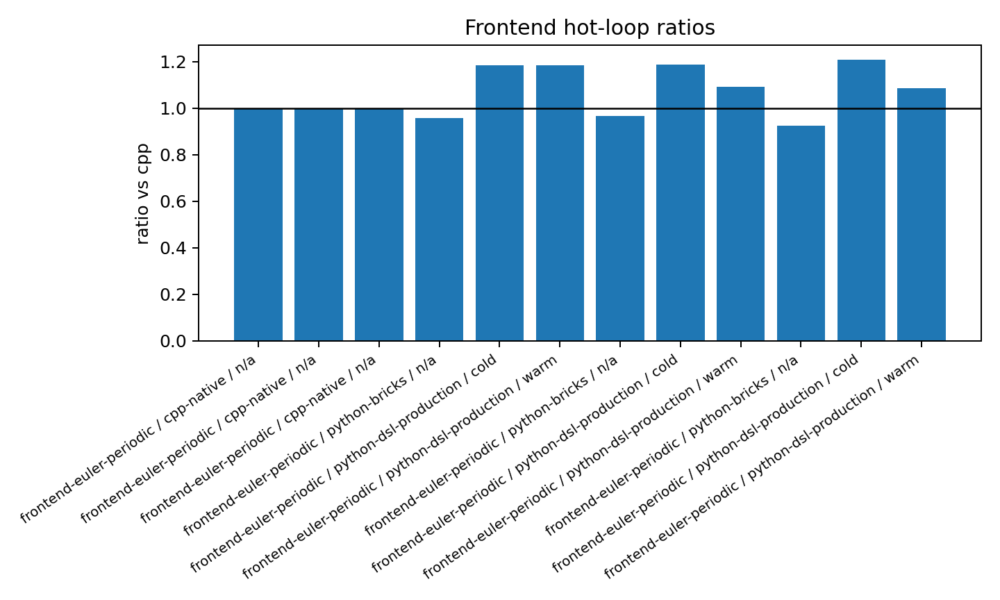

Reading: `python-bricks` stays at the C++ level within measurement noise. The DSL
`production` is no longer flat across all threads: it finally follows the OpenMP
scaling, but keeps in this local run a residual of about `+9 %` at `4/8`
threads. Since `648034` ends in `rc=134`, this graph is a diagnostic
proof, not a final measurement. The upstream branch
`feat/dsl-production-optflags` explains this residual by the `.so` flags and the
single Kokkos runtime.

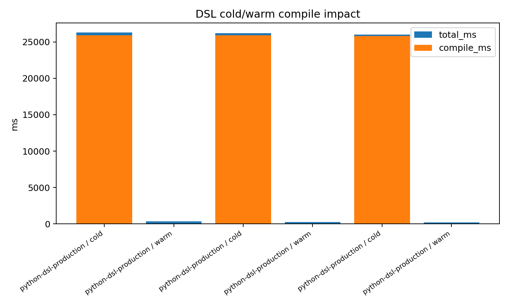

Reading: the cold cost of the DSL is a compilation cost, not a runtime
cost. The warm cache brings `compile_ms` back to a few milliseconds. The theory
`T_total = T_compile + Nsteps*T_step` is therefore confirmed: for a small run,
the cold compile dominates; for a long run or warm cache, it amortizes. The
cold value of this graph must not be extrapolated to the final upstream fix, which
no longer links `libkokkos*`.

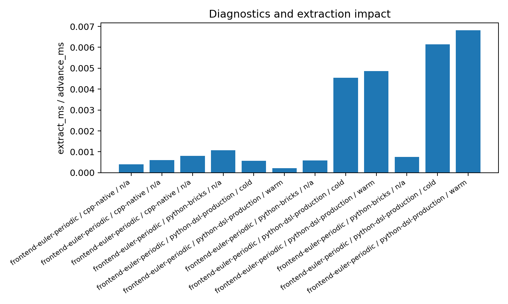

Reading: on CPU, the final extraction does not dominate this case. It remains to
be re-checked on GPU, where a host read can add a `Kokkos::fence` and a
memory migration.

#### Final CPU/Poisson/frontends campaign before upstream DSL fix

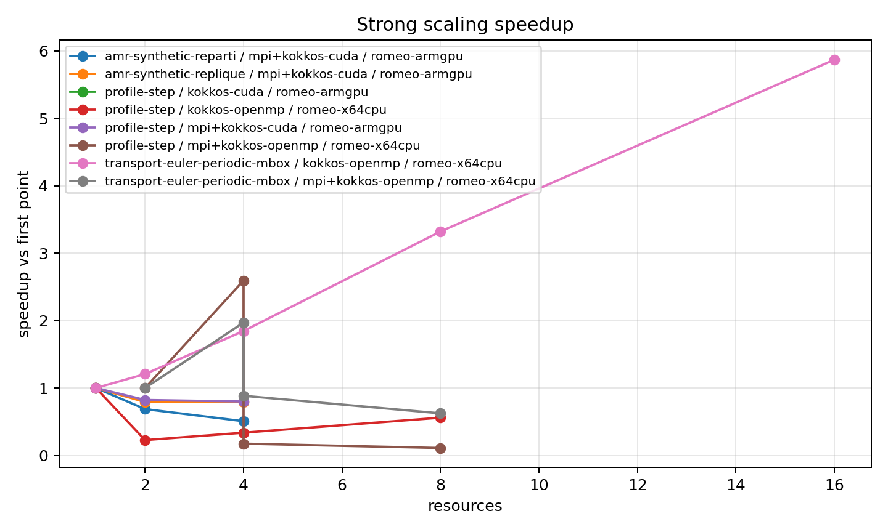

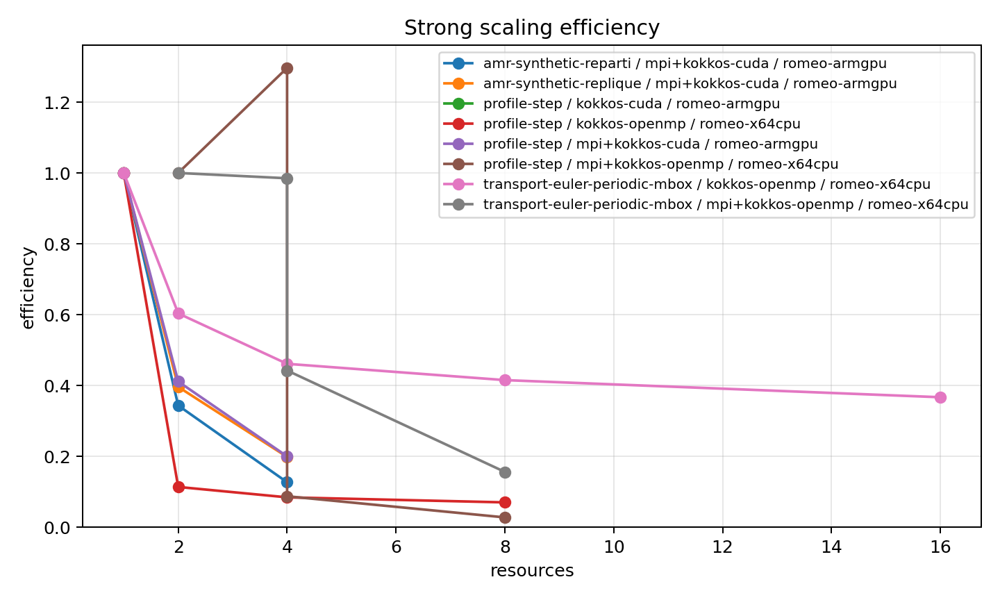

Reading: the first `profile_step` points are Poisson-dominant and must not
be read as pure FV transport. The multi-box transport catch-up
shows a positive OpenMP scaling, but MPI becomes negative as soon as halos and
reductions take over.

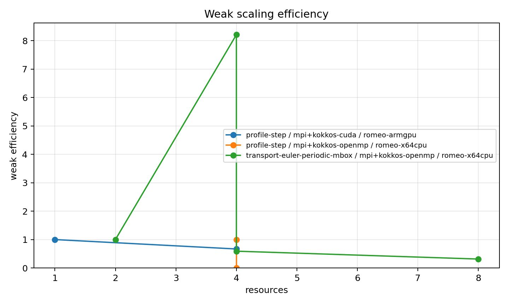

Reading: the CPU multi-box weak scaling degrades strongly. At comparable local
size, `T_halo` then `T_reduction` grow too fast; it is not a
problem of Python nor of Poisson in the pure transport case.

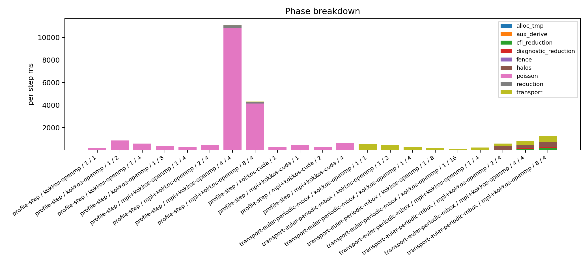

Reading: this graph justifies the per-phase conclusions. Poisson dominates the
first system-like bench; halos/reductions dominate the multi-rank transport.
We must therefore optimize/profile per phase, not just look at a total
time.

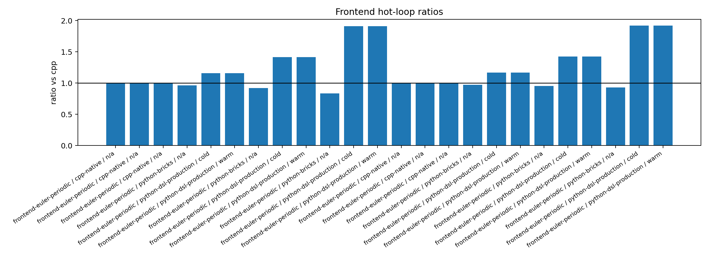

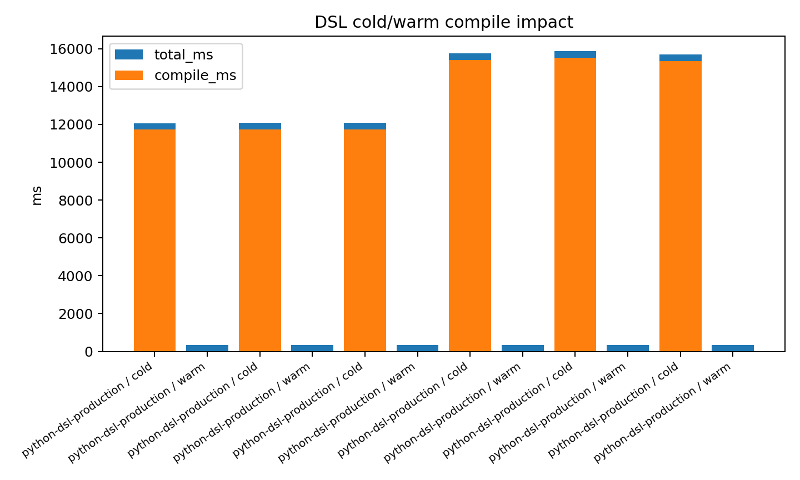

Reading: before the upstream fix, the DSL warm stayed almost invariant with
the threads; it is the signal that led to the diagnostic "loader compiles without
Kokkos backend". The graphs after fix show that this blocker has been
lifted.

#### CPU/GPU matrix branch `feat/perf-campaign-bench`

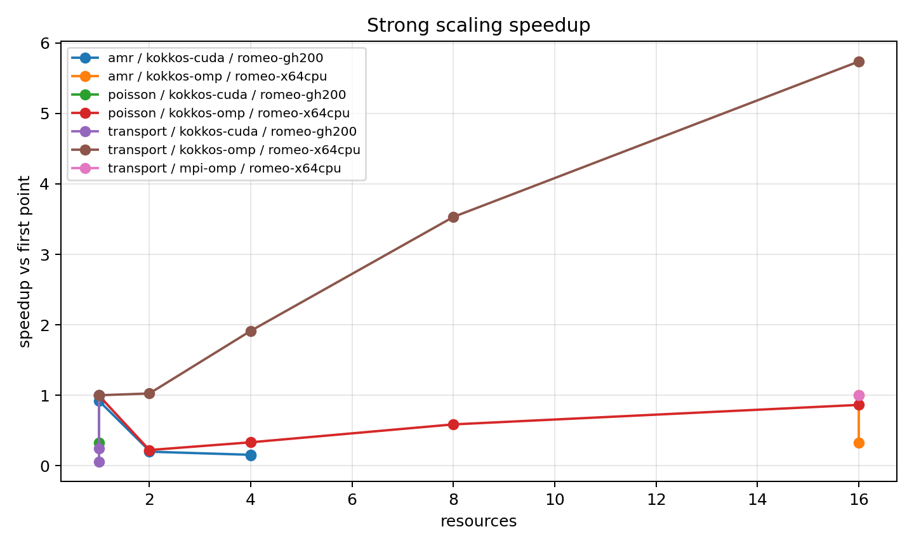

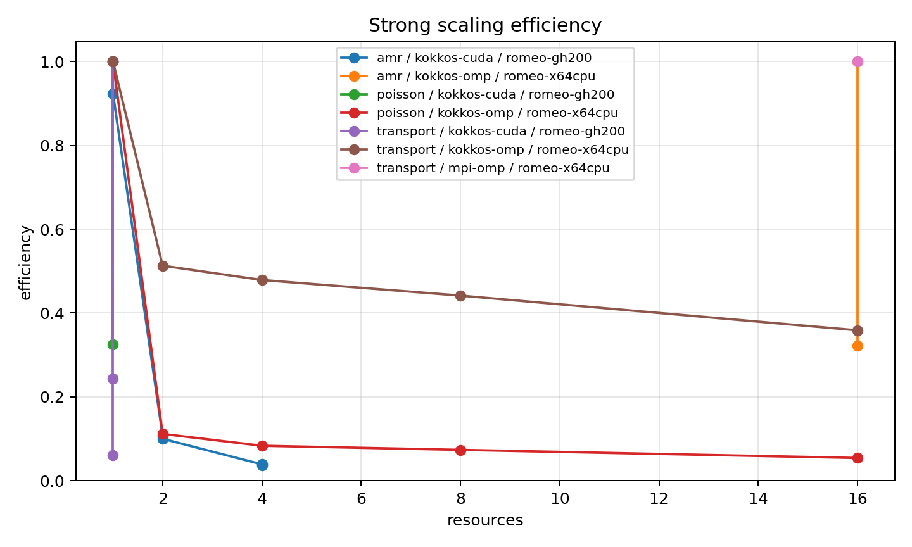

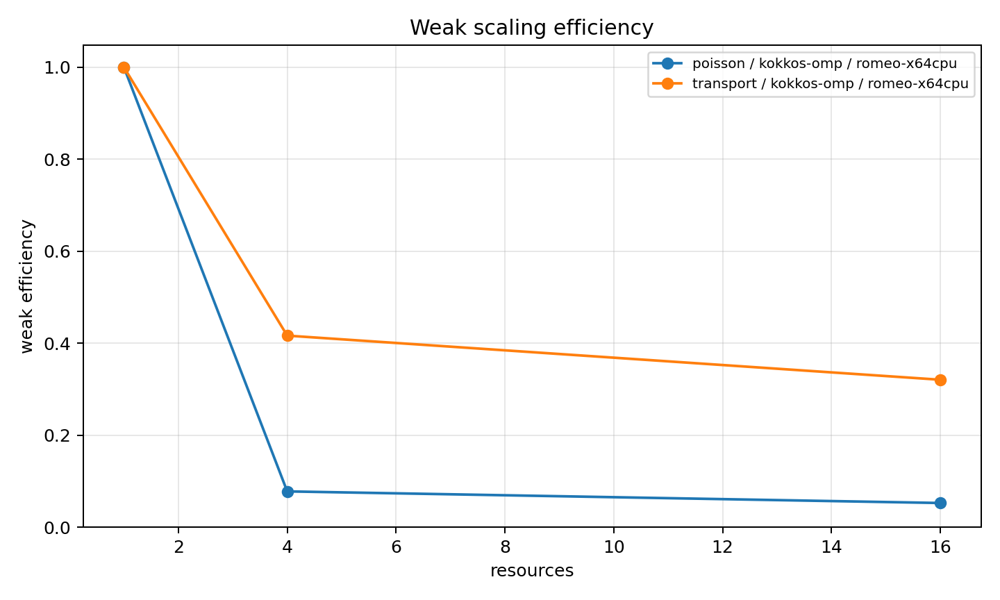

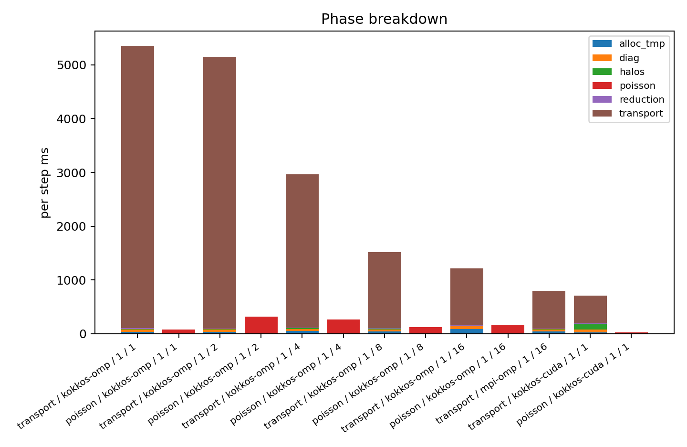

Reading: the matrix separates transport, Poisson and AMR better. The single-rank
GPU transport reaches a stable throughput, but this graph does not prove a multi-GPU
scaling. The multi-GPU AMR stays negative at small sizes, consistent with
a communication/coarse-grid bound regime.

#### MPI v2 relaunch after `#254` merge

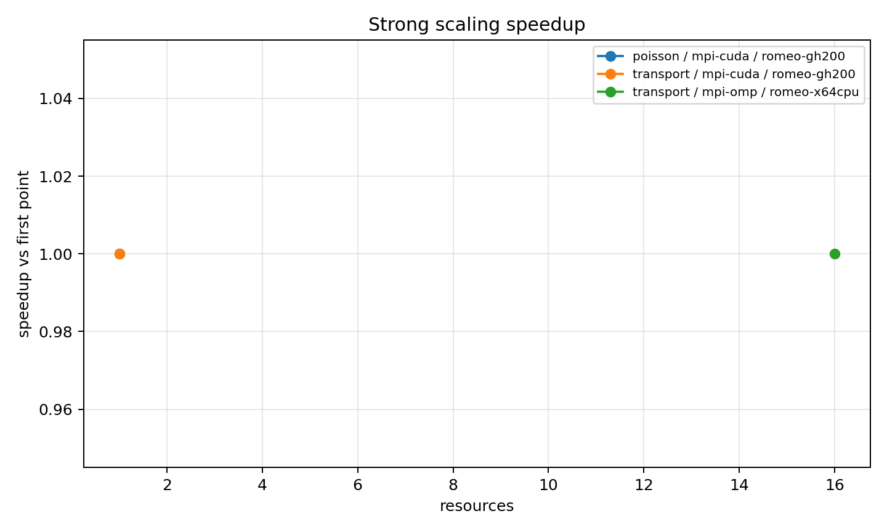

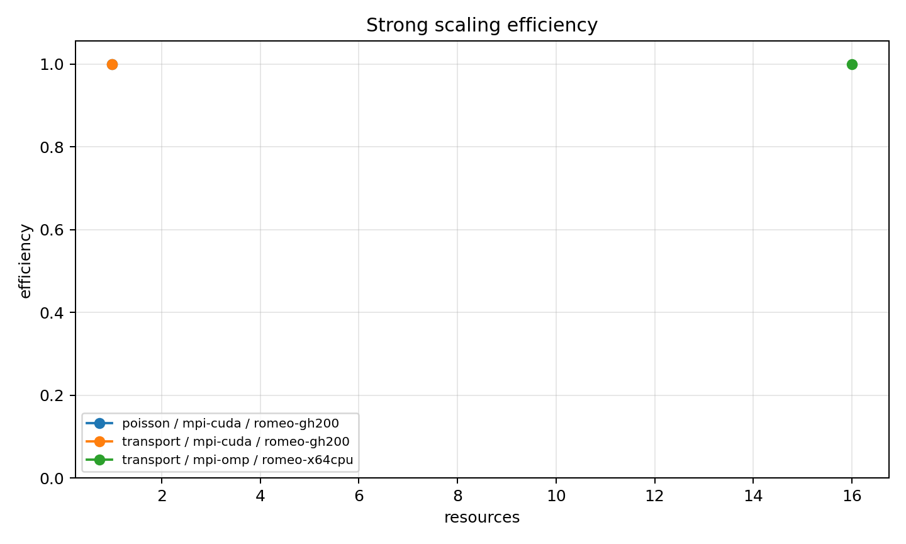

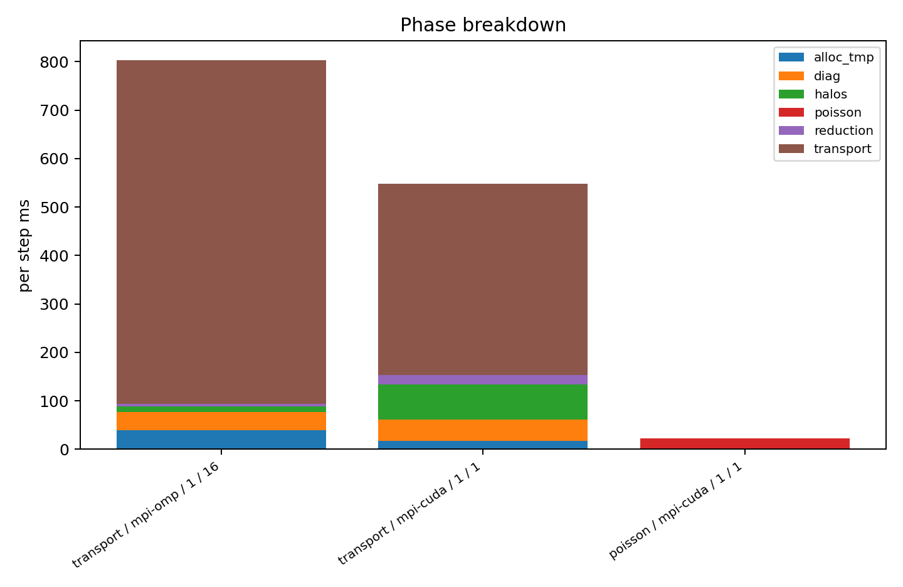

Reading: only the single-rank lines finish. The `2/4` ranks CPU and
`2` GPU points time out and are not visible as measurable speedup. The graph is
therefore mostly a `np=1` reference trace; the multi-rank verdict comes from the
timeouts documented in the logs and tables, not from an absent curve.

### 10.10-e Critical audit of the results and of the campaign

This section explicitly corrects the interpretation risks of the
campaign. It does not remove the previous results; it indicates their
level of proof.

What is solid:

1. `python-bricks` does not reproduce the MUFFIN model. The hot loop stays
   in `advance(dt, nsteps)` on the C++ side; the ratios `0.93-0.97x` against the C++
   PIC are measurement noise and must not be read as "Python faster". The reliable
   conclusion is the practical parity when the diagnostics
   and NumPy extractions are outside the loop.
2. The DSL `production` before fix had a real C++ specialization
   problem: warm time almost invariant with `1/4/8` threads. The move from
   `341/342/341 ms` to `346/261/193 ms` after Kokkos propagation proves that
   the cost came from the loader backend, not from a Python copy.
3. The cost theory is respected: when the compute stays native,
   `T_py_boundary` is small; when the halos/reductions or Poisson are
   active, `T_halo`, `T_reduction`, `T_poisson` and `T_fence` dominate. The
   per-phase breakdowns are therefore more important than the total times alone.
4. `pops::Real` is currently `double`, so the MPI calls in `MPI_DOUBLE`
   are not a type error today.

What is only diagnostic, not a final conclusion:

1. Job `648034` is useful to identify the DSL/Kokkos blocker, but it
   is not publishable as final DSL performance: it ends with
   `rc=134` after writing the CSV because of the double Kokkos runtime. The numbers
   of `648034` say "the DSL re-scales with OpenMP", not "the final DSL costs
   +9 %".
2. The cold DSL cost of `648034` includes a local build variant. The upstream
   branch that does not link `libkokkos*` and adds `-O3 -DNDEBUG` may have a
   different cold compile; this branch must be measured to freeze this number.
3. The MPI v2 graphs only display the finished lines. The multi-rank
   timeouts are strong experimental information, but they do not produce
   speedup points. Any v2 curve must therefore be read as a `np=1`
   reference, not as scaling.
4. The GPU JSONL of the `scaling_step` harness contains `gpus:0` even on
   GPU runs. The consolidated CSVs were corrected when the information was
   known by the job, but the raw field of the harness is a metadata bug.
   It does not affect the times, but it weakens the automatic provenance.
5. The v2 JSONL indicate `pops_cpp_branch=unknown`; the provenance therefore relies
   on the Slurm logs and the SHA `1d4cd25e25`, not on the branch field of the JSON.

Self-critique of what I did:

1. I first presented the local DSL fix too quickly as "after
   fix". The correct phrasing is "after partial fix
   local DSL/Kokkos". The useful result is the change of slope with the
   threads; the final measurement must come from the clean upstream branch.
2. I was also too direct in the reading of `#254`. The pinned host fix
   does exist in `origin/master`, but the current local worktree does not yet
   contain it. The v2 conclusions concern the ROMEO code at SHA
   `1d4cd25e25`, not the local checked-out file.
3. The timeouts `648114/648115` are not enough to declare "MPI CPU broken".
   Job `647836` proves that `profile_transport_mbox` CPU finishes in
   `np=1/2/4/8`. The remaining problem is more precise: the
   multi-rank `scaling_step` harness, at large size and after `#254` merge,
   times out.
4. The ratios below `1.0` for `python-bricks` do not prove that
   Python speeds up PoPS. They signal the variability of the bench and the difficulty
   of comparing separate executables/processes. For a publication, we need
   paired repetitions, median/CI, and stricter CPU pinning.
5. The local patch `include/pops/runtime/abi_key.hpp` is potentially too
   invasive. It protects against a header-only backend mismatch, but it changes
   a public ABI key. The upstream branch solves the same problem through the
   Python cache key; it is probably the path of least risk.

Code risks to investigate before relaunching a big campaign:

1. In `origin/master`, `fill_boundary` uses
   `comm_allocator<Real>` buffers in `Kokkos::SharedHostPinnedSpace`. This avoids the
   CUDA IPC pitfall, but may still be expensive: the pack/unpack kernels
   read/write pinned host memory from the device. We must measure
   separately `pack`, `MPI_Waitall`, `unpack` and the fences.
2. The halo protocol relies on a deterministic enumeration of jobs and a
   unique MPI tag `0`. If two ranks diverge on the order or size of the
   jobs, `MPI_Waitall` may block. The next minimal test must print or
   reduce per neighbor `send_bytes`, `recv_bytes`, `n_jobs` and an order hash
   before posting MPI.
3. `MPI_DOUBLE` is correct as long as `Real=double`. To make the code robust,
   add a `static_assert(std::is_same_v<Real,double>)` near the MPI calls,
   or centralize a `mpi_datatype<Real>()`.
4. The GPU diagnostics remain under-instrumented: any host extraction can
   hide a `Kokkos::fence`. The next runs must separate diagnostics
   off, reduction-only diagnostics, NumPy extraction, and I/O.

Revised interpretation:

The main result is not "C++ beats Python" nor "Python is expensive". The
main result is that production Python costs little if the boundary is at the
`advance` level and if the DSL loader is compiled with the same backend as the
native module. The observed performance losses come mostly from the wrong native
paths: poorly specialized DSL loader, halos/reductions, Poisson/MG,
fences and MPI metadata. The next priority technical step is therefore
not a new campaign of curves, but a halo MPI micro-benchmark that
proves the buffer correspondence and decomposes pack/comm/unpack.

### 10.11 Closing conclusion of the perf TODO

The ROMEO runs and the upstream branches confirm four solid points:

1. The PoPS Python bricks path does not reproduce the MUFFIN problem: no
   Python callback per cell, no full-array copy per step in `advance`.
2. The observed perf blocker is not Python. Depending on the case, it is either
   Poisson/MG/reductions (`profile_step`), or MPI halos/reductions
   (`profile_transport_mbox`).
3. The DSL `production` is fixed on the upstream side by
   `feat/dsl-production-optflags`: Kokkos backend parity, `-O3 -DNDEBUG`,
   single Kokkos runtime. The remaining diff is not a Python copy.
4. The multi-rank `scaling_step` stays blocked/timed-out even after the merge of
   `#254` into `feat/perf-campaign-bench` (`1d4cd25e25`). This is not a
   general verdict against MPI CPU, but it is no longer a perf campaign task:
   it is an MPI/halo code work item to isolate.

The perf TODO is therefore closed: the available measurements allow interpreting
where the time goes, and the remaining gaps are identified technical
blockings, not missing curves to relaunch as-is.
