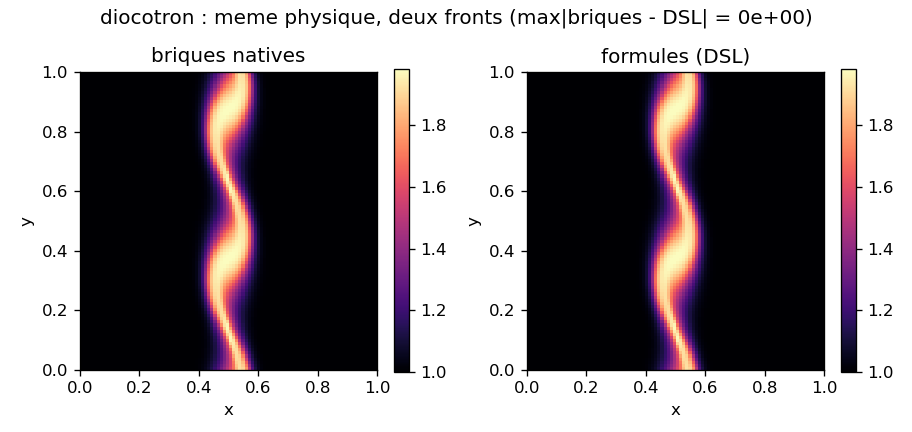

# A->Z Tutorial

This tutorial runs a complete diocotron simulation, from `git clone` to the figures, the GIF
and the uniform/AMR comparison. All the code shown below comes from a single, reproducible
script, [`diocotron_tutorial.py`](https://github.com/wolf75222/adc_cpp/blob/master/docs/sphinx/tutorials/diocotron_tutorial.py): the doc includes it
via `literalinclude` (the code is never copied by hand). The script is self-contained; it depends
only on `adc`, `numpy` and `matplotlib`, not on `adc_cases`, and runs as follows:

```bash
python docs/sphinx/tutorials/diocotron_tutorial.py            # --n 96 --steps 60
python docs/sphinx/tutorials/diocotron_tutorial.py --quick    # passage de fumee rapide
```

:::{admonition} Physics: reduced model
:class: note
A single density `n`, advected by the E x B drift `v = (-d_y phi / B0, d_x phi / B0)` (with
zero divergence), where `phi` solves the system Poisson `-lap phi = alpha (n - n_i0)`. This is the
diocotron normalization benchmark, not a reproduction of the full Euler-Poisson
system. See the [honest limitations](#limites-honnetes) at the end of the page.
:::

## Step 1: Clone the repository

```bash
git clone https://github.com/wolf75222/adc_cpp.git
cd adc_cpp
```

## Step 2: Dependencies

- C++23 compiler (AppleClang 16+, GCC 13+, Clang 17+).
- CMake >= 3.21, Ninja, Python >= 3.10 with `numpy` (and `matplotlib` for the figures);
  the simplest way is the repository conda env: `conda env create -f environment.yml && conda
  activate adc`. pybind11 is taken from the env, otherwise fetched by CMake.

Detail and options: [Installation](installation.md).

## Step 3: Build the Python module

The core is header-only; only the Python module `adc` is compiled (a few minutes). Two
equivalent paths:

```bash
# Voie utilisateur : installe dans site-packages, rien a exporter ensuite.
pip install .

# Voie developpeur : build dans l'arbre (re-build incremental rapide apres une edition C++).
cmake --preset python && cmake --build --preset python
```

The full build (core + tests, for contributing) is in [Installation](installation.md).

## Step 4: Environment variables

```bash
export PYTHONPATH=$PWD/build-py/python   # voie developpeur seulement (inutile apres pip install)
export ADC_INCLUDE=$PWD/include
export ADC_KOKKOS_ROOT=$CONDA_PREFIX     # install Kokkos pour le backend DSL aot/production (Serial suffit sur CPU)
export ADC_CACHE_DIR=$PWD/.adc_cache
```

- `ADC_INCLUDE`: the DSL (backends `production` / `aot`) compiles its `.so` against the repository headers.
- `ADC_KOKKOS_ROOT`: adc_cpp is **Kokkos-only**, so the headers the DSL `.so` includes require Kokkos;
  point this at a Kokkos install (the conda env root `$CONDA_PREFIX`, or a custom prefix -- Serial
  suffices on CPU). **Without it the model compile fails** with a clear error (`compile_aot/compile_native:
  adc_cpp is Kokkos-only`) and the backend fallback chain (`production` then `aot`) cannot wire any
  block. It is the same variable used for the multi-thread build in Step 16.
- `ADC_CACHE_DIR`: caches the generated `.so` for reruns (optional; default
  `~/.cache/adc/dsl`, already out of source).
- `PYTHONPATH`: only for the developer path; the build drops the full package into
  `build-py/python`, this single path is enough.

The extension is pinned to the interpreter that built it (`cpython-312`): import with the
same python. On an import error, the message gives the cause and the rebuild
command; `python -c "import adc; adc.doctor()"` checks the whole environment.

## Step 5: Import and detect the backend

The script imports `adc` and the DSL, then prints the running backend (serial for a
Python module; see [Check your backend](backend.md)).

```{literalinclude} ../tutorials/diocotron_tutorial.py
:language: python
:lines: 50-53
```

```{literalinclude} ../tutorials/diocotron_tutorial.py
:language: python
:pyobject: detect_backend_runtime
```

## Step 6: The physical parameters of the model

Two constants drive the reduced model; they must stay consistent between the flux formulas
and the right-hand side of the Poisson.

```{literalinclude} ../tutorials/diocotron_tutorial.py
:language: python
:lines: 55-60
```

## Step 7: Write the model as formulas (DSL) and compile it

We write the model symbolically with `adc.dsl.Model`: the conservative variable `n`, the
auxiliary fields `phi` / `grad_x` / `grad_y` provided by the solver, the E x B advection flux, the
eigenvalues, and the elliptic right-hand side `alpha (n - n_i0)`. `m.check()` verifies that every
referenced variable is declared.

```{literalinclude} ../tutorials/diocotron_tutorial.py
:language: python
:pyobject: diocotron_model
```

Then we compile the model into a `.so` and wire it in: the script first tries the
`production` backend (native zero-copy path, preferred under MPI/AMR), then falls back to `aot`
(numerically identical, marshaled host-side), as in the application cases. The default of
`m.compile(...)` is `aot`; `production` requires that `_adc` and the `.so` were compiled with the
same adc headers (ABI guard). This is also where we choose the spatial scheme (finite volume,
minmod limiter, Rusanov flux), the time (explicit) and the system Poisson.

```{literalinclude} ../tutorials/diocotron_tutorial.py
:language: python
:pyobject: compile_and_build
```

## Step 8: Build the System

`adc.System(n=, L=, periodic=True)` creates the coupler; `add_equation` dispatches on the model
type (a `CompiledModel` goes to the backend adder). All of this is wired in
`compile_and_build` above.

## Step 9: The initial condition

A horizontal band of charge, perturbed sinusoidally along `x` (azimuthal mode 2):
this is what carries the instability. Convention `ne[j, i]` (numpy `'xy'` indexing), contiguous array.

```{literalinclude} ../tutorials/diocotron_tutorial.py
:language: python
:pyobject: band_density
```

The density is set via `sim.set_density("ne", ne0)` (in `compile_and_build`), after fixing
the neutralizing ionic background `n_i0 = ne0.mean()` (solvability of the periodic Poisson).

## Step 10: Finite volume, time, Poisson

These three choices are passed to `add_equation` / `set_poisson` (step 7):

- spatial: `adc.FiniteVolume(limiter="minmod", riemann="rusanov")`, MUSCL minmod
  reconstruction + Rusanov Riemann flux;
- time: `adc.Explicit()`;
- Poisson: `sim.set_poisson(rhs="charge_density", solver="geometric_mg")`, right-hand side =
  charge density, geometric multigrid solver.

## Step 11: Integrate in time

We advance `steps` steps at fixed CFL (`sim.step_cfl(cfl)`), capturing frames, the time and
the L2 amplitude of the perturbation over time.

```{literalinclude} ../tutorials/diocotron_tutorial.py
:language: python
:pyobject: run
```

## Step 12: Diagnostics

The amplitude of the perturbation is the deviation from the mean along `x` (the unperturbed band
is uniform in `x`; what deviates from it carries the instability). At the end of the run the script
checks that the instability has grown and that mass is conserved (periodic advective transport).

```{literalinclude} ../tutorials/diocotron_tutorial.py
:language: python
:pyobject: perturbation_amplitude
```

## Step 13: The growth curve

`make_figures` plots the amplitude (log scale) as a function of time, next to the final density.

```{literalinclude} ../tutorials/diocotron_tutorial.py
:language: python
:pyobject: make_figures
```


## Step 14: The GIF

The same `make_figures` function assembles the density evolution into a GIF (and a PNG cover
image for static exports).


*Static cover image (the final density), shown where the GIF does not animate,
PDF/print exports:*


## Step 14bis: The same physics, two fronts (bricks == DSL)

The model was written here as formulas (`adc.dsl.Model`, Step 7). But the core can also
compose a model from native bricks: `adc.Model(state, transport, source, elliptic)`.
The two writing fronts are interchangeable: they are two ways of describing the same
physics, and they produce an identical numerical kernel. We write it in bricks:

```{literalinclude} ../tutorials/diocotron_tutorial.py
:language: python
:pyobject: native_diocotron_model
```

then we replay the same grid / the same scheme / the same number of steps, and compare the final
state of the two fronts:

```{literalinclude} ../tutorials/diocotron_tutorial.py
:language: python
:pyobject: native_vs_dsl
```

The difference is zero to binary precision (`max|briques - DSL| = 0`, `np.array_equal`): the
DSL formulas reproduce exactly the conventions of the `ExBVelocity` and `BackgroundDensity` bricks.
A divergence (even $10^{-15}$) would betray a wrong formula (sign of the drift, wave bound,
right-hand side). The full brick catalog is in the
[brick reference](../reference/native-bricks.md), and the DSL one in the
[DSL reference](../reference/symbolic-dsl.md); the `tutorial/` application case in `adc_cases`
pushes the demonstration to three fronts (specialized helper included).



## Step 15: Uniform vs AMR

We replay the same physics on a uniform grid (`adc.System`) and on a refined hierarchy
(`adc.AmrSystem`), with exactly the same model composed in native bricks. `AmrSystem` refines
where the density exceeds a threshold (`set_refinement(0.05)`); the regrid cadence is carried by
`AmrSystemConfig.regrid_every`. The two final densities are plotted side by side, with the maximum
difference in the title.

```{literalinclude} ../tutorials/diocotron_tutorial.py
:language: python
:pyobject: uniform_vs_amr
```


## Step 16: Kokkos OpenMP (CPU parallelism)

There is no Python parameter of the form `threads=8`. `import adc` drives the simulation, but the
per-cell computation inherits the backend with which `_adc` was compiled (see
[Check your backend](backend.md)). The number of cores therefore depends on the build of `_adc` and the
OpenMP variables at launch, not on a script flag; the distributed module runs in Kokkos Serial
because the CI builds it that way (adc_cpp is Kokkos-only).

For multi-threading, we rebuild the module with the Kokkos OpenMP backend, against a Kokkos installed
with OpenMP (`Kokkos_ENABLE_OPENMP=ON` at the Kokkos build).

**Conda path (recommended)** -- the env root is `$CONDA_PREFIX` (conda NEVER sets a
`$KOKKOS_ROOT` variable) and the `python-parallel` preset is already wired to it; if the env's kokkos
is Serial-only, `scripts/kokkos_openmp_conda.sh` first installs a Kokkos OpenMP (~2 min):

```bash
conda activate adc
bash scripts/kokkos_openmp_conda.sh        # si besoin : Kokkos OpenMP dans $CONDA_PREFIX
cmake --preset python-parallel && cmake --build --preset python-parallel
```

**Custom / cluster Kokkos path** (install outside conda, e.g. ROMEO/Spack): set
`KOKKOS_ROOT=<prefix de l'install Kokkos>` yourself, then:

```bash
cmake -S . -B build-py-kokkos -G Ninja \
  -DADC_BUILD_PYTHON=ON \
  -DADC_BUILD_TESTS=OFF \
  -DADC_USE_KOKKOS=ON \
  -DKokkos_ROOT="$KOKKOS_ROOT" \
  -DCMAKE_BUILD_TYPE=Release \
  -DPython_EXECUTABLE=$(which python3.12)
cmake --build build-py-kokkos --target _adc -j$(sysctl -n hw.logicalcpu)
```

At launch, point `PYTHONPATH` at this build and set the number of threads
(`adc.set_threads(8)` on the Python side is equivalent to exporting `OMP_NUM_THREADS`):

```bash
export PYTHONPATH=$PWD/build-py-kokkos/python
export ADC_INCLUDE=$PWD/include
export ADC_CACHE_DIR=$PWD/.adc_cache_kokkos
export ADC_KOKKOS_ROOT="$CONDA_PREFIX"  # chemin conda ; ($KOKKOS_ROOT en chemin custom/cluster)

OMP_NUM_THREADS=8 python docs/sphinx/tutorials/diocotron_tutorial.py
```

`ADC_KOKKOS_ROOT` is the key point for the DSL `backend="production"`: since the `_adc` module is
compiled WITH Kokkos, a loader compiled without (ABI key `kokkos=0` vs `kokkos=1`) is REJECTED with an
explicit message -- no more silent serial fallback. With it, the loader is compiled with the same Kokkos
as `_adc`, so the `OMP_NUM_THREADS` cores are used (see
[`dsl.py`](https://github.com/wolf75222/adc_cpp/blob/master/python/adc/dsl.py)).

Common pitfall: running `OMP_NUM_THREADS=8 python ...` against an `_adc` compiled in serial changes
almost nothing; you must first do the Kokkos build above. The C++ facade (outside Python) is validated
separately against a Kokkos OpenMP (`-DKokkos_ROOT=<install OpenMP>`) then `ctest` (CI job ci-full).
There is no longer a standalone OpenMP backend: Serial, OpenMP and Cuda are Kokkos execution
spaces chosen at the Kokkos install.

## Step 17: MPI (distributed parallelism)

Likewise, the distributed mode is obtained at compile time, and launched via `mpirun`:

```bash
cmake --preset mpi && cmake --build --preset mpi     # OpenMPI de l'env conda
ctest --preset mpi                                   # rejoue np=1/2/4 via mpirun
```

`comm.hpp` then goes through `MPI_Comm_rank/size` + collectives. MPI and Kokkos combine (one GPU
per rank) for the GPU. The GPU itself requires ROMEO: `-DADC_USE_KOKKOS=ON` +
`Kokkos_ARCH_HOPPER90` + `nvcc_wrapper`, validated manually on GH200 (never in CI). See
[Check your backend](backend.md) and [`GPU_ROMEO.md`](https://github.com/wolf75222/adc_cpp/blob/master/docs/GPU_ROMEO.md).

(limites-honnetes)=

## Step 18: Honest limitations

- **Reduced model.** This tutorial transports a density by the E x B drift coupled to a scalar
  Poisson (`alpha (n - n_i0)`). This is not the full Euler-Poisson system (no
  momentum equation, no energy), and it is not a reproduction of the Hoffart
  configuration. It is the diocotron normalization benchmark. The fidelity to the
  full system is discussed in [`HOFFART_FIDELITY.md`](https://github.com/wolf75222/adc_cpp/blob/master/docs/HOFFART_FIDELITY.md); the
  full scenarios live in `adc_cases` (see [Repository organization](repository-layout.md)).
- **Serial backend.** The Python run is serial (see steps 16-17 and [backend](backend.md)); the
  figures are produced at low resolution to stay fast and reproducible.
- **Indicative AMR comparison.** `uniform_vs_amr` illustrates the use of `AmrSystem`; the
  uniform/AMR difference reported in the title measures consistency, not a convergence study.

Each asset comes with a provenance record
([`_assets/provenance.json`](../tutorials/_assets/provenance.json): `adc_cpp` SHA, backend,
resolution, command) for reproducibility.

## The full script

For reference, the complete script, in its orchestration:

```{literalinclude} ../tutorials/diocotron_tutorial.py
:language: python
:pyobject: main
```
