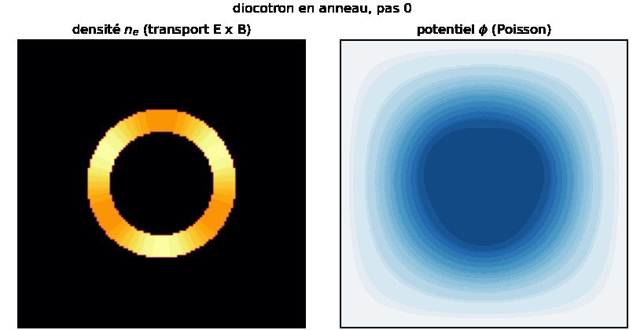
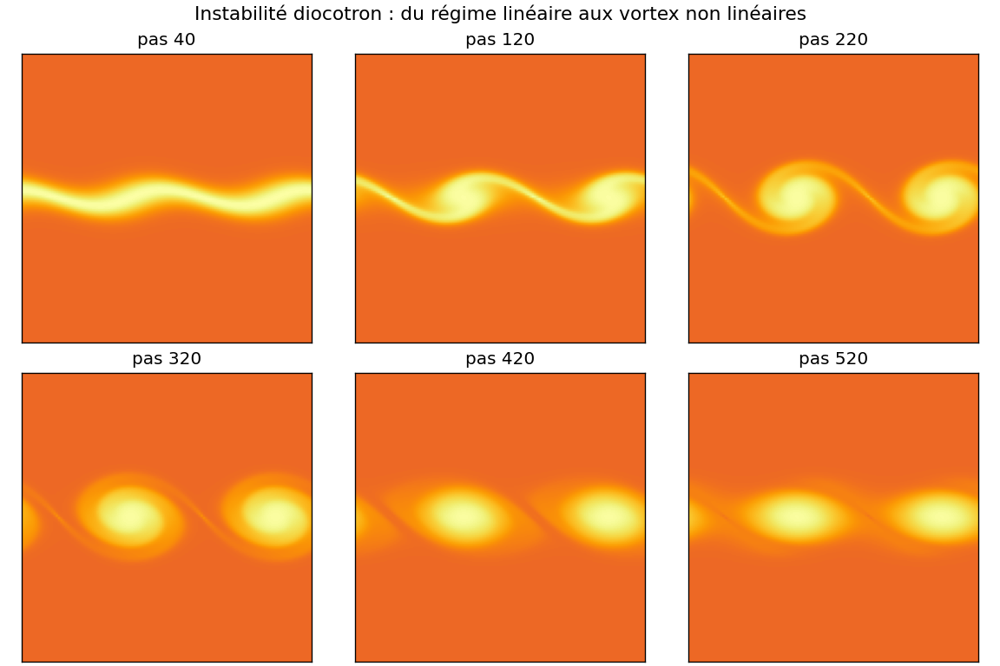

# 01, L'instabilité diocotron

Le problème phare d'`adc_cpp` : une couche d'électrons non neutre dérive `E x B` dans un
champ magnétique, son propre champ électrique l'enroule, et une perturbation initiale
s'amplifie. C'est l'analogue électrostatique de Kelvin-Helmholtz.


## La physique en une équation

Densité `n` transportée par la dérive `E x B`, champ par Poisson :

$$\partial_t n + \nabla\cdot(n\,\mathbf{v}) = 0,\quad
  \mathbf{v} = \tfrac{1}{B}(-\partial_y\phi,\ \partial_x\phi),\quad
  \nabla^2\phi = \alpha\,(n - n_{i0})$$

La vitesse dérive d'un potentiel-flux donc `div(v) = 0` : transport incompressible, pas de
choc, juste de l'enroulement. Détail : [ALGORITHMS.md §1](../docs/ALGORITHMS.md).

## En C++

Le pilote `examples/diocotron.cpp` lie la façade `adc::solver` : il ne fait que la config,
les diagnostics et l'I/O. Toute la physique est dans `libadc`.

```bash
./build/bin/diocotron out 128 500          # nc=128, 500 pas, frames -> out/
python3 scripts/make_diocotron_gif.py out docs/anim_diocotron.gif
```

La boucle interne est, en substance :

```cpp
DiocotronConfig cfg;            // n, L, B0, n_i0, alpha, condition initiale
cfg.n = 128;
DiocotronSolver sim(cfg);
for (int s = 0; s < 500; ++s) sim.step_cfl(0.4);   // pas stable choisi par la façade
```

## En Python

```python
import adc
cfg = adc.DiocotronConfig()
cfg.n = 128
cfg.ic = adc.DiocotronIC.Band       # Smooth | Band | Ring
cfg.band_mode = 3                   # nombre d'azimut de la perturbation
sim = adc.DiocotronSolver(cfg)

m0 = sim.mass()
for _ in range(500):
    sim.step_cfl(0.4)               # CFL sur la dérive E x B
rho = sim.density()                 # numpy (n, n)
phi = sim.potential()               # numpy (n, n)
print("derive masse :", abs(sim.mass() - m0))   # ~ arrondi machine
```

Trois conditions initiales : `Smooth` (mode lisse), `Band` (bande de charge perturbée),
`Ring` (anneau). Les champs `band_*` et `ring_*` paramètrent l'amplitude, la largeur, le
mode azimutal.

## Validation

La masse est conservée à l'arrondi (forme flux + domaine périodique). Le **taux de
croissance** du mode instable est comparé à la théorie linéaire dans
`include/adc/analysis/diocotron_growth.hpp` (sous `ADC_USE_EIGEN`) ; voir
`docs/fig_diocotron_growth.png` et `fig_diocotron_modes.png`.

## En images (bindings Python)

Deux scripts exécutables (voir [run/](run/README.md)) produisent ces figures depuis la
façade `adc`.

`diocotron_ring.py` rend le couplage visible : un anneau de charge se brise en lobes
(densité, à gauche, transport `E x B`) pendant que Poisson recalcule le potentiel `phi`
(à droite, elliptique) à chaque pas.



`diocotron_sequence.py` fige une bande à six instants : la perturbation linéaire enfle,
s'enroule en oeil-de-chat, puis fusionne en vortex. Une planche statique, sans GIF, qui
montre le passage du régime linéaire au régime non linéaire.



## Variantes

- `examples/diocotron_column.cpp` : colonne au lieu d'une bande (`docs/anim_diocotron_column.gif`).
- `examples/diocotron_amr.cpp` / `diocotron_amr3.cpp` : le même problème sur AMR
  ([04_amr_multilevel.md](04_amr_multilevel.md)).
- `examples/diocotron_multipatch.cpp` : AMR multi-patch + regrid dynamique
  ([05_amr_multipatch.md](05_amr_multipatch.md)).
- `examples/diocotron_column_amr.cpp` : colonne du papier (arXiv:2510.11808) sur AMR, avec
  Poisson multi-niveau. C'est l'objectif du stage, détaillé pas à pas dans
  [10_diocotron_reproduction.md](10_diocotron_reproduction.md).

## Pièges

- Le pas de temps doit respecter la CFL sur `max|v| = max|grad phi|/B`. `step_cfl(0.4)`
  s'en charge ; `step(dt)` impose `dt` brut (un `dt` trop grand explose).
- Le couplage Poisson par étage (`poisson_per_stage = true`) donne l'ordre 2 en temps ;
  `false` est ~2.6x plus rapide mais ordre 1 sur le champ (voir PERFORMANCE.md).
