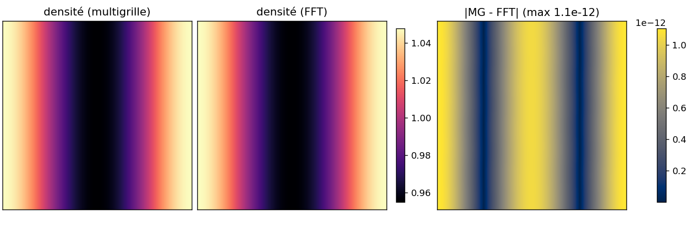

# 02, Poisson : multigrille vs FFT

Le couplage hyperbolique-elliptique passe par une inversion de Poisson à chaque pas (ou
chaque étage). C'est souvent le gros du temps de calcul (~86% sur le couplé Euler-Poisson).
Deux backends inversent le MÊME Laplacien 5 points, derrière le même concept.

## Le concept `EllipticSolver`

Tout solveur elliptique expose `rhs()`, `solve()`, `phi()`. Le coupleur est générique
dessus : `AmrCoupler<Model, GeometricMG>` ou `AmrCoupler<Model, PoissonFFTSolver>`, même
code. C'est un des trois axes orthogonaux de l'architecture.

## Multigrille géométrique

`GeometricMG` (`include/adc/elliptic/geometric_mg.hpp`). Le lisseur Gauss-Seidel rouge-noir
tue vite les hautes fréquences ; la multigrille restreint les basses sur des grilles
grossières où elles redeviennent hautes. V-cycle : lisser -> résidu -> restreindre ->
récursion -> prolonger -> lisser. Coût O(N). Entièrement on-device (le V-cycle passe par
`for_each_cell`), donc compile pour le GPU. **Warm-start** : `solve()` repart du `phi`
précédent, 1-2 V-cycles suffisent en régime établi.

## Poisson spectral

`PoissonFFTSolver` (`include/adc/elliptic/poisson_fft_solver.hpp`). Sur un domaine
périodique, le Laplacien est diagonal en Fourier : une transformée, une division par
`-(k_x^2 + k_y^2)`, une transformée inverse. **Direct** (pas d'itération), résidu machine.
Limites : périodique, `N` puissance de 2, mono-rang.

## Lequel choisir ?

Mesuré (voir [PERFORMANCE.md](../docs/PERFORMANCE.md)), et **contre-intuitif** :

| Charge | Gagnant | Pourquoi |
|---|---|---|
| Couplé Euler-Poisson (N=256) | **FFT ~4.8x** | Poisson-dominé (86%), résolu par étage |
| Deux-fluides AP (N=512) | **MG ~2.4x** | transport-dominé, Poisson 1x/pas warm-startée |

Leçon : ne pas extrapoler d'un solveur à l'autre. Le FFT gagne quand le Poisson domine et
qu'on le résout souvent ; la multigrille warm-startée gagne quand on le résout une fois par
pas depuis une bonne initialisation.

## Validation

`test_fft_coupler` : MG vs FFT donnent `maxdiff = 1.6e-14` après 5 pas (ils inversent le
même Laplacien discret). `test_poisson`, `test_mpi_poisson` (le distribué via `mpirun`).

Le script `poisson_backends.py` (voir [run/](run/README.md)) le montre sur une simulation
couplée complète : même densité par les deux chemins, écart au niveau de l'arrondi.



## Python

`EulerPoissonConfig.use_fft = True` bascule le backend depuis Python :

```python
cfg = adc.EulerPoissonConfig(); cfg.use_fft = True   # FFT direct (n puissance de 2)
es = adc.EulerPoissonSolver(cfg)
```

## Pièges

- Le FFT exige `N` puissance de 2 et des CL périodiques ; hors de ce cadre, multigrille.
- La multigrille est itérative : le résidu n'est pas exactement nul. Pour une dérive de
  masse à l'arrondi machine sur un run long, c'est en général suffisant ; sinon FFT.
