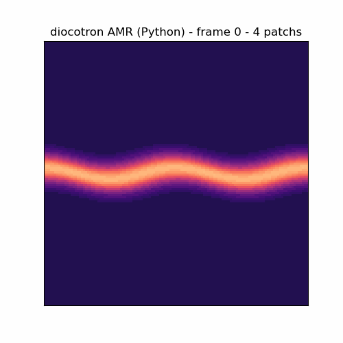

# 03, L'API Python

Le module `adc` expose les solveurs **concrets** de la façade compilée `libadc` (jamais les
templates C++). Trois solveurs, chacun piloté par une config, rendant des champs en numpy.
Le backend (série / OpenMP / Kokkos) est celui avec lequel `libadc` a été compilée.

```python
import adc
import numpy as np
```

## DiocotronSolver (dérive E x B)

```python
cfg = adc.DiocotronConfig()
# géométrie / physique
cfg.n = 64                 # grille n x n
cfg.L = 6.283185           # taille du domaine (2 pi par défaut)
cfg.B0 = 1.0               # champ magnétique
cfg.n_i0 = 1.0             # fond ionique neutralisant
cfg.alpha = 1.0            # couplage Poisson
cfg.poisson_per_stage = True   # ordre 2 (False = ordre 1, plus rapide)
# condition initiale
cfg.ic = adc.DiocotronIC.Band  # Smooth | Band | Ring
cfg.band_amp = 0.5; cfg.band_width = 0.05; cfg.band_mode = 3; cfg.band_disp = 0.02
cfg.ring_r0 = 0.3; cfg.ring_r1 = 0.4; cfg.ring_delta = 0.02; cfg.ring_mode = 5
cfg.wall_radius = 0.0      # paroi conductrice circulaire (0 = pas de paroi)

sim = adc.DiocotronSolver(cfg)
sim.step(0.01)             # un pas de dt brut
sim.step_cfl(0.4)          # un pas au CFL 0.4 sur la dérive
sim.max_drift_speed()      # max|grad phi|/B0
sim.dx(); sim.time(); sim.nx(); sim.mass()
rho = sim.density()        # numpy (n, n)
phi = sim.potential()      # numpy (n, n)
```

## EulerPoissonSolver (auto-gravitant)

```python
cfg = adc.EulerPoissonConfig()
cfg.n = 64; cfg.gamma = 1.4
cfg.four_pi_G = 1.0; cfg.rho0 = 1.0; cfg.p0 = 1.0
cfg.use_fft = True         # Poisson spectral (périodique) au lieu de la multigrille

es = adc.EulerPoissonSolver(cfg)
for _ in range(5):
    es.step(0.004)
es.mass(); es.energy()
es.total_momentum(0); es.total_momentum(1)   # composantes x, y
rho = es.density()         # numpy (n, n)
```

## TwoFluidAPSolver (deux-fluides isotherme AP)

```python
cfg = adc.TwoFluidAPConfig()
cfg.n = 64
cfg.cse2 = 1.0; cfg.csi2 = 0.04         # vitesses du son^2 (électron, ion)
cfg.omega_pe = 1e3; cfg.omega_pi = 20.0  # fréquences plasma (régime raide)
cfg.stabilize = True                     # schéma AP (False explose en régime raide)
cfg.upwind_continuity = False            # True = flux de masse Rusanov MUSCL (anti-Gibbs)
cfg.omega_ce = 0.0; cfg.omega_ci = 0.0   # fréquences cyclotron (champ magnétique)

ts = adc.TwoFluidAPSolver(cfg)
ts.advance(5.0 / 1e3, 200)               # 200 pas de dt = 5/omega_pe (explicite exploserait)
ts.mass_e(); ts.mass_i()
ts.max_charge()                          # max|n_i - n_e| (quasi-neutralité)
ts.max_dev()                             # max|n_e - 1| (borne en régime AP)
ne = ts.density_e(); ni = ts.density_i() # numpy (n, n)
```

## DiocotronAmrSolver (AMR multi-patch, regrid dynamique)

Le seul solveur **raffiné** exposé : une bande de charge sur un niveau grossier + des
patchs fins reconstruits a la volee par regrid Berger-Rigoutsos (couche `AmrCouplerMP`
-> `advance_amr`). `density()` rend le niveau grossier en numpy ; `n_patches()` donne le
nombre de patchs fins courants (il evolue avec l'enroulement cat's eye).

```python
ac = adc.DiocotronAmrConfig()
ac.n = 128                 # cellules du niveau GROSSIER
ac.band_amp = 1.0; ac.band_mode = 2; ac.band_width = 0.05
ac.refine_frac = 0.15      # tag si n_e > fond + 0.15
ac.regrid_every = 15       # re-raffine tous les 15 pas

asim = adc.DiocotronAmrSolver(ac)
m0 = asim.mass()
for _ in range(480):
    asim.step_cfl(0.4)     # un pas AMR couple (regrid periodique inclus)
print(asim.n_patches(), asim.density().shape)   # patchs fins, grossier numpy (128,128)
assert abs(asim.mass() - m0) < 1e-9             # reflux conservatif a l'arrondi
```



GIF genere 100 % depuis Python (zero ligne de C++) :
`python3 scripts/make_python_amr_gif.py docs/anim_python_amr.gif`. Le compteur de patchs
monte avec l'instabilite (4 a 7 patchs ici). La masse reste conservee a `~1e-13` (7e-14 mesure) : le reflux
conservatif de l'AMR passe inchange par la facade.

## Invariants à vérifier

```python
m0 = sim.mass()
for _ in range(100): sim.step_cfl(0.4)
assert abs(sim.mass() - m0) < 1e-9       # conservation
assert sim.density().shape == (cfg.n, cfg.n)
```

`python/test_bindings.py` exerce chaque solveur (diocotron Band + step_cfl, Euler-Poisson
FFT + quantité de mouvement nulle, deux-fluides raide + magnétisé). Le module est un miroir
**1:1** de la surface publique des façades C++ : toute config, toute méthode est exposée.

## Pièges

- Les champs sont rendus en numpy `(n, n)` row-major **copiés** (modifier le tableau ne
  touche pas le solveur).
- `omega_pe` grand sans `stabilize = True` explose : c'est l'intérêt du schéma AP.
- `n` doit être une puissance de 2 si un chemin FFT est utilisé (Euler-Poisson `use_fft`).
