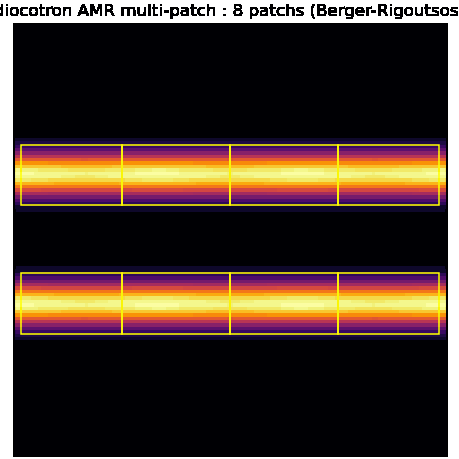

# 05, AMR multi-patch + Berger-Rigoutsos

Quand les zones d'intérêt sont **plusieurs et mobiles** (deux blobs qui dérivent), un seul
rectangle raffiné gaspille. Le multi-patch met **plusieurs patchs disjoints** par niveau,
re-découpés à la volée par clustering.



## Les deux subtilités

Par rapport au multi-niveaux mono-box ([04](04_amr_multilevel.md)), deux choses changent :

1. **Reflux coverage-aware.** Au joint entre deux patchs voisins (interface fin-fin), il ne
   faut PAS refluxer (ce n'est pas une interface fin-grossier ; le joint est géré par
   `fill_boundary`). Un masque de couverture distingue les vraies interfaces fin-grossier.
2. **Routage vers la box parente.** Quand le grossier est lui-même multi-box, la correction
   doit aller dans la boîte parente qui contient la cellule adjacente (`mf_find_box`).

## Le clustering Berger-Rigoutsos

Étant donné les cellules marquées (fort gradient), `berger_rigoutsos` trouve un petit
nombre de rectangles qui les couvrent : il coupe récursivement là où la signature
(histogramme projeté des marques) a un trou ou une inflexion. `tag_cells` + `grow_tags`
produisent et dilatent les marques. Détail : [ALGORITHMS.md §9-10](../docs/ALGORITHMS.md).

## En C++

Le démo couplé `examples/diocotron_multipatch.cpp` re-clusterise à chaque regrid :

```bash
./build/bin/diocotron_multipatch out 128 480
python3 scripts/make_diocotron_multipatch_gif.py out docs/anim_diocotron_multipatch.gif
```

Le coupleur réutilisable `AmrCouplerMP<Model, Elliptic>`
(`include/adc/coupling/amr_coupler_mp.hpp`) fait Poisson grossier -> injection -> pas
multi-patch, et `regrid()` reconstruit le niveau fin par Berger-Rigoutsos :

```cpp
AmrCouplerMP<Diocotron> sim(model, geom, ba, bc, std::move(levels));
auto crit = [&](const ConstArray4& a, int i, int j){ return a(i,j,0) > seuil; };
for (int s = 0; s < nsteps; ++s) {
  if (s % 10 == 0) sim.regrid(crit);   // re-cluster les patchs fins
  sim.step(dt);                        // amr_step_multilevel_multipatch (conservatif)
}
```

## Validation

- `test_amr_multipatch` : « 2 boîtes pavant exactement = 1 grande boîte » donne le MÊME
  grossier (`0` exact). Ça vérifie d'un coup le reflux coverage-aware ET le transfert des
  halos fin-fin.
- `test_amr_multilevel_multipatch` : trois gardes à `0` exact (3 niveaux mono-box =
  référence ; 2 niveaux multi-box = référence 2-niveaux ; 3 niveaux avec niveau
  intermédiaire multi-box conservatif).
- `test_amr_coupler_mp` : `AmrCouplerMP` bit-identique (`0`) à `AmrCoupler` sur mono-box, et
  conservatif (`1.3e-15`) sous regrid dynamique à 3 patchs.

## Distribué

La couverture est bâtie sur le **BoxArray global** (toutes les boîtes, connues de tous les
rangs), donc correcte sous n'importe quelle distribution MPI. Le reflux multi-patch tourne
**réellement distribué**, 2-niveaux comme N-niveaux : la copie inter-niveaux parent->enfant
passe par `parallel_copy`, le gather des registres par `all_reduce_sum_inplace` (niveau 0
répliqué, niveaux >0 répartis). `test_mpi_amr_multipatch3` (3 niveaux, niveau intermédiaire
multi-box réparti) est bit à bit identique np=1/2/4, masse conservée.

## Pièges

- Sans masque de couverture, le joint fin-fin serait reflué deux fois -> non-conservation.
- Le nesting propre (patch fin intérieur à la couverture parente) doit être imposé après le
  clustering, sinon le ghost-fill inter-niveaux laisse des trous.
