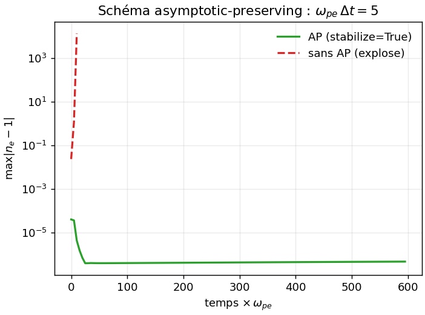
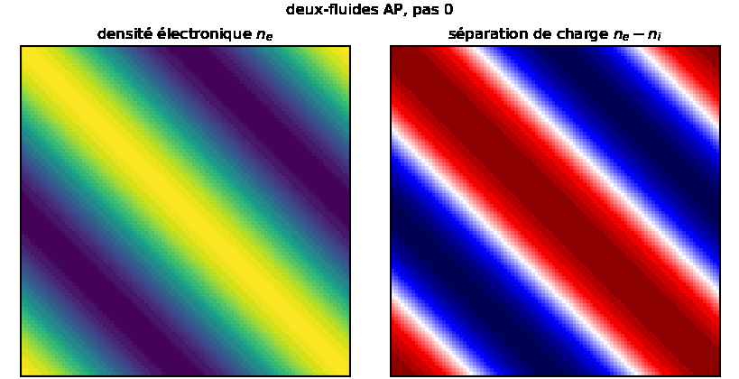

# 06, Deux-fluides isotherme asymptotic-preserving

Deux espèces (électrons, ions) couplées par Poisson. La cible de validation physique du
projet (Hoffart arXiv:2510.11808). La note de méthode complète est
[two_fluid_ap.md](../docs/two_fluid_ap.md) ; ce tutoriel montre comment le faire tourner.

## La raideur, et pourquoi AP

La fréquence plasma `omega_pe` est la fréquence des oscillations de Langmuir. Un schéma
explicite est stable seulement si `omega_pe dt < O(1)` : en régime quasi-neutre,
`omega_pe` est grand, donc `dt` minuscule, alors que la dynamique d'intérêt (le transport)
est lente.

Le schéma **asymptotic-preserving** traite la force de Lorentz implicitement et reformule
Poisson :

$$\beta_0 = \Delta t^2\,(\omega_{pe}^2 + \omega_{pi}^2),\qquad
  \nabla^2\phi = \frac{n_e^* - n_i^*}{1 + \beta_0}$$

Le facteur `1/(1+beta0)` tend vers 0 quand `omega_pe -> inf`, forçant la quasi-neutralité
et gardant le pas stable indépendamment de `omega_pe dt`.

## Python

```python
import adc
cfg = adc.TwoFluidAPConfig()
cfg.n = 64
cfg.omega_pe = 1e3; cfg.omega_pi = 20.0     # régime raide
cfg.stabilize = True                        # AP (False explose)
ts = adc.TwoFluidAPSolver(cfg)

m0 = ts.mass_e()
ts.advance(5.0 / 1e3, 200)                  # dt*omega_pe = 5 : explicite exploserait
print("borne AP   :", ts.max_dev())         # max|n_e - 1|, doit rester borné
print("quasi-neutre:", ts.max_charge())     # max|n_i - n_e|, petit
print("masse e     :", abs(ts.mass_e() - m0))
```

Mettre `cfg.stabilize = False` et relancer : le `max_dev` explose. C'est la démonstration
du schéma AP.

## Continuité upwind (anti-Gibbs)

La continuité centrée est un flux central pur, dispersif sur les fronts raides. L'option
`cfg.upwind_continuity = True` bascule sur un flux de masse Rusanov à reconstruction MUSCL
(minmod) : ordre 2 précis sur le lisse, monotone aux extrema.

Mesure (`test_two_fluid_ap_amplitude`) : sur un front raide le sous-dépassement passe de
17.6% (centré) à 17.0% (MUSCL), quasi identiques. Ce sous-dépassement est donc surtout la
**raréfaction acoustique physique**, pas du Gibbs numérique. Sur une bosse lisse, MUSCL ne
perd que 0.4% du pic : c'est un upwind ordre 2 qui ne sur-diffuse pas.

## Validation

`test_two_fluid_ap_2d_mf` : dispersion isotrope (écart théorie/mesure 3.1%), borne AP +
quasi-neutralité à `omega_pe = 1e3` là où le non-stabilisé explose, conservation par
espèce. `test_two_fluid_ap_amplitude` : enveloppe de robustesse (lisse robuste à eps=0.8,
front raide). Portable GPU GH200, bit-identique au CPU.

## En images (bindings Python)

`two_fluid_ap.py` (voir [run/](run/README.md)) trace la démonstration AP : le schéma
stabilisé reste borné quand le non-stabilisé explose, au même pas de temps raide.



`two_fluid_field.py` anime les champs 2D : la densité électronique `n_e` et la séparation
de charge `n_e - n_i`, qui oscille à la fréquence plasma tout en restant quasi-neutre.



## Champ magnétique

`cfg.omega_ce`, `cfg.omega_ci` ajoutent un champ magnétique hors-plan -> rotation cyclotron
([07_magnetic.md](07_magnetic.md)).

## Pièges

- `omega_pe` grand sans `stabilize = True` explose : c'est l'intérêt du schéma.
- La continuité upwind demande 2 ghosts sur la densité (géré en interne).
