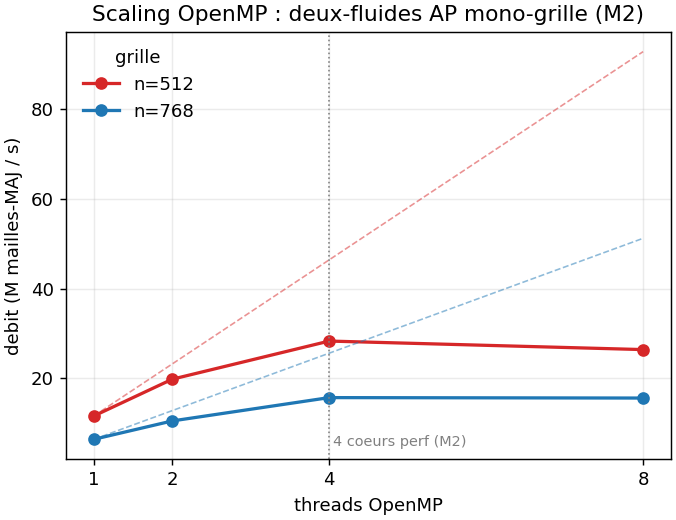

# 08, Backends : OpenMP, MPI, GPU

La physique est écrite une fois ; le parallélisme vit dans un **seam** unique. Le même code
tourne en série, en OpenMP, en MPI distribué, et sur GPU (Kokkos), selon la cible avec
laquelle `adc` a été compilée.

## Le seam

Une seule primitive de boucle :

```cpp
for_each_cell(box, [=] ADC_HD (int i, int j) { /* ... */ });
```

dispatche vers une boucle série, `#pragma omp parallel for`, ou `Kokkos::parallel_for`
(CUDA) selon le backend. `Array4` / `ConstArray4` sont des vues POD passables au device.
`comm.hpp` enveloppe les collectives MPI (`all_reduce_sum`, `all_reduce_sum_inplace`). La
physique ne voit jamais le backend. Détail : [ARCHITECTURE.md §2-4](../docs/ARCHITECTURE.md).

## OpenMP

```bash
cmake -S . -B build-omp -DADC_USE_OPENMP=ON && cmake --build build-omp -j
ctest --test-dir build-omp     # 60/60, identiques à la série (déterminisme thread-count)
```

Le banc `bench_amr` mesure le scaling (`OMP_NUM_THREADS=k ./build-omp/bin/bench_amr n nsteps tf`).
Sur Apple M1 Pro (6 cœurs Performance + 2 Efficiency) :



Le scaling **dépend de la taille** : à n=384 on est overhead-bound (trop de petits noyaux +
niveaux grossiers du multigrille, le fork/join par noyau coûte plus que le travail) ; dès
n>=512, ~x2.4-2.5 à 4 threads. Le **plateau au-delà** n'est pas un plafond de cœurs (il y en
a 6) mais la **saturation de la bande passante mémoire** : le stencil + le multigrille sont
à faible intensité arithmétique, ~4 threads saturent le bus.

## MPI

```bash
cmake -S . -B build-mpi -DADC_USE_MPI=ON && cmake --build build-mpi -j
ctest --test-dir build-mpi     # 73/73 (60 + 13 via mpirun)
mpirun -np 4 ./build-mpi/bin/diocotron_mpi out 128 600
```

Le BoxArray est global (tous les rangs connaissent toutes les boîtes) ; seules les données
sont distribuées par le `DistributionMapping`. Le round-robin est le défaut ; un équilibrage
par courbe de Morton (`make_sfc_distribution`, `parallel/load_balance.hpp`) est disponible et
vérifié sur l'AMR distribué (`test_mpi_amr_multipatch3` : `maxdiff = 0` sous répartition SFC).
Les résultats sont **bit-identiques** à np=1 quelle que soit la répartition (invariance au
nombre de rangs ET à la distribution, vérifiée par les tests `test_mpi_*`).

## GPU (Kokkos, GH200)

```bash
cmake -S . -B build-gpu -DADC_USE_KOKKOS=ON    # C++20 sous nvcc
```

La façade `libadc` (multigrille + transport) compile telle quelle pour le GPU : tous les
kernels passent par `for_each_cell` + `ADC_HD`, sans lambda imbriquée, avec une discipline
de **fences** sur la mémoire unifiée (toute fonction qui fait un kernel device puis une
boucle hôte sur la même mémoire doit `device_fence()` entre les deux). Validé bit-identique
au CPU sur ROMEO (CUDA 12.x).

## Pièges

- Le backend est une **propriété de la cible** `adc`, pas un drapeau par solveur : on ne le
  rajoute jamais dans le code physique, juste à la configuration CMake.
- Sur GPU, oublier un `device_fence()` entre un kernel et une lecture hôte sur mémoire
  unifiée donne une course silencieuse (le bug le plus subtil rencontré, corrigé dans les
  remplissages de halo).
- OpenMP n'accélère pas les petites grilles (overhead-bound) : ce n'est pas un bug, c'est le
  grain par noyau ; le bon grain serait une région parallèle au-dessus de la boucle de
  niveaux du multigrille.
