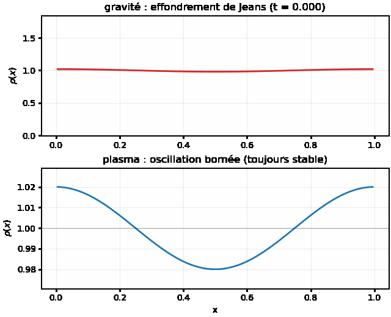

# 09, Euler-Poisson : gravité OU plasma

Un gaz compressible (Euler) dont chaque maille crée un potentiel par Poisson et subit en
retour la force `g = -grad phi`. Le même code fait deux physiques opposées selon le SIGNE
de la source elliptique : auto-gravité attractive (effondrement de Jeans, astrophysique) ou
électrostatique répulsive mono-espèce (oscillation de Langmuir + explosion de Coulomb,
plasma). C'est le coeur hyperbolique-elliptique de la bibliothèque, au-delà du diocotron.



## La physique, un seul signe

$$\partial_t U + \nabla\cdot F(U) = S(U,\nabla\phi),\qquad
  \nabla^2\phi = s\,4\pi G\,(\rho - \rho_0),\qquad s = \pm 1$$

avec `g = -grad phi` et `S = (0, rho g_x, rho g_y, rho u . g)`. `s = +1` (`Gravity`) : une
sur-densité creuse un puits de potentiel, `g` pointe vers elle, elle s'accentue (Jeans).
`s = -1` (`Plasma`) : le potentiel fait une bosse, `g` pointe vers l'extérieur, la
sur-densité se disperse (Coulomb). Une seule ligne, `coupling_sign`, sépare les deux.

## La dispersion sépare les deux régimes

Une perturbation acoustique au repos `delta_rho = eps rho0 cos(kx)` obéit à

$$\omega^2 = c_s^2 k^2 \;\mp\; \omega_p^2,\qquad \omega_p^2 = 4\pi G\,\rho_0$$

signe `-` en gravité (Jeans : `omega^2 < 0` dès que `omega_p > c_s k`, donc effondrement),
signe `+` en plasma (Bohm-Gross : `omega^2 > 0` toujours, inconditionnellement stable). Le
plasma mono-espèce ne s'effondre jamais.


## En Python

```python
import adc
cfg = adc.EulerPoissonConfig(); cfg.n = 128; cfg.four_pi_G = 20.0
cfg.interaction = adc.InteractionKind.Gravity   # ou .Plasma
es = adc.EulerPoissonSolver(cfg)
for _ in range(100): es.step(2e-3)
rho = es.density()                              # numpy (n, n)
```

`use_fft = True` bascule Poisson sur la FFT directe (n puissance de 2) ; sinon multigrille
(tout n). Les scripts `plasma.py` et `euler_poisson_collapse.py` ([run/](run/README.md))
produisent les figures ci-dessus.

## En C++

Le modèle `EulerPoisson` délègue toute l'hydrodynamique à `Euler` et n'ajoute que la source
(la force, via `aux = grad phi`) et le second membre elliptique signé. Il se branche tel
quel sur `Coupler<EulerPoisson>`. Détail : [ALGORITHMS.md §8](../docs/ALGORITHMS.md).

## Validation

`test_euler_poisson` : effondrement de Jeans stable, `omega` mesuré à 0.1% de la théorie,
masse et quantité de mouvement conservées. `test_euler_poisson_plasma` : Bohm-Gross à 0.1%,
et un même grumeau gaussien dont le pic CROÎT en gravité mais DÉCROÎT en plasma (signes
opposés).

## Pièges

- La FFT directe exige `n` puissance de 2 (sinon comportement indéfini) ; en périodique,
  `rho0` doit valoir la moyenne de `rho`, sinon le second membre n'est pas à moyenne nulle
  et `phi` dérive.
- Le couplage par étage (`poisson_per_stage = true`) donne l'ordre 2 en temps ; `false` est
  ~2.6x plus rapide mais ordre 1 sur le champ.
