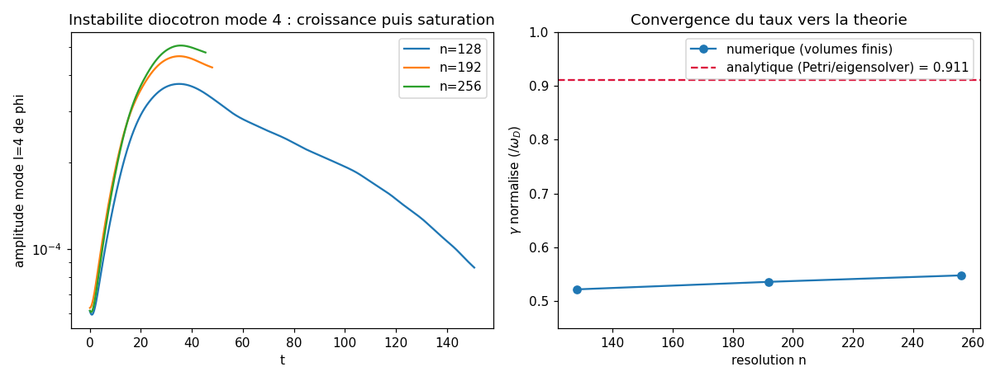
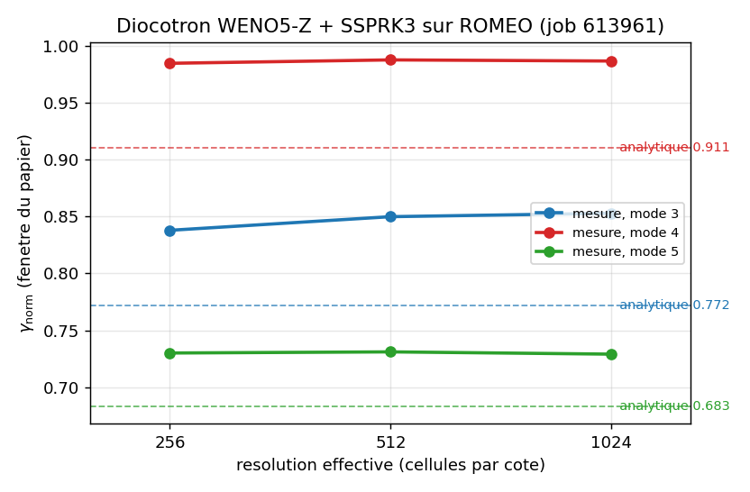
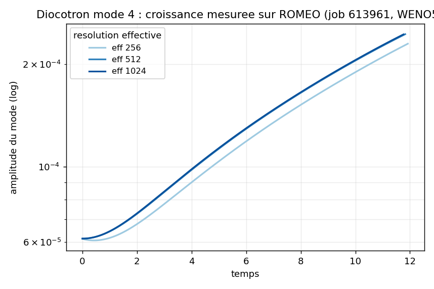
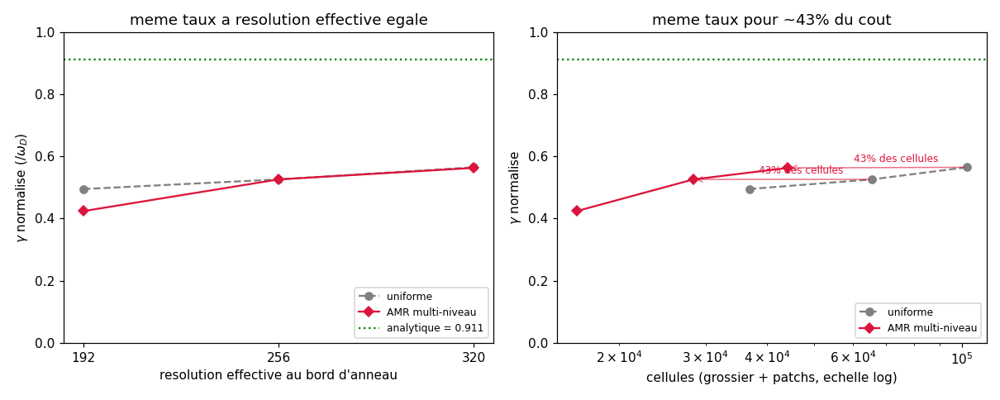
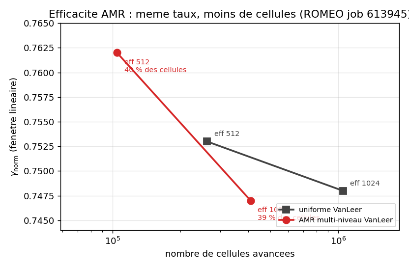

# 10, Reproduire le papier diocotron avec notre AMR

Objectif du stage : reproduire les résultats de Hoffart et al.,
*Structure-preserving FEM of magnetic Euler-Poisson* (arXiv:2510.11808), puis y
intégrer notre AMR. Ce tutoriel relie les quatre étapes (M1 à M2b) en un seul
récit chiffré et donne les lignes de commande pour tout rejouer.

Le papier traite l'instabilité diocotron d'une colonne d'électrons non neutre.
Dans la limite de dérive magnétique `v = -∇φ x Ω/|Ω|²`, ses équations se
réduisent EXACTEMENT au modèle `Diocotron` d'`adc_cpp` (transport `E x B` +
Poisson). C'est le point de départ : même physique, deux codes.

## La cible analytique

Géométrie de la colonne (rapport `a:b:Rw = 6:8:16` du papier, porté ici à
`r0=0.15`, `r1=0.20`, paroi conductrice `Rw=0.40`) : un anneau de charge entre
deux rayons, dans un mur conducteur circulaire qui ferme Poisson par Dirichlet.
La théorie linéaire donne le taux de croissance par mode azimutal `l`,
normalisé par `ω_D = ρ̄/(2π)` :

| mode `l` | 3 | 4 | 5 |
|---|---|---|---|
| `γ_norm` analytique | 0.772 | **0.911** | 0.683 |

Le mode 4 domine. C'est le nombre à reproduire : `γ_norm = 0.911`.


## M1, reproduction sur grille uniforme

`examples/diocotron_column.cpp` sur grille uniforme reproduit l'instabilité, et
le taux mesuré croît de façon monotone vers l'analytique quand on raffine. Mais
il PLAFONNE bien en dessous de `0.911` à résolution accessible : la diffusion
numérique lisse le bord d'anneau fin, qui est précisément ce qui porte la
croissance.



Conclusion de M1 : atteindre `0.911` demande de résoudre finement le bord
d'anneau. Sur grille uniforme, cela coûte des cellules partout. C'est la
motivation directe de l'AMR.

## M2, raffiner le transport avec notre AMR

`examples/diocotron_column_amr.cpp` met la colonne sur l'AMR 2 niveaux
(`AmrCouplerMP` + paroi conductrice dans le multigrille, tag couronne
`[0.13,0.22]`, regrid Berger-Rigoutsos). Le même binaire fait les deux branches
(`refine=0/1`), numériquement identiques en l'absence de patchs.

À base grossière égale (96), raffiner le bord d'anneau **triple le taux**
(`γ_norm = 0.38` contre `0.12` sur l'uniforme de même base). L'AMR est sur une
meilleure courbe taux par cellule. Mais il n'atteint pas encore l'uniforme fin,
parce qu'à ce stade le **Poisson reste résolu sur le grossier** : le coupleur
injecte le potentiel grossier aux patchs. Le transport est raffiné, pas le champ.

## M2b, le Poisson multi-niveau

Le mode `ml=1` lève ce plafond. À chaque pas il assemble une densité COMPOSITE
sur la grille fine (grossier prolongé, puis patchs fins écrasés là où on
raffine), résout un multigrille fin dessus, restreint le potentiel vers le
grossier pour le transport grossier, et garde le gradient fin direct pour les
patchs. Le bord d'anneau voit donc un potentiel résolu à la résolution fine.

À base 96 (mêmes 16 392 cellules qu'en M2), le taux remonte de `0.38` à `0.42`.
Le Poisson grossier bridait bien le taux : hypothèse confirmée.

## M2b-HO : WENO5-Z + SSPRK3 sur ROMEO (job 613961)

Pour lever le plafond de diffusion numérique de M2b, la reconstruction WENO5-Z (ordre 5
sur champ lisse) remplace le limiteur VanLeer sur la grille uniforme. Résultats sur ROMEO
(96 cœurs EPYC, modes 3/4/5, résolutions effectives 256/512/1024) :

| mode `l` | analytique | eff 256 | eff 512 | eff 1024 | sur-tir |
|---|---|---|---|---|---|
| 3 | 0.772 | 0.838 | 0.850 | 0.853 | +10 % |
| **4** | **0.911** | **0.985** | **0.988** | **0.987** | **+8 %** |
| 5 | 0.683 | 0.730 | 0.731 | 0.729 | +7 % |



Le sur-tir est **uniforme et PLAT** en résolution (eff 512 et eff 1024 donnent le même
taux à 0.1 % près). La résolution ne referme pas l'écart. Conclusion : la limite n'est
pas la diffusion numérique du schéma, c'est la **géométrie cartésienne en escalier** qui
approxime l'anneau circulaire et la paroi conductrice ronde. Lever ce verrou demande
soit des coordonnées polaires, soit des cellules coupées (cut-cell).

Courbes d'amplitude `ring_amp.csv` réelles (mode 4) :



Les courbes eff 512 et eff 1024 se superposent, ce qui confirme la convergence du taux.
Données brutes : `romeo/runs/613961_growth/`.

## Convergence et payoff de l'AMR

En montant la base (96, 128, 160, 224 ; résolution effective au bord 192, 256,
320, 448), l'AMR multi-niveau converge vers l'uniforme à MÊME résolution
effective, pour 41 à 44 % des cellules :

| résolution effective | AMR `ml` (γ_norm / cellules) | uniforme (γ_norm / cellules) | coût AMR/unif |
|---|---|---|---|
| 192 | 0.42 / 16 392 | 0.50 / 36 864 | 44 % |
| 256 | 0.526 / 28 352 | 0.526 / 65 536 | 43 % |
| 320 | 0.563 / 44 192 | 0.565 / 102 400 | 43 % |
| 448 | 0.592 / 82 808 | 0.577 / 200 704 | 41 % |




À base 128 et plus, le taux AMR COÏNCIDE avec l'uniforme à résolution effective
égale (à 41-44 % du coût). À base 96 l'AMR reste sous l'uniforme-192 (le transport
grossier hors patchs limite encore), puis rattrape. La ligne eff 448 vient d'un
run sur 1 GPU GH200 (voir plus bas).

Le taux monte de façon monotone avec la résolution (0.42, 0.526, 0.563, 0.592)
mais N'ATTEINT PAS `0.911`. La section M2b-HO ci-dessus montre que même avec WENO5-Z,
le taux plafonne à ~0.987 (+8 % uniforme au-dessus de l'analytique). La limite n'est
donc pas la diffusion numérique : c'est la **géométrie cartésienne en escalier**
(anneau et paroi circulaires sur grille carrée). Lever ce verrou demande des coordonnées
polaires ou des cellules coupées (cut-cell).

## Tout rejouer

```bash
cmake --build build -j --target diocotron_column_amr

# AMR multi-niveau, base 96/128/160 (resolution effective 192/256/320)
./build/bin/diocotron_column_amr /tmp/ml96  96  600  1 4 1   # <out> nc nsteps refine l ml
./build/bin/diocotron_column_amr /tmp/ml128 128 800  1 4 1
./build/bin/diocotron_column_amr /tmp/ml160 160 1000 1 4 1

# references uniformes a la meme resolution effective (refine=0, ml=0)
./build/bin/diocotron_column_amr /tmp/u192 192 1000 0 4 0
./build/bin/diocotron_column_amr /tmp/u256 256 1200 0 4 0

# fit du taux, normalise par omega_D = rhobar/(2 pi)
python3 scripts/validate_diocotron_growth.py \
  /tmp/ml96/ring_amp.csv /tmp/ml128/ring_amp.csv /tmp/ml160/ring_amp.csv \
  --rhobar 0.9 --target 0.911 --labels "ml96,ml128,ml160"
```

Le pilote écrit `ring_amp.csv` (amplitude du mode `l` de φ sur le cercle `r=r0`),
reporte le nombre de patchs et la dérive de masse (conservée à `~1e-14` sur tout
le run). Comparer deux branches : même binaire, on bascule `refine` et `ml`.

## M3, le système magnétique complet (fait)

Tout ce qui précède vit dans la limite de dérive `v = -∇φ × Ω/|Ω|²`. Le papier
résout le système COMPLET (eq 2.4) : Euler compressible + énergie + Poisson +
force de Lorentz `m × Ω`, où la dynamique cyclotron est résolue et non supposée
instantanée. `integrator/magnetic_euler_poisson.hpp` l'ajoute par un splitting de
Strang autour du `Coupler<EulerPoisson>` déjà validé : demi rotation cyclotron
exacte, un pas transport + électrostatique, demi rotation. La rotation exacte est
inconditionnellement stable, donc le pas de temps suit la CFL hydro et pas la
fréquence cyclotron `ω_c = |Ω|` : le schéma est asymptotic-preserving. Le test
`test_magnetic_euler_poisson` prouve qu'à `Ω = 0` le pas est bit à bit le coupleur
nu, et que le point fixe de la carte de Strang converge à l'ordre 2 vers la dérive
E×B `v = (-∂_yφ, ∂_xφ)/Ω` : le système complet se réduit à la limite de dérive
ci-dessus quand `Ω` grandit. Démo `examples/magnetic_diocotron.cpp`, animation
`docs/anim_magnetic_diocotron.gif`.

## Où va la suite

- **Hero-run ROMEO (fait)** : 1 GPU GH200 (`armgpu`, MPI + Kokkos/CUDA) reproduit la
  ligne eff 448 (uniforme 0.577, AMR `ml` 0.592, checksum bit-identique CPU). WENO5-Z sur
  EPYC (job 613961) confirme le sur-tir geometrique (+8 % plat). Voir `romeo/HERO_RESULTS.md`.
- **Verrou geometrique** : la prochaine amelioration demande soit des coordonnees polaires,
  soit des cellules coupees (cut-cell) pour approximer correctement l'anneau et la paroi
  circulaire. C'est le chantier M3bis / M4.
- **M4 : SAMRAI**. Porter la colonne sur l'AMR de SAMRAI et comparer.

Détail des opérateurs : [ALGORITHMS.md](../docs/ALGORITHMS.md). Hiérarchie AMR :
[04_amr_multilevel.md](04_amr_multilevel.md). Plan complet : [ROADMAP.md](../docs/ROADMAP.md).
